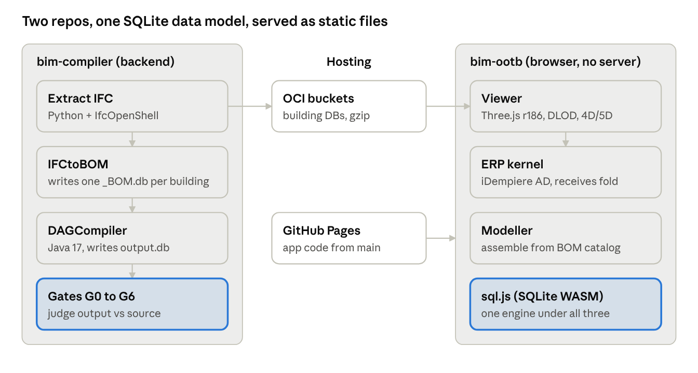

# BIM Compiler — Architecture Overview

*As of 2026-09-28 · written for outside engineers and domain experts*

## 1. Purpose and how to read this

The BIM Compiler treats a building as a compiled program. An IFC model is broken down into a Bill of Materials (BOM) tree, rebuilt by deterministic arithmetic, and checked element by element against the source. The same data then drives schedule, cost and ERP views in a browser, with no server.

**Who this is for.** An outside engineer or domain expert who must understand, assess or extend the system without the author in the room.

**What it covers.** The current design: parts, data, flows, verification and known limits. Every statement cites a file in `bim-compiler` or `bim-ootb`.

**What it leaves out.** History, except for sections 12–13, which summarise how the methods evolved. The repos hold about 6,600 commits and 332 prompt files, and many earlier decisions have been superseded. If a prompt file disagrees with this document, check the cited code first. If the code agrees with the prompt file, this document is out of date.

**The system in one paragraph.** There are two repositories:

- `bim-compiler` (Java 17, SQLite, Python scripts) is the compiler backend. It extracts IFC, mines rules, compiles BOMs and runs the seven proof gates (G0–G6).
- `bim-ootb` is the browser app (JavaScript, sql.js WASM, Three.js). It holds the Viewer, the Modeller and a browser ERP kernel descended from iDempiere.

Both work on SQLite files. By the README's own figures, 35 real buildings have been compiled, the largest with 126K elements, and the browser code runs to about 90K lines ([README](https://github.com/red1oon/BIMCompiler)). Those figures are self-reported and should be re-measured before anyone relies on them.

## 2. Core idea: a building is its Bill of Materials

The system rests on one model. A building is a recursive BOM, and every element's position is the sum of parent-relative offsets. It is decomposed from real IFC, recompiled by arithmetic, and verified against the source per element. Source: [Spatial Compilation paper](SpatialCompilationPaper.md), priority date 2026-03-30.

**Recursion.** A BOM has one parent, N children and a quantity for each. Each child can itself be a BOM: building → floor → room → furniture → leaf. Each level is atomic and self-contained (`CLAUDE.md` §BOM PRINCIPLE). The table model is iDempiere's `M_BOM` / `M_BOM_Line`, extended with three offset columns (paper §2.4).

**Tack convention (paper §3.1).** Each BOM line carries `dx, dy, dz`: the child's offset from its parent, in metres, measured from the left-bottom-down (LBD) corner. The element's centroid is:

```
centroid = parent_anchor + (dx, dy, dz) + (W/2, D/2, H/2)
```

The rule can be inverted: the offset equals the child's LBD corner minus the parent's. That is how extraction turns an IFC model into a BOM. Compiling is a depth-first walk that adds up anchors and applies each level's rotation.

**Identity.** Each compiled element keeps its IFC GlobalId (GUID) through a Material Allocation table. Verification is therefore per element, not a bulk statistic. The paper reports a worst-case error of 0.002 mm across 1,653 element pairs in a 58-element house (paper §4.3). That error comes from double-precision arithmetic and is far below the 1 mm construction tolerance.

**Three Concerns never merge (`docs/MANIFESTO.md`, `CLAUDE.md`).**

| Concern | Holds | Tables / files |
| --- | --- | --- |
| WHAT | Orders, categories, products | `M_Product`, `M_Product_Category` |
| HOW | Recipes, attribute sets, validation | BOMs, rules DBs |
| WHERE | Compiled placement for downstream use | `output.db` (4D–8D) |

With this split, swapping a product (WHAT) never touches a recipe (HOW), and neither is rewritten when the output is projected (WHERE).

**Dimensional folding (paper §5.6).** 4D to 8D are projections of the same BOM, not separate models:

- schedule comes from BOM depth and support order;
- cost is leaf quantities × prices;
- compliance is constraint rules applied to the fold.

The ERP layer (section 8) applies the same idea to business records.

**Rosetta Stones.** Rules are mined from reference buildings of three types: small residential (SH), multi-storey residential (DX) and large institutional (TE, the Terminal). A new building of a matching type takes its BOM structure from its stone through category matching (paper §2.5). Matching across types is recorded as not yet specified (paper §2.6, Gap 2).

## 3. System map

The system is two repositories joined by SQLite files. The backend compiles and proves buildings. The browser apps read the resulting DBs from OCI, and their code is served as static files. No application server runs anywhere.



The compiler runs top to bottom. Viewer DBs from extraction go to OCI, and the browser apps load them through sql.js. The Viewer's 4D/5D data folds into the ERP kernel (section 8).

| Part | Repo path | Size | Source |
| --- | --- | --- | --- |
| Compiler (Java) | `DAGCompiler/`, `IFCtoBOM/`, `ORMSandbox/`, `orm-core/` + 6 more modules | 1,288 Java files | `find`, excluding `target/` and worktrees |
| Extraction + tooling | `scripts/`, `IFCtoBOM/` | 218 Python files | `find` |
| Viewer | `bim-ootb/viewer/` | 504 JS files, about 280K lines (173 top-level files, about 139K lines) | `find` + `wc` |
| ERP | `bim-ootb/erp/` | `ad_full.db`, `ad_parser.js` | `docs/internal/ERP.md` |
| Modeller | `bim-ootb/modeller/` | kernel + op-log + grid modules | `docs/BIM_Modeller_OOTB.md` |

Each browser app has its own service worker for offline use: Viewer `v1449`, ERP `v793`, Modeller `v61` (`CACHE_VERSION` in each `sw.js`). `bim-ootb` HEAD was `b6b7c9c9` on 2026-09-27 when these counts were taken.

## 4. Data layer

All state lives in SQLite files. On the compiler side there are four kinds of database with more than 120 tables in all. Catalog, ERP metadata, recipe and output never share a file, which is how the Three Concerns are enforced physically (`docs/internal/DATA_MODEL.md:5–24`, `:589`).

| Database | Holds | Written by | Read by |
| --- | --- | --- | --- |
| `{PREFIX}_BOM.db` (e.g. `SH_BOM.db`) | Per-building recipe: `C_DocType`, `m_bom` (headers + origin), `m_bom_line` (type-level lines, not instances) | IFCtoBOM Java pipeline | Compiler, read-only (`DATA_MODEL.md:178–284`) |
| `component_library.db` | Product catalog + geometry: `I_Element_Extraction`, `M_Product`, `M_Product_Image`, `LOD_Object` mesh BLOBs | `ProductRegistrar.ensureProductCatalog()` | Compiler, viewer export (`:313–380`) |
| `ERP.db` | Discipline metadata + compliance: `AD_Org`, `M_Product_Category`, `ad_val_rule` (415 mined + 63 authored), `AD_Clash_Rule`, `AD_Occupancy_Class` | Rule mining, migrations | Compiler validation, browser ERP (`:22`, `:579`) |
| `output.db` | One compile's result: `c_order`, `c_orderline`, `elements_meta`, `elements_rtree`, `element_instances`, `base_geometries` | `PlacementCollectorVisitor`, fresh on every compile | Gates, 4D–8D projections (`:382–420`) |
| `duplex_rules.db`, `terminal_rules.db` | Mined walker rules by building class | `run_RosettaStones.sh`, `onboard_ifc.sh` | `disc_walker` (section 5) |
| `*_extracted.db` / `*_library.db` / `*_geo.db` / `*_meta.db` | Viewer-side building data. One file can be served as both extracted and library. | Extraction + export | Browser Viewer (`bim-ootb docs/internal/SQLite3D_Schema.md:147`) |

In `output.db`, each placement is `anchor = origin + Σ(line.dx + child.origin)` (`DATA_MODEL.md:395–401`). That is the tack rule from section 2 as it appears in code.

**Changing a database.** Binary `.db` commits are banned. A change ships in one of two ways:

- **Schema and rules DBs** get an idempotent SQL script in `migration/`, which holds 186 files. Existing migrations are append-only. The one exception is `DV_<prefix>_rules.sql`, which is regenerated by mining.
- **Deployed building DBs** get a SQL patch at `<dir>/patches/<dbFile>.sql`. The app applies it on every load (`bim-ootb modeller/str_walker_outliner.js:751–792`, `viewer/scene.js:1781–1810`). It runs on every load because a cached copy may predate the fix. Statements are fed in chunks of about 500, because one very large string crashes the bundled `sql-wasm.wasm`.

A full rebuilt building DB goes to OCI, never to git (section 10).

**Open discrepancy:** `mesh.db` appears in `CLAUDE.md` as a 120 MB LFS file in `bim-ootb/modeller/`, but the compiler's data docs never name it.

## 5. Compile pipeline

Adding a new building takes eight scripted stages. The only hand-written input is one YAML classification file per building (`scripts/onboard_ifc.sh:49–50`). The pipeline ends in seven gates "proving the compiler extracts and compiles, never invents" (`RosettaStoneGateTest.java:36`).

**Stages** (`scripts/onboard_ifc.sh:5–15`):

1. **Recon:** `ifc_recon.py` surveys the IFC. Python 3 with IfcOpenShell is required.
2. **Extract:** `extract.py` writes `{type}_extracted.db`.
3. **Skeleton:** the hand-written `classify_XX.yaml` and a generated `dsl_XX.bim`.
4. **Manifest:** the building is registered in `scripts/construction_manifest.yaml`.
5. **Gate scope:** the building is registered in `BuildingRegistryTest` and `RosettaStoneGateTest`.
6. **Pipeline:** `run_RosettaStones.sh` extracts to `*_BOM.db`, compiles to `output.db` and runs the gates. It builds with `mvn install -pl orm-core,ORMSandbox`, then `mvn compile -pl DAGCompiler` (`:120–132`).
7. **Validation rules:** `extract_validation_rules.sh`.
8. **Report:** `rosetta_report.sh`.

**The compiler.** `BuildingCompiler.java` (`DAGCompiler/.../dsl/BuildingCompiler.java:47`) turns a `BuildingDefinition` into a `BuildingSpec` with geometry. It works with:

- `SpaceSolver`, which places rooms that have no position (it uses the Choco constraint solver);
- `MEPSystem` and `Discipline`;
- the building-code checks under `validation.building.*`, with IRC 2021 stair, door and window constants in `BIMConstants`.

The file is listed as a "Sacred File" in `CLAUDE.md`.

**The gates** (`RosettaStoneGateTest.java:38–46`). They apply per building through `GATE_SCOPE`, which lists 29 document-type tags (`:62`):

| Gate | Checks | Line |
| --- | --- | --- |
| G0 COMPILED | The output has at least one `c_order` row, so it is not extraction-only | `:96–113` |
| G1 COUNT | Element count, reference = output | `:40` |
| G2 VOLUME | Total bounding-box volume within ±0.1% | `:199–202` |
| G3 DIGEST | Spatial SHA-256 per element, reference vs compiled | `:42` |
| G4 TAMPER | Self-inspection: 20 rules (T1–T20) over source and git history | `:415` |
| G5 PROVENANCE | Every output element traces to the library (material + geometry) | `:44` |
| G6 ISOLATION | Spatial containment; no metadata leaks between buildings | `:612–616` |

No CI job runs these gates. Keeping them green before a commit is a local discipline (`CLAUDE.md` §Sacred Files).

**Walkers.** Walkers generate or place elements from mined rules instead of copying them from a source model (`docs/internal/WalkerDoctrine.md`).

- `disc_walker` is one engine for every discipline (Placer, Router, Gate). The discipline is a data filter (`WHERE disc=?`), never a separate code path.
- `room_walker` finds rooms by rasterising the wall and door footprints of each storey and flood-filling from outside (`bim-ootb viewer/lib/room_walker.js:1–16`).
- Rules are chosen by building class, never per building:
    - `duplex_rules.db` for small residential buildings (Sample House, Duplex, Sample Castle);
    - `terminal_rules.db` for complex LOD400 buildings (Terminal, Clinic, Hospital).

    The Terminal rules can also lend a discipline that residential rules lack, such as sprinklers, through `dwBorrow`.

**Known trap:** `disc_walker.dwInit()` defaults to `terminal_rules.db`, so a residential caller must pass `duplex_rules.db` explicitly (`WalkerDoctrine.md` §1).

**Fleet on disk.** There are 23 `classify_*.yaml` files in `IFCtoBOM/src/main/resources/`. They include Sample House (SH), Duplex (DX), Airport Terminal (TE), Clinic (CN), Schependomlaan (SC), FZK-Haus (FK) and two IFC Infra samples, a bridge (BR) and rail (RL). The paper claims 35 buildings, and `GATE_SCOPE` lists 11 tags with no YAML on disk. Those three numbers have not been reconciled.

## 6. Viewer runtime

The Viewer is a static web app. SQLite runs in the page through sql.js (WebAssembly), Three.js r186 draws the model, and a service worker keeps it working offline. Building DBs are fetched from OCI and cached in IndexedDB.

**How a building loads.**

1. `viewer/loader.js:6–8` loads `lib/sql-wasm.wasm`, falling back to the jsDelivr copy of `rtree-sql.js@1.7.0`.
2. `db_resolve.js` works out the building's URL, retries against OCI, and applies the IndexedDB cache-key rules.
3. `A._applyPendingPatch()` applies any SQL patch for that DB (`scene.js:1781–1810`, section 4).
4. `streaming.js` streams geometry from SQLite BLOBs into batched and instanced meshes.
5. `scene.js` (3,519 lines) owns the scene, camera, controls, lighting and ground.

**Level of detail** (`viewer/dlod.js:6–20`). Culling works per slot and per instance against the view frustum. `BatchedMesh` slots are hidden with `setVisibleAt`, and `InstancedMesh` instances outside the view are scaled to zero so the GPU skips them. It re-evaluates every 6 frames and only switches on above 5,000 elements.

**Other modules.** Each is a top-level file in `viewer/`: `time_machine.js` (4D/5D playback and the Gantt editor, section 7), `panels.js`, `city.js`, `import.js` (import of IFC, OBJ, DAE, GLB, FBX and STL), and `room_walker.js` in `lib/`.

**Offline.** `viewer.html` links a web manifest and registers `sw.js`. Every deploy must bump `CACHE_VERSION`. Otherwise users keep running stale code, which is the error recorded in §CRISIS (section 9).

**Measured browser limit** (`prompts/IFC_LARGE_PRIVATE_STRESS_TEST.md`, closed 2026-07-30). Importing IFC in the browser hits the 4 GB WebAssembly (wasm32) memory ceiling. A real Chrome Web Worker failed at 63,608 elements, while Node on the main thread reached 125,570. A 2.0 GB IFC (KUL070, 66,214 elements) was extracted without loss by splitting it into 8 regions, recovering 100% of GUIDs. The earlier suspect, a call-stack overflow in `.apply()`, was real but minor.

**Doc drift to note.** `GH_DEPLOY.md` says `viewer/*.js` has about 80 files, but there are now 173. A comment in `scene.js:34` names Three.js r184, while the shipped library is r186.

## 7. 4D to 7D: schedule, cost and the Gantt editor

The schedule is derived from the model, not drawn by hand. A declared task template is filled with the building's elements, which are ordered by physical support. Durations come from labour rates, and a critical-path (CPM) solve sets the dates. The Time Machine plays the result or lets the user edit it as a Gantt chart. Canonical spec: `prompts/4D_MODEL_INTEGRITY.md` (read §L, then §A). Since 2026-08-27 the canonical model is the **template path**. The older zone-derivation path is labelled `legacy-deriveZones`.

**Who owns each question** (§I, `4D_MODEL_INTEGRITY.md:460–491`). Paths are relative to `bim-ootb/viewer/`. The rule: call the owner, never re-derive the answer.

| Question | Owner |
| --- | --- |
| Does S support T? | `support_sweep.js:384 _contactGraph()` |
| Which one thing supports T? | `support_sweep.js:432 _designatedSupport()` |
| Is anything floating? | `support_sweep.js:500 _midairAudit()` and `schedule_gate.js:1147 auditFloating()` |
| Does T rest on soil? | `schedule_gate.js:1210` (`T.seq !== 1`) |
| Phase and trade of an element | `schedule_author.js` `matchNameOverride()` / `matchRule()`, tables in `rates.js` |
| Install duration | `schedule_author.js:78 _installSecs()` with labour rates from `rates.js` |
| The task grid | `schedule_author.js:425 instantiateTemplate()` from `rates/4D_template.json` |
| Authored schedule | `schedule_author.js:924/965 remapSolveToTasks()` / `_writeTemplateSchedule()` |
| CPM solve | `cpm_schedule.js:796 run()` |

Known duplicates, flagged in §I:

- `cpm_schedule.js:81` carries a copy of `_contactGraph`, which a parity witness keeps equal to the original (closed 2026-09-15).
- `schedule_gate.js:338/404` is the old, broken level-derivation path.
- `schedule_gate.js:382 deriveStoreyMergeMap()` was measured as non-functional across the fleet.
- `rates/sequence_rules.json` is a dead mirror of the tables in `rates.js`.

**Data path, template to bars** (`4D_MODEL_INTEGRITY.md:1867–1874`):

1. `instantiateTemplate` builds the task grid.
2. `_writeTemplateSchedule` persists `tasks`, `task_elements` and `task_sequences`.
3. `time_machine.js:5290 buildTaskIndex()` reads those tables.
4. `gantt_model.js:96 buildTasks()` draws the bars.

The Time Machine plays a **played** layer, which is separate from the **authored** `displaySchedule`. Edits are checked by `verifyGanttIntegrity()` (`time_machine.js:4395`) against the floating-element audits, relative to a locked baseline.

**Edit witnesses.** `witness_gantt_edit_coherence`, `witness_gantt_lock_integrity`, `witness_tm_edit_exception` (23/0), `witness_undo_dot_spawn` and `witness_whatif_authored_sync`. The spec records two open caveats:

- the flagship coherence witness (11/0) runs a configuration the browser never runs, and never asserts the actual move (`:2135`);
- `witness_gantt_edit_undo` (9/0) still runs on the legacy model (`:2140`).

A standalone `schedule_editor_ui.js` exists but is unverified (`:1800`).

**Cost (5D)** (`prompts/SETTINGS_5D_COST.md`). `_projectCost()` reads quantities from `qto_cache` (for example, the Hospital) or from `m_bom_line` (for example, Sample House). It takes rates from an AD price list (`m_pricelist`). An item with no price is marked `rateSource=TBD`, never estimated.

**6D and 7D.** The paper treats carbon, lifecycle and compliance as further projections of the BOM (§5.6). No owner function for them is listed in §I.

## 8. ERP layer and the BIM-to-ERP fold

The ERP is a browser kernel descended from iDempiere. iDempiere's Application Dictionary (AD) is exported to SQLite and interpreted in JavaScript, so there is no JVM, PostgreSQL, OSGi or server process (`docs/internal/ERP.md:7–23`). `CLAUDE.md` names `docs/ERP.md` as the blueprint; that path does not exist, and the ERP doc is `docs/internal/ERP.md`.

**Where the dictionary comes from** (`ERP.md:1206–1230`, `:1386`). `scripts/export_ad.sh` exports from a live iDempiere PostgreSQL database:

- `AD_Menu`, `AD_Window`, `AD_Tab`, `AD_Field` (21,432 rows);
- `AD_Column`, `AD_Table`, `AD_Reference`, `AD_Ref_List`, `AD_Element`.

That is about 60,000 rows and 8–12 MB of SQLite. It ships as `bim-ootb/erp/ad_full.db` / `ad_seed.db` and is parsed by `erp/ad_parser.js`.

**Storage model** (`ERP.md:96–97`). About 1,000 iDempiere tables collapse into five runtime tables with a `doc_type` discriminator: `containers`, `items`, `documents`, `document_lines` and `journal`. The doc claims 98.4% of business edges map onto this model. State is a deterministic fold over a signed operation log. Business logic is a few pure verbs of the form `(doc, ctx) → ops[]`: `completeOrder`, `createShipment`, `createInvoice`, `allocate` and `match` (`scripts/erp_kernel.js`, `erp_engine.js`).

**Business cycles covered:**

| Cycle | Status | Source |
| --- | --- | --- |
| Order to cash (Order → Shipment → Invoice) | Closed 2026-07-22 | `prompts/ERP_BUSINESS_CYCLE_E2E.md:1–40` |
| Procure to pay | Material receipt + signed `M_MatchPO` proven (PR #972); vendor-invoice match (`M_MatchInv`) not built | `prompts/ERP_P2P_INVOICE_MATCH.md` |
| Scope | Narrow O2C / P2P / GL / Inventory. O2C, P2P and GL are diff-checked against a GardenWorld reference run | `ERP.md:323`, `:888` |

**The fold** (`prompts/BIM_ERP_FOLD.md`). A building becomes an iDempiere Project Order. Only one new file is added, a pure mapping adapter (`bim_adapter.js`); the kernel verbs are unchanged.

- 4D tables (`tasks`, `task_sequences`, `task_elements`) map to `C_ProjectPhase` / `C_ProjectTask`.
- 5D quantities × rates map to `C_ProjectLine`.
- iDempiere's "Generate Order from Project" then produces a `C_Order`.

A process step then posts a BOQ receipt and project cost to `Fact_Acct`. The witness tag is `§BIM-FOLD`.

**Modeller.** It sits alongside the ERP on the same kernel. The Modeller assembles buildings from the BOM catalogue, and every operation is a committed transaction; geometry is a derived view (`docs/BIM_Modeller_OOTB.md:282`). A save is a validated snapshot, not a raw dump (`prompts/MODELLER_MASTER.md` O7–O8). The strategy is to leave authoring in Revit or ArchiCAD, and to assemble and hand off here.

## 9. Verification model

The system is verified by witnesses: scripts that assert numbers the running code writes to its own logs, not by eye. There are 743 witness files (624 in `bim-ootb`, 119 in `bim-compiler`, main checkouts only). No single command runs them all.

**`§`-tagged logs.** Code under test prints lines such as `§TAG context: value=X expected=Y result=PASS|FAIL` (format rule in `2D_Layout/docs/2D_ARCHITECTURAL_LAYOUT.md:2356`). A witness reads those lines. Tagged console output is the primary browser check, ahead of Playwright (`docs/archive/TestArchitecture.md:419`). A grep of `bim-ootb` JavaScript finds 6,758 distinct tags.

**The witness contract** (`bim-ootb/witness_kit/contract.js:28–142`). A new witness must declare three things, or `run()` throws (`:71–74`):

1. the population it judges;
2. the schema it expects;
3. a red control, meaning a case that must fail.

Invariants are optional. The contract does not itself print NO-OP, VACUOUS or INCONCLUSIVE. That rule lives in `CLAUDE.md`, and each witness implements it on its own (for example `viewer/tests/witness_vacuous_tag_guards.js`).

**Entry points.**

| Command | Covers | Source |
| --- | --- | --- |
| `scripts/system_is_real.sh` | One shallow check each: compiler gates G1/G2, browser gate + anti-drift audit, ERP headless witness, Red Pill governance | `bim-compiler/scripts/system_is_real.sh:1–40` |
| `node tests/run_witness_suite.js` | Every `viewer/tests/witness_*.js`: 42 headless (they gate), 21 browser-driven (report only) | `bim-ootb/tests/run_witness_suite.js:1–52` |
| `./scripts/run_RosettaStones.sh classify_<prefix>.yaml` | Compiler gates for one building type | `CLAUDE.md` §Session Startup |
| `scripts/cache_4d_run.js` | Runs the 4D pipeline once per building and caches `witness.log` + `run.json`, keyed on the content of the pipeline files | `bim-ootb/scripts/cache_4d_run.js:1–45` |

**CI.** In `bim-ootb`, `ci.yml` runs syntax, eslint, audits and a Playwright golden path. In `bim-compiler`, `docs.yml` runs the `system_is_real.sh` headless subset plus 39 of the 46 ERP witnesses. Most witnesses run in no CI job.

**Enforced by code vs written only as rules.** Reviewers should know which rules a machine enforces:

| Rule | Enforced by |
| --- | --- |
| No direct edits to the shared `bim-ootb` checkout | Hook `~/.claude/hooks/block-shared-tree.sh` (Edit/Write only; Bash not covered) |
| Docs publish must not delete or shrink live pages | `scripts/safe_gh_deploy.sh` (aborts above a 5% shrink) |
| A witness must have a red control | `contract.js:73–74` throws |
| Playwright tests must assert, not skip | `deploy/dev/tests/audit_specs.js` (reported as WARN in CI, not gating) |
| OCI uploads checked against the live etag | `bim-ootb/scripts/oci_patch_gate.js` |
| Never invent data (PRIME RULE) | Written rule only |
| Never edit `deploy/live/` | Written rule only (no hook in `bim-compiler`) |
| Witness replaces visual checks | Written rule only |
| DB change = migration + self-heal loader | Written rule only |

**A recorded failure** (`prompts/WITNESS_INTERFACE_FRAMEWORK.md` §CRISIS, 2026-08-25). A Gantt date fix (PR #1520) collapsed 6,880 elements onto a few instants. Its witness checked "inside the window", never "spread out", so it stayed green. Two follow-up PRs within 90 minutes repeated a cache-version mistake that had just been documented. The lesson: a witness proves only its exact claim, so coverage has to be designed in, not left to each author's judgment.

## 10. Deployment and operations

There are two hosting targets. Building databases and the live app go to Oracle Cloud (OCI) Object Storage. Documentation goes to GitHub Pages. GitHub rejects files over 100 MB and every major building DB exceeds that, which is why DBs go to OCI (`PROGRESS.md:213–216`).

**OCI rules** (`deploy/OCI_UPLOAD.md` §RULES):

- Download and diff before any upload, and upload one file at a time.
- Always set `--content-type`. OCI does not infer it, and a wrong type is blocked by `nosniff`.
- Building DBs are gzip-compressed and uploaded with `--content-encoding gzip`.
- Split pairs (`_extracted.db` with `_meta.db` / `_geo.db`) must come from the same build run. This rule followed a traced incident.
- Every bucket patch goes through `scripts/oci_patch_gate.js`.

**Environments.** `deploy/dev/` is the working copy. `deploy/live/` is a production snapshot and is never edited directly. Promotion from dev to production is described in `OCI_UPLOAD.md:210–286`.

**Docs** (`prompts/DOCS_DEPLOY_POLICY.md`). Automatic docs deploy is permanently disabled after two incidents wiped live pages. Docs are published only through `scripts/safe_gh_deploy.sh`, which refuses a publish that would delete or shrink a live page.

**CI and releases (`bim-ootb`).**

- `release-please.yml` batches semantic-version releases.
- `auto-publish-release.yml` publishes a release daily.
- `curate-release.yml` attaches the offline bundle to each release.
- `deploy-pages.yml` deploys on push to `main`, but see section 11: Pages actually serves tracked files from the branch.

**Database changes** are shipped as SQL patch files, not binaries. A loader in the app applies pending patches when it starts: `str_walker_outliner.js _applyPendingPatch()` in the Modeller and `viewer/scene.js A._applyPendingPatch()` with `buildings/patches/*.sql` in the Viewer (`CLAUDE.md` §DB CHANGES).

## 11. Known limits, open risks, and how to extend safely

The biggest risks come from how the knowledge is held, not from the core model. Much of what a maintainer needs lives in dated prompt files rather than in code checks, and a single author holds the context that ties them together.

**Recorded limits and risks:**

| Area | What is recorded | Source |
| --- | --- | --- |
| Browser memory | wasm32 has a 4 GB ceiling; browser IFC import fails around 63,600 elements in a Web Worker | `prompts/IFC_LARGE_PRIVATE_STRESS_TEST.md` |
| File size | GitHub rejects files over 100 MB and every major building DB exceeds it, so DBs live only on OCI | `PROGRESS.md:213–216` |
| Serving model | GitHub Pages for `bim-ootb` is "legacy" and serves the tracked files on `main`; the build artifact is never published, so anything users fetch must be committed | `.github/workflows/deploy-pages.yml:42` |
| Verification coverage | 743 witnesses, but no single runner; most run in no CI job; the compiler gates run only locally | Section 9 |
| Witness quality | Green witnesses shipped two regressions in 90 minutes (§CRISIS); the flagship Gantt witness does not assert the edit it names | `WITNESS_INTERFACE_FRAMEWORK.md`, `4D_MODEL_INTEGRITY.md:2135` |
| Rules held in prose only | PRIME RULE, no edits to `deploy/live/`, and the migration + loader rule have no hook or check | Section 9 |
| Duplicate owners | Several 4D questions have two implementations, and some legacy paths are still live | `4D_MODEL_INTEGRITY.md` §I |
| Fleet count | 23 YAML files on disk, 29 gate tags, and 35 buildings claimed in the paper, not reconciled | Section 5 |
| Open decisions | 12 items wait on the author in the agent queue (e.g. Hospital duration calibration 318 → 940 days, LFS 8.53 GB pay-or-rewrite) | `PROGRESS.md:198–211`, `prompts/AGENT_QUEUE.md` |
| Concurrency | `bim-compiler` has no hook against parallel sessions editing the shared checkout; one such collision was recorded on 2026-07-11 | `CLAUDE.md` §WORK-TO-ZERO |

**How to extend without breaking it:**

1. **Start from the owner.** Before computing any 4D relation, find its row in §I (section 7) and call that function. If the question has no row, add one.
2. **Write the claim first.** A spec section, then a witness built on `witness_kit/contract.js` (population, schema, red control), then code that prints `§` lines the witness can read. A witness that judged nothing must print INCONCLUSIVE.
3. **Keep the Three Concerns apart.** A new product goes in WHAT, a new recipe or rule in HOW, and a new projection reads WHERE (`output.db`). Never mix them in one table or file.
4. **Change DBs by script.** Write a migration in `migration/` or a patch in `patches/`, together with the loader that applies it. Never commit a `.db` file.
5. **Run the gates for the building type** you touched (`run_RosettaStones.sh classify_<prefix>.yaml`) and `system_is_real.sh` before merging.
6. **Deploy only through the guards:** `safe_gh_deploy.sh` for docs, `oci_patch_gate.js` for buckets, and a `CACHE_VERSION` bump for app code.
7. **Turn each new lesson into a check.** If a rule is worth writing down, make a hook, audit or witness enforce it. History shows written-only rules get broken again.

## 12. How the methods evolved

Over time the way of working changed more than the architecture did. Three runtimes were tried, and the SQLite schema survived all of them ([Project Chronology](PROJECT_CHRONOLOGY.md)). Each period ran into one kind of failure, and its fix became the next period's standard method.

| Period | Way of working | What broke | What it taught |
| --- | --- | --- | --- |
| Oct–Dec 2025, Blender federation (349 commits) | Build it, then optimise by force | A units bug made everything 1000× off; Blender hit scale ceilings | Pin units and coordinates before anything else |
| Jan–Mar 2026, Java compiler | Proof gates G0–G6; first witness 2026-01-30; paper 2026-03-30 | The risk that the compiler invents data instead of extracting it | Extract, never invent (PRIME RULE, G4 tamper gate) |
| Apr 2026, browser pivot | Measure the ceiling, then abandon the runtime | Geometry Nodes took 8 minutes per orbit at 500 trees (S175) | The schema is the asset; runtimes can be thrown away |
| May–Jul 2026, parallel AI sessions (948 commits in July) | Many agents in many worktrees | Docs wiped twice, 49 worktrees draining LFS bandwidth, two sessions editing one file, stale service-worker caches | Deploy guards, patch-plus-loader for DB changes, worktree hygiene, the edit-blocking hook |
| Aug–Sep 2026, verification crisis | Witnesses as law | Two regressions shipped with every witness green; 3 retractions in one session; 5 re-derivations of the same relation | A witness must be able to report its own failure; call the owner, don't re-derive; cache runs |

What counted as proof kept moving:

1. the eye (Blender);
2. a number (the gates);
3. a `§` log line in the browser;
4. a witness with a red control;
5. whether the witness itself can be wrong.

Each step came from finding that the previous kind of proof could be fooled. 121 commits say retract, supersede or revert, and every dated rule in `CLAUDE.md` falls between June and August 2026. The rules are a record of past failures, not a design made up front.

## 13. Lessons for others

Six lessons generalise beyond this project, strongest first. Most have known relatives in other fields. What this project adds is one measured case of them holding together in AI-built software over nine months.

1. **With AI, the bottleneck moves from writing code to proving it, and the proofs need proving too.** Two regressions shipped with every witness green. The fix was checks that can say "I judged nothing" and must include a case that fails.
2. **AI sessions do not accumulate experience, so lessons must be turned into code.** 404 memory files and 332 prompt files did not stop rules being broken again. Only hooks, guards and witnesses held.
3. **A building is a manufactured product, and 4D to 8D are views of one recipe.** Construction treats BIM as a drawn artefact, with schedule, cost and ERP in separate tools. Here they are all derived from one spatial BOM. This is the lesson with a real claim to originality in its field (paper priority date 2026-03-30).
4. **The data format outlives every runtime.** Blender, the desktop Java tools and the browser came and went; the schema stayed. Design the schema as the asset.
5. **The server was a habit, not a requirement.** A static page with SQLite in WebAssembly runs a 126K-element viewer, a 4D schedule and a 5-table ERP kernel offline. The measured limit is the 4 GB wasm32 ceiling, reached at about 63,600 elements during in-browser IFC import.
6. **Projects like this are discovered, not planned, so the method must absorb being wrong.** Dated specs, marking work superseded instead of deleting it, and gates that make reversal cheap turned 121 retractions into progress rather than loss.

## 14. Glossary and where to read next

| Term | Meaning |
| --- | --- |
| AD | iDempiere's Application Dictionary: windows, tabs, fields and rules stored as data |
| BOM | Bill of Materials; here a recursive, spatial recipe (section 2) |
| Tack offset | `dx, dy, dz` of a child relative to its parent's left-bottom-down corner |
| Rosetta Stone | A reference building whose mined rules define a building class (SH, DX, TE) |
| Gate (G0–G6) | A JUnit check in `RosettaStoneGateTest.java` comparing compiled output with the source |
| Walker | A rule-driven generator that places elements (`disc_walker`, `room_walker`) |
| Witness | A script asserting values from `§` logs; must say PASS, FAIL or INCONCLUSIVE |
| `§` tag | A structured log line emitted by code under test (`§TAG value=… expected=…`) |
| Fold | Turning an operation log into state; also, building data mapped into an ERP Project Order |
| Played / authored layer | The schedule the Time Machine plays vs the schedule the author stored |
| DLOD | Per-slot and per-instance frustum culling in the Viewer |
| Self-heal loader | App code that applies pending SQL patches to a cached DB on every load |
| OOTB | The browser app repository, `bim-ootb` |

**Reading order for a newcomer:**

1. [Spatial Compilation paper](SpatialCompilationPaper.md): the model and its proof.
2. [The ERP World View](MANIFESTO.md): the Three Concerns.
3. `docs/internal/DATA_MODEL.md` (repo only): every table and cross-DB key.
4. `docs/internal/WalkerDoctrine.md` (repo only): settled walker rules.
5. `prompts/4D_MODEL_INTEGRITY.md` §L, §A, §I: the 4D model and its owners.
6. `docs/internal/ERP.md`: the ERP kernel (not published on this site; read it in the repo).
7. `bim-ootb/witness_kit/contract.js` and `viewer/tests/witness_tm_schedule_output_of_truth.js`: how to write a witness.
8. `deploy/OCI_UPLOAD.md` §RULES and `prompts/DOCS_DEPLOY_POLICY.md`: before any deploy.

**Sources.** Every path above is in [BIMCompiler](https://github.com/red1oon/BIMCompiler) or [bim-ootb](https://github.com/red1oon/bim-ootb). The counts were taken on 2026-09-28 from local checkouts: `bim-compiler` at branch `fable/meshdb-livewire`, `bim-ootb` at `b6b7c9c9`.
