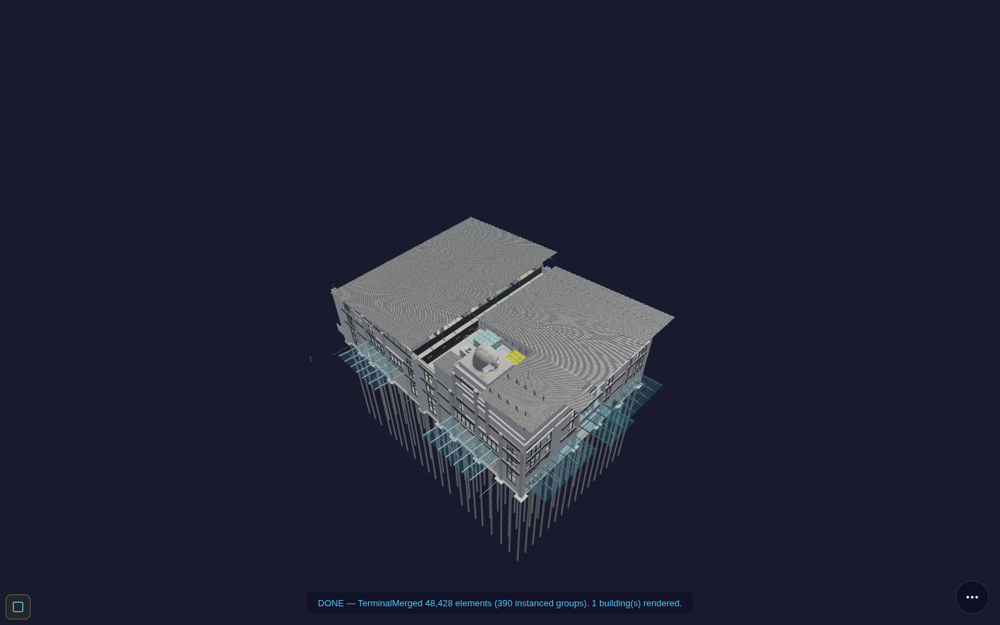
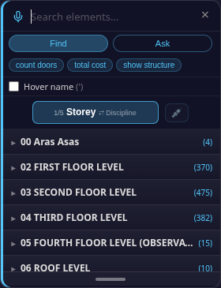
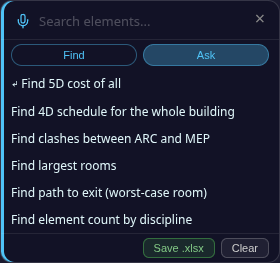
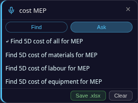
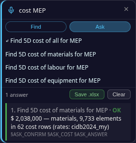
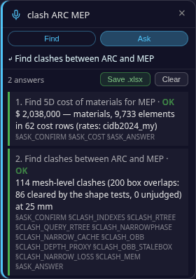
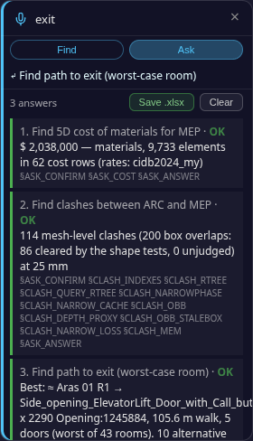
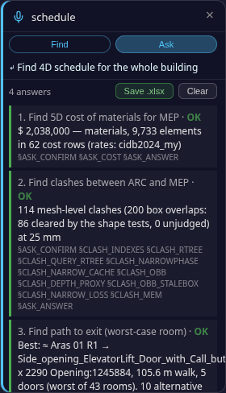

# Viewer Ask — First Steps (5 minutes, no experience needed)
*[← Back to the **BIM Viewer guide**](BIMUserGuide.md) · [Home](index.md)*

One small job, start to finish: **open a building, ask four questions, save the answers, hand them to
your own AI.** Use a desktop browser (Chrome or Edge). Every step below was run by a script against the
live site and the numbers quoted are what the app itself reported.

---

### Step 1 — Open Terminal

Go to the **[front door](https://red1oon.github.io/bim-ootb/)**, choose **Buildings / IFC**, and click
**Terminal**. Wait until the status line reads `DONE — TerminalMerged 48,428 elements`.

### Step 2 — Press F

The **Find** panel opens on the right.

### Step 3 — Click **Ask**

A list of questions appears. Greyed lines are not available for that building.

### Step 4 — Type `cost MEP`, click **Find 5D cost of materials for MEP**

The list narrows to four cost lines (all, materials, labour, equipment). Click *materials*. An answer card
appears: *2,038,000 — materials, 9,733 elements in 62 cost rows.*

### Step 5 — Type `clash ARC MEP`, click the line

A second card: *114 mesh-level clashes (200 box overlaps: 86 cleared by the shape tests).*

### Step 6 — Type `exit`, click **Find path to exit (worst-case room)**

A third card: the best route (*105.6 m walk, 5 doors*) and *10 alternative exits*.

### Step 7 — Type `schedule`, click **Find 4D schedule for the whole building**

Wait for it. A fourth card: *48,428 elements, 122 days, 9 trades, labour cost 1,721,750.*

### Step 8 — Click **Save .xlsx**

One file downloads (*BIM_OOTB_TerminalMerged_Answers_….xlsx*, about 30 KB), one row per answer.

### Step 9 — Give the file to your own AI

Attach the file to ChatGPT, Claude, Gemini, or any AI you use, and paste the prompt from the file's first
rows: *"Answer only from this workbook. For every number you state, cite the Evidence tag and the Engine
column of the row it came from. If a row says INCONCLUSIVE, say the data is missing — do not estimate."*

**That is the whole loop:** open → Ask → pick a line → Save → your AI. Everything else is in the
[BIM Viewer guide](BIMUserGuide.md#find-panel-search-voice-query-and-axis-lenses).
