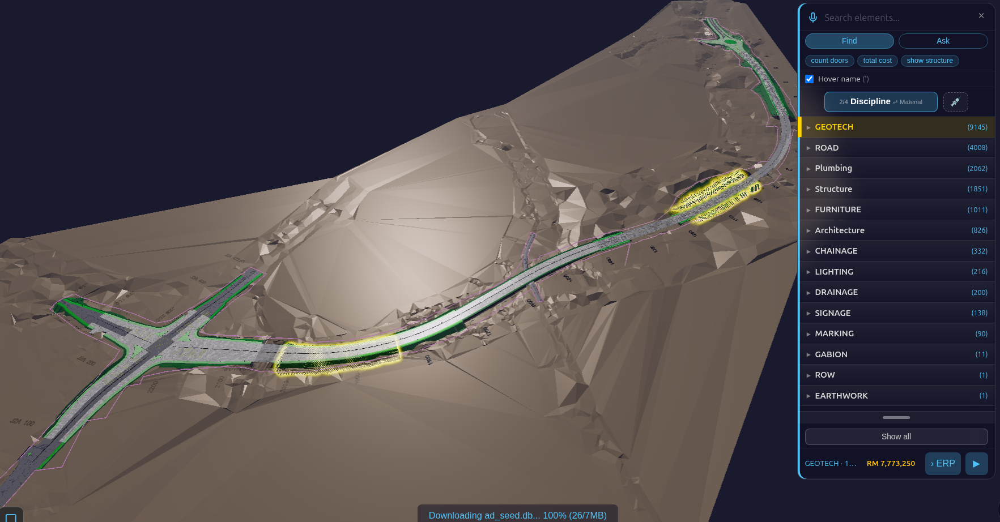
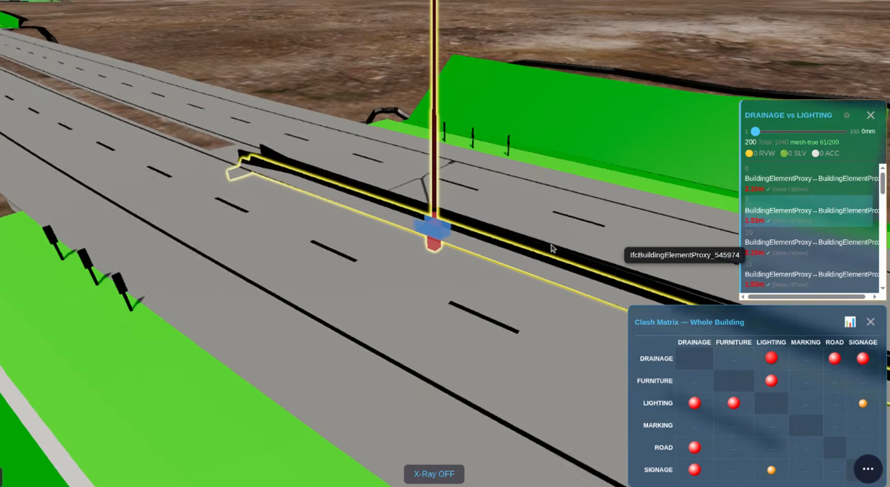
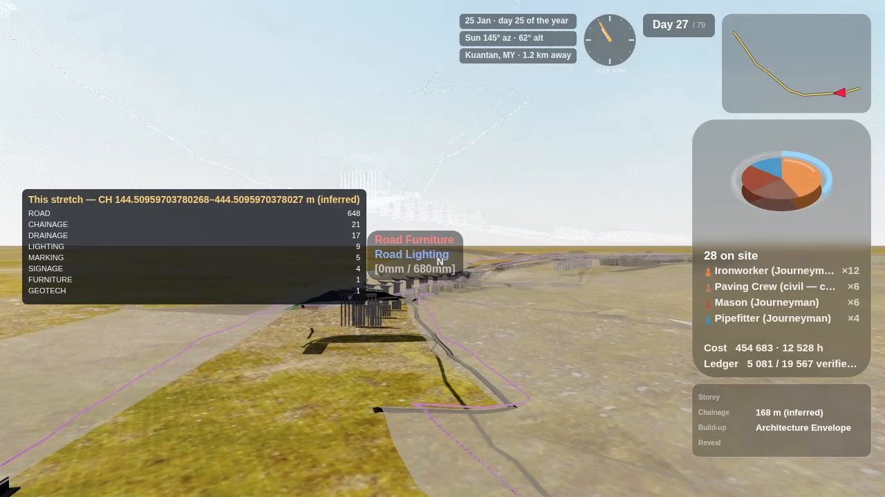
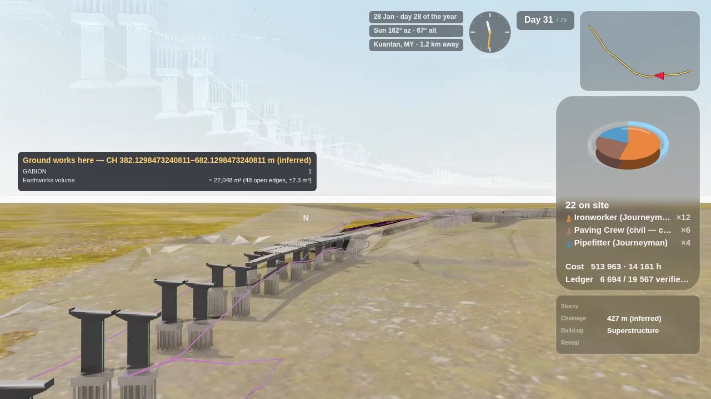
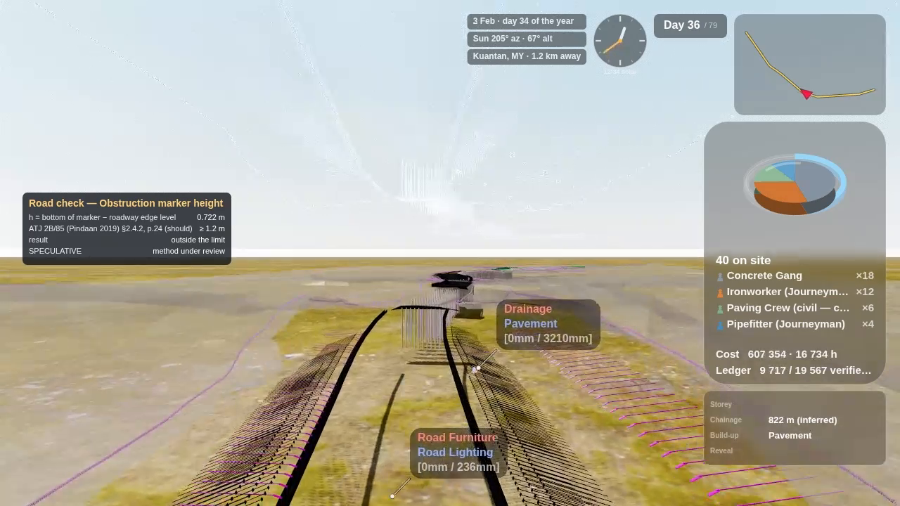
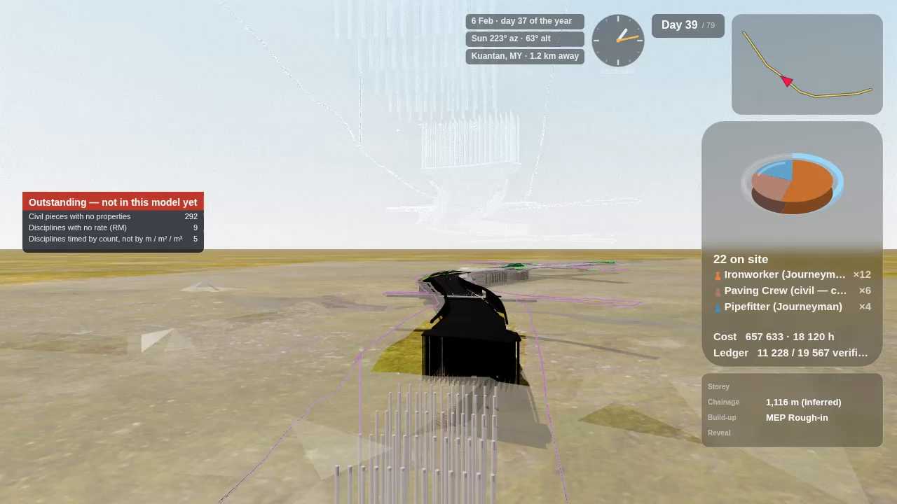
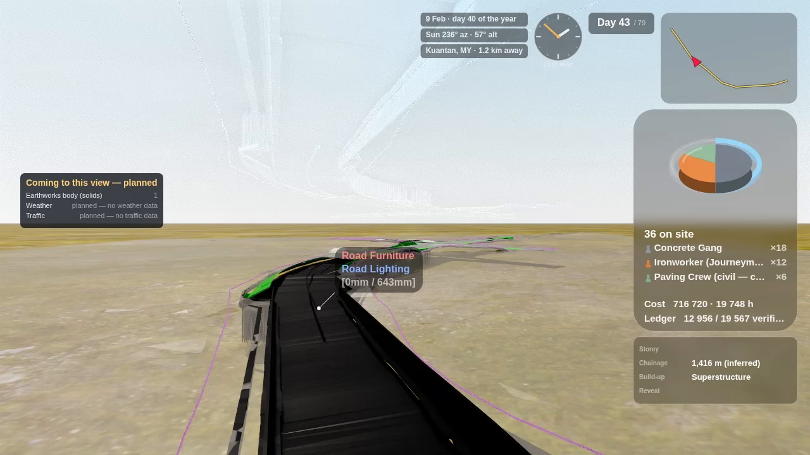

# Civil Works — Step by Step (road models)
*[← Back to the **BIM Viewer User Guide**](BIMUserGuide.md) · [User Guide](USER_GUIDE.md) · [Home](index.md)*

This page shows what the Viewer adds **only when the model is a road (civil works)**: the extra
counts, costs, clashes, volumes, sections and the road check report you can take out of a set of
road IFC files. Everything else (navigation, Find, X-Ray, the 4D Time Machine) works as in the
[BIM Viewer User Guide](BIMUserGuide.md). The Alt+C film and the ERP push are left out here; they have
their own pages.

!!! privacy "🔒 Your data stays in your browser"
    There is no AI and no LLM in this app. The IFC files are read in your own browser and turned into
    one SQLite file on your own device; nothing is uploaded to us. The full wording is in the
    [User Guide](USER_GUIDE.md).

> **How this page was checked.** Each number below was read back from the app's own log lines or from
> the model file, on the sample road set described in *Before you start*, on 6–7 October 2026. The tests
> that drive these steps are named in each step (test file names in `viewer/tests/`). Where a
> result is an estimate or a check is not proven, this page says so in a **Not yet** box. The screenshots
> are illustrations from the same runs; they are not the evidence, the logged values are.

---

## Words you will meet

| Term | What it means here |
|---|---|
| **Civil model** | A model that carries at least one civil discipline (ROAD, DRAINAGE, LIGHTING, SIGNAGE, MARKING, FURNITURE, EARTHWORK, GEOTECH, GABION). The Viewer switches on the civil features only then. A building never takes these paths. |
| **Discipline** | Which trade a piece belongs to. For a road set it comes from the **file name** of each IFC (for example `…_DRAINAGE.ifc`). |
| **Chainage** | Distance along the road, in metres. The Viewer **infers** the road's centre line from the road pieces and measures along it, so every chainage on screen is marked *(inferred)*. |
| **Mesh-true clash** | Two pieces whose actual surfaces overlap — not just their bounding boxes. Box overlaps are many; real clashes are few. |
| **Long section** | The road's profile along its length: road level, ground level and drain levels against chainage. |
| **Cross section** | A thin slice square to the road at one chainage, showing what is cut there. |
| **Speculative** | A check whose rule or input is not proven yet. The report shows these rows, marked, instead of hiding them. |

---

## Before you start

- **Desktop browser, real GPU recommended.** The sample road set is large: 19,892 pieces in one 421 MB
  file. A laptop with a separate graphics card handles it.
- **The sample set.** 15 IFC files, 970 MB: 11 road files from Civil 3D (IFC2X3) and 4 bridge files
  from Revit (IFC4X3). They load into **one** model.
- **Your own road set works the same way** as long as each file name names its discipline. A file
  without a discipline in its name is read as a building file.

---

## Part A — Open the road and see what it holds

### Step 1 · Load the road files as one model
Open the Viewer, choose **Open** and pick all the road IFC files at once (or open an already-saved road
`.db`). Wait until the status bar reads **DONE** — the civil features need the whole model streamed in.
The Viewer logs `§CIVIL_MODEL civilRows=14820 → true` for the sample set: that line is the switch that
turns the civil steps below on.

### Step 2 · Count the pieces per discipline (Find → Discipline)
1. Open the **Navigate** drawer → **Find / Navigate** (keyboard **F**).
2. Tap the **Storey / Discipline** toggle until it reads **Discipline**.
3. The tree lists every discipline with its piece count. Tap one to light its pieces in the model;
   **Ctrl-tap** to add more.

Sample set: GEOTECH 9,145 · ROAD 4,008 · FURNITURE 1,011 · LIGHTING 216 · DRAINAGE 200 · SIGNAGE 138 ·
MARKING 90 · GABION 11 · EARTHWORK 1 — plus the bridge's own disciplines (PLB 2,062 · STR 1,851 · ARC 826)
and the setting-out references (CHAINAGE 332 labels, ROW 1), which are never priced.

### Step 3 · Read the cost of what you selected
The bottom of the Find panel shows the selected pieces' cost. A civil discipline is priced **per piece
by discipline** from the civil rate table, so it is never priced as a building element.

| Discipline | Rate | Source |
|---|---|---|
| SIGNAGE | RM 800 per sign | Selangor road-furniture tender 2023, lowest sign line (RM 800–870); includes face, post, base and labour. *Regional, not national.* |
| LIGHTING | RM 485 each | CIDB Malaysia 2024 price pack, *LED light fixture* — a building item standing in for a road lantern. |
| all others | *rate not set* | No free source prices them per piece yet. |

Sample set: SIGNAGE selected → 138 × RM 800 = **RM 110,400** (`§FIND_COST elements=138 cost=110400`).

!!! note "Not yet"
    The rates are editable starting points, not a bill of quantities. A model piece may not be one whole
    sign or lamp. The Find bar still shows the currency sign **$** for these ringgit amounts — a display
    label not yet switched to RM.

---

## Part B — Checks between the trades

### Step 4 · Find the real clashes between ground works and drains
1. Open the **Inspect** drawer → **Clash Matrix** (keyboard **C**).
2. The **Clash Matrix** shows each pair of disciplines; a red dot is a pair with clashes. Tap a dot to
   list that pair's clashes.

Sample set, GEOTECH × DRAINAGE (two teams, two files): **11 mesh-true clashes** out of 30,529 box
overlaps (`§CLASH_NARROWPHASE broad=30529 meshTrue=11`) — 6 horizontal drains against a roadside drain,
5 retaining-wall pieces against drains. Quote 11, never 30,529. Test: `viewer/tests/witness_clash_geotech_drainage.js` (10/10).

This is the clash an authoring tool cannot show: the two trades come from different files and
different vendors.

---

## Part C — Quantities

### Step 5 · Earthworks volume
1. Open the **Inspect** drawer → **4D / 5D** (keyboard **4**). The 4D/5D page opens in a new tab.
2. Find the **EARTHWORK** row: it carries the volume line.

Sample set: **≈ 22,048 m³ (48 open edges, ±2.3 m³)** (`§EARTHWORKS_VOLUME verdict=APPROXIMATE
V_m3=22048.191 B_m3=2.256`). The earthworks surface in the file is not fully closed (48 open edges), so the
Viewer gives the volume **with its error bound**, measured each time, instead of a bare number. A closed
solid gets an exact figure; a surface too open to bound gets no number at all. Test: `viewer/tests/witness_ew_volume_surfaces.js` (11 pass, 0 fail).

---

## Part D — Long and cross sections

### Step 6 · Open the section tool
Open the **Inspect** drawer → **Section Cut** (keyboard **X**). On a road model its panel shows two extra
buttons after **X / Y / Z**: **Cross** and **Long**. They appear only on a civil model.

### Step 7 · Long section — the road profile
Tap **Long**. The road's profile along its length appears: road level (blue), ground level (brown) and
drain levels (red) against chainage. Drag the slider (or click on the profile) to move along the road;
the camera follows to that chainage.

### Step 8 · Cross section — a slice at one chainage
Tap **Cross**. A 2 m slice is cut square to the road at the slider's chainage; drag the slider to slide
it along the road. Each position logs what is cut, by discipline. Sample set:

| Chainage | Pieces cut | Mostly |
|---|---|---|
| 900 m | 131 | ROAD 62, GEOTECH 53, DRAINAGE 10 |
| 1,000 m | 157 | GEOTECH 69, ROAD 67, DRAINAGE 14 |
| 1,100 m | 38 | STR 18 (the bridge), ROAD 6 |

(`§CROSS_SECTION … normal·tangent=1.000000 slabM=2 elementsCut=…`). Test: `viewer/tests/witness_civil_sections.js` — the cut set
matches an independent recompute from the raw geometry at every slider position checked (0 differences).

!!! note "Not yet"
    Chainage is **inferred** from the road pieces (the files carry no alignment), so it is good for
    finding your way, not for setting out. A round **profile lens** over the 3D view, with a **Profile PDF**
    of the whole road, is in review and not live yet.

---

## Part E — The road check report

### Step 9 · Open Model Check
On the **4D/5D** page of a road model, the button that reads **MEP** on a building reads
**✅ Model Check**. Tap it: the road check report opens in a new tab.

It lists every check row with its result and a tag: **valid** (rule and inputs proven) or
**speculative** (shown, not hidden). Sample set: **302 rows — 20 valid, 282 speculative**
(`§MC_REPORT rows=302 valid=20 speculative=282`). The one road check proven so far is stud spacing:
1.00 m in 20 groups. The report also carries a **Quantities** card with the earthworks volume from Step 5.

!!! note "Not yet"
    Most road checks are speculative: the sign-height rule reads below ground (−6.02 m) and lateral
    clearance reads 0.00 m on all 138 signs — the inputs in the files do not support those rules yet.
    The report says so instead of passing them.

---

## What the film shows of the same data (Alt+C)

You do not need the film to get any report above. If you make one (see the
[BIM Viewer User Guide → Cinema Film-Maker](BIMUserGuide.md#cinema-film-maker-alt-c-the-bim-ootb-film-maker)),
a road model adds five info panels along the drive. They read the same values as Parts A–E:

!!! note "Not yet"
    The chainage range on panels 1 and 2 prints raw decimals (e.g. *CH 144.50959703780268–444.50959703780268 m*);
    it should round to whole metres.

---

## Troubleshooting

| You see | Why | Do |
|---|---|---|
| No **Cross / Long** buttons, no **Model Check** | The model has no civil discipline (file names carry none), or it is still streaming. | Wait for **DONE**; check Find → Discipline shows ROAD, DRAINAGE, … |
| Cost shows *rate not set* | That discipline has no per-piece rate yet. | Edit the rate in the 4D/5D rates panel. |
| Earthworks line shows no number | The surface is too open to bound the volume. | Ask for a closed earthworks solid in the export. |
