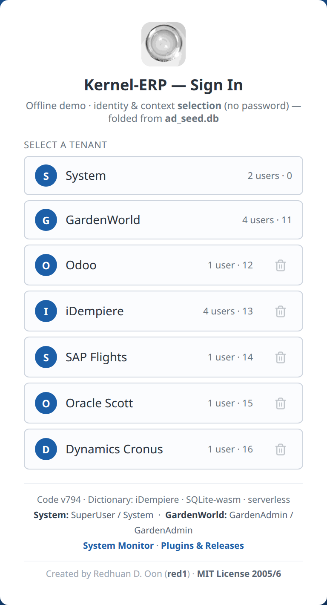
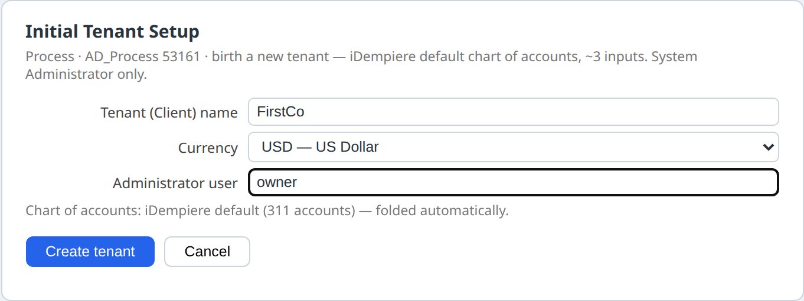
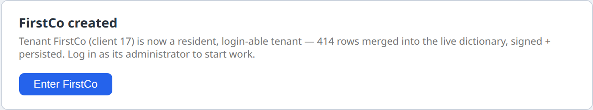
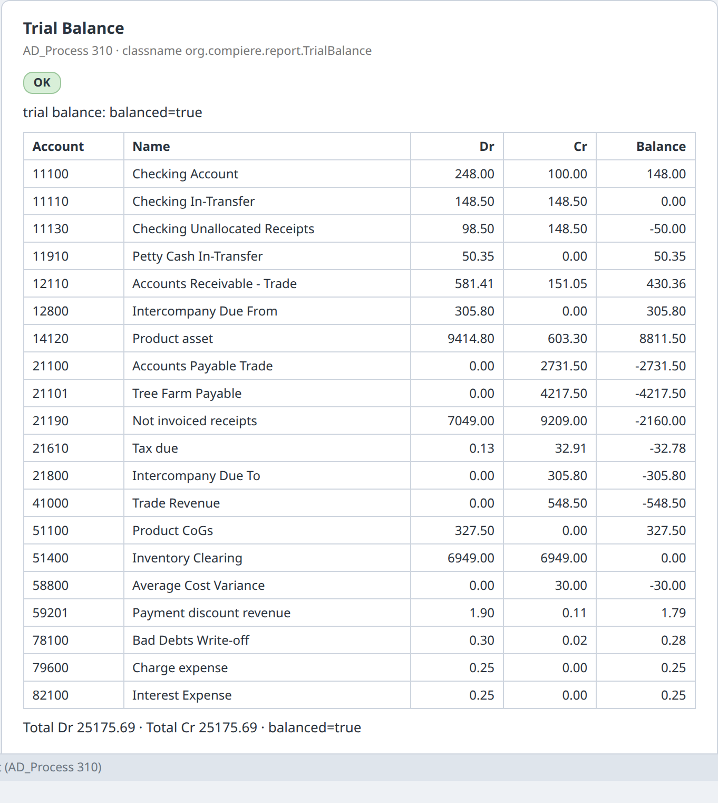

# Kernel-ERP — Your First Setup (a new company, from scratch)
*[← Back to the **User Guide**](USER_GUIDE.md) · [Kernel-ERP User Guide](ERPUserGuide.md) · [Home](index.md)*

This page walks a first-time user through setting up a **new company** in the in-browser ERP, in the
order an Odoo or iDempiere user would expect: open the app, create the company, add customers, vendors
and products, enter a first sales order and purchase order, and look at the books.

!!! privacy "🔒 Your data stays in your browser"
    There is no AI and no LLM in this app. Everything you type stays in your own browser's storage
    (IndexedDB) on your own device; nothing is uploaded to us. A few optional features that you start
    yourself (share links, QR codes, the update check) call a public service and send it only what that
    feature needs, never your data. The full wording is in the [User Guide](USER_GUIDE.md).

> **How this page was checked.** Every step below was carried out by an automated test that drives the
> real app in a browser and reads back the values it produced: record counts, field values, status text
> and the app's own log lines. It is called **W-ERP-FIRST-SETUP**. The numbers quoted here come from its
> run of **3 October 2026** on the live build (v808). Where a step does not work yet, this page says so in a **Not yet** box rather
> than describing a workaround as if it were the product. In that run every step worked. The screenshots are illustrations captured
> from the same kind of run. They are not the evidence; the logged values are.

---

## Words you will meet

| Term | What it means here | Odoo calls it | iDempiere calls it |
|---|---|---|---|
| **Tenant** | One company's complete, separate set of books and data. | Company / database | Tenant (formerly *Client*) |
| **Organization** | A branch or legal unit inside a tenant. `*` means "shared by all organizations". | Branch / company in a multi-company setup | Organization |
| **Role** | What a user may see and do. The menu you see is cut down to your role's windows. | Access rights / groups | Role |
| **Business Partner (BP)** | Anyone you trade with. The same record can be a customer, a vendor, or both. | Contact | Business Partner |
| **Document type** | The kind of document, for example *Standard Order* or *Purchase Order*. It decides numbering and what happens when the document is completed. | Journal / operation type | Document Type |
| **Complete** | The action that turns a draft document into a finished one (status `DR` → `CO`). | Confirm / Validate | DocAction *Complete* |
| **Posting** | The journal entries (debits and credits) that a completed document writes to the ledger. | Journal items | Accounting facts (`Fact_Acct`) |
| **Chart of accounts** | The list of ledger accounts. | Chart of accounts | Account Element |
| **Accounting schema** | Which currency and rules the books are kept in. A tenant can keep more than one set. | Fiscal localization / currency | Accounting Schema |
| **Signed op-log** | Every change is saved as a signed, chained entry, so it can be checked and replayed. | — | — (this ERP's own) |

---

## Before you start

- **Desktop browser recommended.** Chrome, Edge or Firefox on a laptop or desktop.
- **⚠ First open downloads about 26 MB.** The first time you open the ERP it fetches its data file,
  `ad_seed.db` (**27,193,344 bytes, about 25.9 MiB**, measured). The file holds the full iDempiere
  dictionary and the demo companies. After that it is cached in your browser, so later visits start
  from the cache. On a metered connection, open it on Wi-Fi.
- **There is no password.** The sign-in card says so: *"identity & context selection (no password)"*.
  You choose who you are working as. This is a single-user, in-browser app. It is not a shared server
  with accounts.

**Open the ERP:** [red1oon.github.io/bim-ootb/erp/idempiere.html](https://red1oon.github.io/bim-ootb/erp/idempiere.html)
(you can also reach it from the [front door](https://red1oon.github.io/bim-ootb/) by choosing the ERP door).

---

## Part A — Create your company

### Step 1 · Open the app and look at the sign-in card

The card lists every **tenant** already installed. In the measured run there were **7**: *System*,
*GardenWorld* (iDempiere's classic demo company), and five companies migrated from other ERPs (*Odoo*,
*iDempiere*, *SAP Flights*, *Oracle Scott*, *Dynamics Cronus*).

Signing in has three steps: **tenant → user → role and organization**. This is the same as iDempiere's
login. *(Verified: tenants=7; the third step shows ROLE, CLIENT and ORGANISATION.)*

### Step 2 · Sign in as the System Administrator

A new company is created by the system administrator, as it is in iDempiere.

1. Tap **System** (the tenant).
2. Tap **System** (the user).
3. Leave the role as **System Administrator** and tap **Log In ›**.

### Step 3 · Run *Initial Tenant Setup*

1. In the menu on the left, open the folders and click **Initial Tenant Setup**. (This is iDempiere's
   *Initial Client Setup*, process 53161.)
2. Fill in the fields:
    - **Tenant (Client) name**, for example `FirstCo`;
    - **Currency**: any active currency in the list (163 of them; **USD** is preselected);
    - **Country**: the country of your company's address (249 countries; **United States** is preselected,
      as iDempiere's setup does for an English login);
    - **Administrator user**, for example `owner`;
    - **Chart of accounts**: *iDempiere default (311 accounts)*, or *Load your own file* (see below).
3. Click **Create tenant**.

The new company is created and installed in your browser. In the measured run it became **client 17**,
with **530 rows** written and saved. The setup wrote the company, its HQ organization (with an address
in the country you chose), an administrator and a user role, a calendar for the current year with **12
monthly periods**, the full **311-account** iDempiere default chart of accounts, an accounting schema with
its default and GL accounts, iDempiere's **42 standard document types** with their **12 GL categories**
and number sequences, one warehouse with a locator and an address, a price list (*Standard*, valid from
today) in which the sample product costs **1.00**, a business partner group, one sample business partner
*Standard BP* with an address, a tax category (*Sales Tax* for the United States, *Standard* otherwise)
with one tax rate, one sample product in that category, the **Immediate** payment term and one sample
sales invoice. Everything is in the currency you chose.

4. Click **Enter FirstCo**. The sign-in card now lists your administrator (`owner`). Pick it and log in.
   The new administrator's menu holds **534** entries.

*(Verified on the live build, 3 October 2026, choosing **MYR**: client=17, rows=530, persisted=true,
C_ElementValue=311, C_DocType=42, 12 periods Jan-26 … Dec-26, the accounting schema and the price list in
MYR, one tax category used by the sample product, one payment term *Immediate*.)*

#### Loading your own chart of accounts

Choose **Chart of accounts → Load your own file** and pick a CSV file in iDempiere's own format (the
layout of iDempiere's `data/import/AccountingUS.csv`: Value, Name, Description, Type, Sign, Document,
Summary, **Default_Account**, …). As in iDempiere:

- only lines with a **Default_Account** key are read; the same account value on several lines is one
  account serving several keys;
- the file must define **every** default account the accounting schema needs (53 keys in this
  dictionary, for example `C_RECEIVABLE_ACCT`). If one is missing, nothing is created and the form says
  which, e.g. *"Account not defined: C_RECEIVABLE_ACCT"*.

*(Verified: a file holding the 53 lines of iDempiere's AccountingUS.csv that carry the 53 required keys
made a second company with **53 accounts**, each required key wired to the file's account (0 wrong); the
same file without its `C_RECEIVABLE_ACCT` line was refused with that message and created no company.)*

**Sales Order → New** in your own company offers its 7 sales document types (Standard Order, POS Order,
Prepay Order and the others). *(Verified: `targetDocTypeOptions=7`, none from another company.)*

---

## Part B — Set up your master data (customers, vendors, products)

Log in as your new administrator (`owner`). Each window below opens from the menu, or straight from a
link such as `idempiere.html?login=owner&window=123`.

### Step 4 · Create a customer

1. Open **Business Partner** (window 123) and click **New record** on the toolbar.
2. **Organization**: pick your company's HQ, or `*` to share the record across organizations.
3. **Search Key**: e.g. `C-001`. **Name**: e.g. `Acme Retail Sdn Bhd`.
4. **Business Partner Group**: pick **Standard**, the group the setup created for your company.
5. Tick **Customer** and click **Save** on the toolbar.

*(Verified: `§CRUD validate key=c_bpartner verb=create ok`, then `§CRUD-PERSIST`. The list went from 1
record (the sample partner the setup made) to 2. Each save is a signed entry in your browser and is still
there after a reload.)*

Your company's **HQ** is in the Organization list, and the records the setup created show in their own
windows: Price List, Calendar and Warehouse 1 record each, Business Partner 3 (the sample plus the two you
make). *(Verified on the live build since 2 October 2026: `inOrgPicker=true`,
`gridRecords={"PriceList":1,"Calendar":1,"Warehouse":1,"BPartner":3}`.)*

### Step 5 · Create a vendor

Same window and steps as Step 4, with **Vendor** ticked instead of Customer, e.g. `V-001`
`Kedai Bekalan Sdn Bhd`. *(Verified: `verb=create ok`, persisted. The list then shows each record once,
3 in all, the same as after a reload.)*

### Step 6 · Products, prices, tax and payment terms

- **Warehouse**: the setup made one, **HQ Warehouse**, with one locator. It shows in **Warehouse and
  Locators** (window 139). *(Verified: 1 record.)*
- **Product** (window 140) needs a **Tax Category**. The setup created one (*Sales Tax* for a United
  States company), and it is the only one offered in your company. *(Verified: 1 tax category, the sample
  product uses it.)*
- **Payment terms**: the setup created **Immediate** (0 days, the default), as iDempiere's setup does.
  *(Verified.)*

The drop-down lists on a new record show only **your own company's** records and shared `*` records, as
in iDempiere. *(Verified on the live build since 2 October 2026: in the new company's **Sales Order →
New**, the Business Partner list offers 3 entries, 0 from another company; before the fix it offered 45,
42 of them other companies'.)*

### Step 6a · Give your customer an address

A sales order needs the customer's address, as in iDempiere (without one the order is refused:
*BPartnerNoShipToAddress*).

1. In **Business Partner**, select your customer (e.g. `Acme Retail Sdn Bhd`) and open the **Location**
   tab. Click **New record**.
2. Next to **Address**, click **Address…**. Fill in **Address 1**, **City**, **Postal** and pick the
   **Country** (and the **Region** if the country uses regions). Click **OK**. The address is saved at
   once, as iDempiere's address dialog does.
3. Click **Save**. The location is named after the city.

*(Verified: before the address, a sales order for this customer was refused; the address saved as typed
— Jalan Ampang 1, Kuala Lumpur, 50450, Malaysia; the location got the name `Kuala Lumpur`; afterwards
the order header saved with that location filled in.)*

### Step 6b · A first sales order in your own company

iDempiere's setup makes the price list **Standard** a *purchase* price list. Make it usable for sales
once:

1. Open **Price List** (window 146), select **Standard**, tick **Sales Price list** and **Save**.
2. Open **Sales Order** (window 143), **New record**. The **Price List** is already *Standard* (your
   company's default). **Business Partner**: *Standard BP*; **Target Document Type**: *Standard
   Order*. **Save**.
3. On **Order Line**, **New record**, **Product**: *Standard Product*, **Quantity** `2`. The price
   (**1.00**), the UOM (*Each*) and the tax fill in. **Save**, then go back to the order and **Complete**.

*(Verified on the live build, 3 October 2026: price 1, UOM 100 and the company's own tax, each equal to an
independent lookup; priced from your company's own price list; Complete → `to=CO verifyChain=ok`.)*

---

## Part C — A sales order in the demo company

The demo company **GardenWorld** has many products, prices and partners, so the rest of this walk-through
uses it. Sign in as **GardenAdmin**, or open `idempiere.html?login=GardenAdmin&window=143`.

### Step 7 · Enter the order header

1. Open **Sales Order** (window 143) and click **New record**.
2. **Business Partner**: e.g. *Joe Block*. Choosing it fills **Invoice Partner** and **Price List**
   automatically (`CalloutOrder.bPartner`, logged).
3. **Target Document Type**: **Standard Order**.
4. Click **Save**. *(Verified: `§CRUD validate key=c_order verb=create ok`.)*

### Step 8 · Add a line

1. Open the **Order Line** tab and click **New record**. You do not have to click **Save** on the header first: as in
   iDempiere, moving to another tab saves the record you were typing. If a required field is still empty, the header is
   not saved and you stay on it, with the field marked. The **Order Line** tab only ever lists the lines of the order you
   are on, including lines added during this session to other orders.
   *(Verified 4 October 2026: an order typed and left unsaved is saved when the Line tab is clicked
   (`§GT-NAV autosave … verdict=saved`). The second order's Line tab shows 0 rows before its line is added and 1 row
   after, and that row belongs to this order, even though an earlier order got a line in the same session.)*
2. **Product**: e.g. *Oak Tree*. Choosing it fills the **Price** from the order's price list (`61.75`),
   the **UOM** (*Each*) and the **Tax** (*Standard*), as iDempiere does. **Quantity**: `2`.
   Line Net Amount becomes **123.50**.
   *(Verified on the live build since 2 October 2026: price 61.75, UOM 100, tax 104, each equal to an
   independent lookup of the price list, product and tax rules. A product with no price in that price
   list fills no price, rather than a guessed one.)*
4. Click **Save**. *(Verified: `§CRUD validate key=c_orderline verb=create ok`.)*

### Step 9 · Complete the order

1. Go back to the **Order** tab. Your order is still the selected record, so there is nothing to look up in the list.
2. The form shows the actions that are allowed now: **Complete · Prepare · Void**. Click **Complete**.

The status becomes **Completed (CO)**. The change is stored as a signed entry, and the chain check
passes (`§CRUD process committed … to=CO verifyChain=ok`). **Reload the page and it is still CO.**
*(Verified: after a reload, the order's status reads CO.)*

**What Complete creates depends on the document type, exactly as in iDempiere.** A **Standard Order**
creates nothing else on Complete: its shipment and invoice come later (iDempiere's *Generate Shipments* /
*Generate Invoices*). A **POS Order**, **Warehouse Order** or **Credit Order** creates its shipment on Complete,
and a POS or Credit Order also its invoice. *(Verified on the live build since 2 October 2026, on orders
typed in the session: Standard Order → 0 new documents; POS Order with one line → a shipment and an
invoice, each with one line, signed in the same step.)*

Those documents are full documents you can open (**Shipment (Customer)**, **Invoice (Customer)**): customer,
document type, lines, prices and totals are copied from the order. They are then **posted** to the books,
the way iDempiere's accounting processor posts completed documents: the invoice debits *Accounts
Receivable* and credits *Revenue* (and *Tax Due* when there is tax); the shipment debits *Cost of Goods
Sold* and credits *Product Asset* at the product's current average cost. *(Verified on the live build, 3
October 2026: POS Order, 1 × Oak Tree at 61.75 → invoice total 61.75, journal DR 61.75 / CR 61.75 on the
Receivable and Revenue accounts; shipment journal DR 51.45 / CR 51.45 on COGS and Asset, 51.45 being the
product's average cost in iDempiere; each account equal to an independent lookup; both marked Posted.)*

---

## Part D — Your first purchase order (demo company)

Same steps as Part C, in **Purchase Order** (window 181): vendor e.g. *Tree Farm Inc.*, document type
**Purchase Order**, line tab **PO Line** (e.g. *Elm Tree* × 5 at 40.00), then **Complete**.
*(Verified: header and line saved, `to=CO verifyChain=ok`.)* Like a Standard Order, a standard Purchase
Order creates no receipt or vendor invoice on Complete (verified: 0 new documents); the receipt is entered
separately.

---

## Part E — Look at the books

### Step 10 · See the journal a document posts

Open **Sales Invoice** (window 167) in GardenWorld. On a record, click the **Posted** button (the
book icon in the *Posted* column). It opens the journal that the invoice posts, or would post if it is
not posted yet. *(Verified on invoice 109: `§PREVIEW-LIVE … coverage=complete balanced=true`.)*

### Step 11 · Run the Trial Balance

1. Open the **Trial Balance** report from the menu (or `idempiere.html?login=GardenAdmin&process=310`).
2. **Accounting Schema** is required. Pick it from the list, which shows your company's schemas only:
   choose **GardenWorld US/A/US Dollar** (id 101, GardenWorld's
   US-dollar schema). Leave the other fields empty.
3. Click **Run**.

The report shows **your company's** postings in **the schema you picked** only. *(Verified on the live
build since 2 October 2026: the list offers GardenWorld's 2 schemas and none of another company's;
GardenWorld, schema 101 → **20 accounts, debits = credits = 25,175.69**,
equal to an independent sum over the same postings.)*

### Step 11b · Aging: who owes you, and since when

1. Open **Aging** from the menu (or `idempiere.html?login=GardenAdmin&process=238`).
2. Leave **Sales Transaction** = Y for customers (N for vendors). **Statement Date** empty means today.
3. Click **Run**. The report lists, per customer and currency, the open amount split into *not yet due*
   and *past due 1-7 / 8-30 / 31-60 / 61-90 / 91+ days*, with a total per currency.

*(Verified on the live build, 3 October 2026, GardenWorld: today, 389.97 open, all past due 91+ days;
with Statement Date 2003-11-15, 114.42 not yet due, 114.43 past due 8-30 days and 161.12 past due 91+
days — each equal to an independent calculation over the open invoices, and the open items are the same
as iDempiere's own `RV_OpenItem` view lists for the same data. Aging with *Account Date* or with
currency conversion is not offered yet; the form says so if you set them.)*

---

## Part F — Bring data in, keep it safe

### Step 12 · Bring your existing ERP data in

Open **Help → Run it yourself (DIY)**. It offers small download bundles ("agents") for **Odoo,
iDempiere, SAP, Oracle and Dynamics**. You run an agent on the machine that holds your ERP. It writes
one file, which you then load back into this ERP. The bundle's README has the exact commands.
*(Verified: the DIY tab lists odoo_agent.zip and the five systems.)*

#### Import business partners from a spreadsheet (iDempiere's import loader)

1. Save your list as CSV. With iDempiere's sample format **Example BPartner** the columns are: Key (used as
   Search Key and Name), Contact Name, Street, City, State, Zip, Phone; the country is fixed to US by the
   format.
2. Open **Import File Loader** from the menu, pick the format **Example BPartner**, choose your file, check
   the preview and click **Save**. The rows land in **Import Business Partner** (window 172).
3. Run **Import Business Partners** (process 194) with your company as **Tenant**. Each row becomes a
   business partner with its address and contact; rows with a problem stay in window 172 with the reason.

*(Verified on the live build, 3 October 2026: a 3-line CSV (one name containing a comma) → 3 rows loaded →
3 business partners, 3 addresses, 3 contacts, 0 errors, each equal to the CSV; running the import again
imports nothing.)*

### Step 13 · Where your work is kept, and backups

- Everything you save is kept in **this browser's** storage. It is still there after a reload
  (verified in Step 9). It does **not** follow you to another browser or device.
- Clearing your browser's site data for the app **deletes it**.

**Back up:** open **Help → Run it yourself (DIY)** and click **Backup (signed)**. You get a file
(`erp-backup-….json`) that holds every change you saved, signed with your browser's key. Keep it
somewhere safe.

**Restore:** same place, **Restore…**, choose the file, confirm. The file is checked first: if anything in
it was changed, it is refused and nothing is replaced. Otherwise your work comes back, and stays after a
reload.

*(Verified on the live build, 3 October 2026: backup of 47 saved changes → browser storage wiped (0) → a
copy with one change altered was refused → the real file restored all 47, the same chain tip and the same
business partners, also after a reload.)*

---

## The whole checklist at a glance

| # | Step | Today |
|---|---|---|
| 1 | Open the app (26 MB first download) | ✅ |
| 2 | Tenant → user → role/organization sign-in | ✅ |
| 3 | Create a new company (Initial Tenant Setup) | ✅ |
| 4 | Choose the company currency | ✅ 163 currencies |
| 5 | Default chart of accounts (311 accounts) | ✅ |
| 5b | Your own chart of accounts from a file | ✅ |
| 6 | Current-year calendar with 12 periods | ✅ |
| 7 | Document types for orders, shipments, invoices, payments | ✅ 42 types |
| 8 | Your HQ is offered on new records | ✅ |
| 9 | Setup records visible in their own windows | ✅ |
| 10–11 | Create a customer and a vendor | ✅ |
| 10b | Customer address (Location editor); order for that customer | ✅ |
| 11b | List shows each new record once | ✅ |
| 12 | Product with your own tax category | ✅ |
| 13 | Payment terms | ✅ Immediate |
| 14 | Lists show only your company's records | ✅ |
| 15 | Sales order document types in your new company | ✅ 7 offered |
| 15b | Sales order in your new company: line prices, Complete | ✅ |
| 16 | Sales order header (demo company) | ✅ |
| 17 | Product fills price / UOM / tax | ✅ |
| 18 | Order line saves | ✅ |
| 19 | Complete the order | ✅ signed |
| 20 | Complete creates shipment / invoice (by document type) | ✅ |
| 20b | Those documents are readable and posted (journal) | ✅ |
| 21 | Completed order survives reload | ✅ |
| 22 | Purchase order, entered and completed | ✅ |
| 23 | See a document's journal (Posted button) | ✅ |
| 24 | Trial Balance correct for my company and schema | ✅ |
| 24b | Schema chosen from a list | ✅ |
| 24c | Aging report | ✅ |
| 25 | Bring data in (DIY agents) | ✅ |
| 25b | Spreadsheet import (Import File Loader → Import Business Partner) | ✅ |
| 26 | Backup / restore on this page | ✅ |

**Count from the measured run on the live build (3 October 2026, build v808): 34 working, 0 not yet, 0
inconclusive, 0 page errors.** Steps 16–24c were measured in the demo company GardenWorld; steps 3–15b
in the new company.

---

## Where the gaps are tracked

Every *Not yet* this page used to carry was written up as a product item with its evidence, a specified fix
and the test that proves it, and is now closed (`prompts/ERP_FIRST_SETUP_GUIDE.md §FS2j–§FS2p, §FS3.3`, in
the project repository). The limits that remain are named where they apply (Aging with Account Date or
currency conversion; the iDempiere import-loader formats beyond the ones in the dictionary). The step-by-step checklist with the Odoo and iDempiere references for each step is
in `prompts/ERP_FIRST_SETUP_GUIDE.md`.

**For developers: re-run the check yourself.** From a bim-ootb checkout, run
`cd erp && node tests/poc_erp_first_setup_live.js`, then read `tests/poc_erp_first_setup_live.log`.
It prints one `§FIRST-SETUP` line per step and ends in PASS only if every step still matches the
checklist, so a fixed gap and a broken step both show up.

---

*Odoo and iDempiere references used for the "what you would expect" column: Odoo 17 documentation
([companies](https://www.odoo.com/documentation/17.0/applications/general/companies.html),
[chart of accounts](https://www.odoo.com/documentation/17.0/applications/finance/accounting/get_started/chart_of_accounts.html),
[payment terms](https://www.odoo.com/documentation/17.0/applications/finance/accounting/customer_invoices/payment_terms.html),
[import/export](https://www.odoo.com/documentation/17.0/applications/general/export_import_data.html));
iDempiere wiki ([Initial Client Setup](https://wiki.idempiere.org/en/Initial_Client_Setup_(Process_ID-53161)),
[Sales Order](https://wiki.idempiere.org/en/Sales_Order_(Window_ID-143)),
[Business Partner](https://wiki.idempiere.org/en/Business_Partner_(Window_ID-123)),
[Trial Balance](https://wiki.idempiere.org/en/Trial_Balance_(Report_ID-310))).*
