# HR_BIM_Asset — HR / Tenancy / Operate Module  *(ALPHA)*

> **⚠ DEMONSTRATOR — NOT OFFICIAL.** Every screen and every generated output (payslip, invoice, report, export,
> print) carries the **`CONTOH — TIDAK RASMI` / `SAMPLE — NOT OFFICIAL`** watermark. Demo values only — this is a
> demonstrator and a policy counter-proposal, **not** a certified/compliant production system.

**HR_BIM_Asset turns a finished building into its operate-phase (7D) cockpit.** Open any building in the Viewer
and a single toolbar pill lets you ask operational questions *on the geometry itself* — which units are occupied,
who is physically present, what equipment is due for service — each answered by a colour wash over the real rooms.

> **One model · a few lenses, each answering exactly one question · all off one signed op-log.**

This is a **task-oriented manual**. If you just want to *use* it, read **Getting started** and **Common tasks**.
If you want to know *how it works* (or you administer the data), read **Under the hood**.

---

## Getting started (about 5 minutes)

You need nothing but the Viewer and a building that carries some operate data (the **HHS office** sample does).

1. **Open the building.** In the Viewer, load a building (e.g. the *HHS Office* sample). Let the 3D model finish
   streaming in — the FM pill only lights once the model is FULLY streamed (a half-loaded model won't show a
   lens the tail of the stream hasn't carried in yet, so the pill deliberately waits).
2. **Reveal the toolbar.** On a fresh load the icon rail is tucked behind the **⋯** button (bottom-right) — tap
   it to unfold the full icon rail.
3. **Find the `FM / Operate` pill.** Look for the **building glyph** in the rail — it turns **blue** once tapped
   (see the screenshot below). It appears **only** when the building has operate data — if you don't see it,
   there's nothing to operate yet (see [Troubleshooting](#troubleshooting)).
4. **Open the drawer.** Tap the pill — it highlights blue and a small **FM / Operate** drawer opens listing the
   lenses. Lenses with data are bright and clickable; lenses with no data for *this* building are **greyed and
   marked "no data"**.

   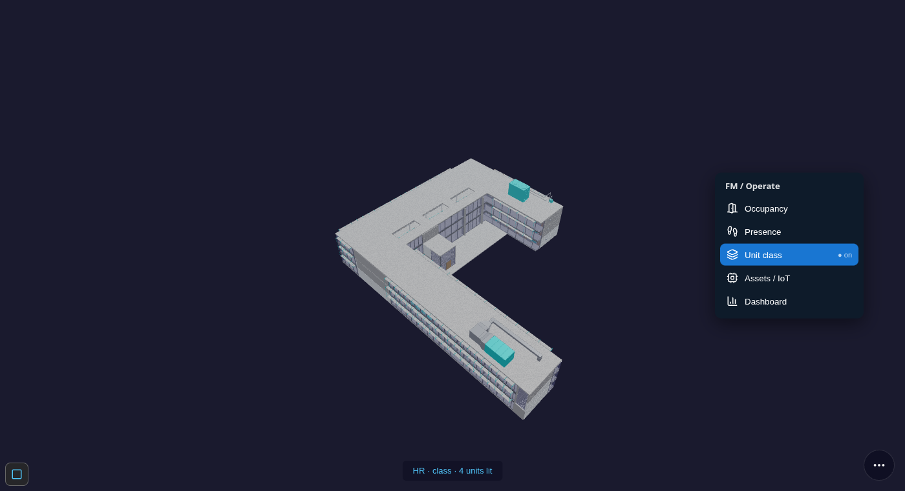

   *(The drawer has since grown to 8 entries — the 4 lenses above plus Tenancy / AD, Dashboard, Payslip, and
   Leave; see [The lenses at a glance](#the-lenses-at-a-glance-reference) for the full current list.)*

5. **Turn on a lens.** Tap **Occupancy**. Tapping a row applies the lens **and closes the drawer**; re-tap the
   pill to reopen it and see which lens is active (highlighted, "● on"). The status bar reads e.g.
   *“HR · occupancy · 11 units lit”* — that status line is the reliable readout of what's lit; on this sample
   building the bound elements are small real fixtures, so at a building-wide view the wash can be subtle — zoom
   toward a room to see an individual tinted element close up.

   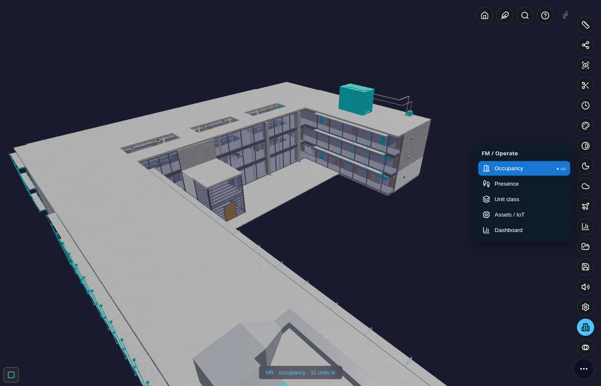

6. **Turn it off.** Tap the lens row again (or pick another). The model is restored **exactly** — overlays never
   leave residue and never disturb other panels.

That's the whole interaction model: **open → reveal toolbar → pill → drawer → toggle a lens**. Everything below
is variations on it.

---

## Common tasks

### See which rooms are occupied
1. Open the **FM / Operate** drawer → tap **Occupancy** (see the screenshot above).
2. Read the wash:

   | Colour | Meaning |
   |---|---|
   | 🟢 green | **occupied** — an active booking covers now |
   | 🟡 amber | **expiring** — the lease ends within the horizon |
   | ⚪ grey | **vacant** — *no* booking (vacancy is read from the absence of one, never a faked tenant) |
   | 🟣 purple | **unavailable** — a maintenance / renovation blackout |
3. The status bar tells you how many units lit (verified live: *"HR · occupancy · 11 units lit"* on the HHS
   sample). Toggle off to restore.

> **Where the colour actually lands.** A room (`IfcSpace`) usually isn't its own mesh — the lens tints its real
> rendered **contained members** instead (see [How a unit binds to the model](#under-the-hood--the-data-model)).
> On the HHS sample those members are small fixtures, so from a building-wide view the wash reads as a subtle
> tint; the **GardenWorld** warehouse below tints a whole aisle-floor at once and is the clearest example to look
> at first if you want to *see* the effect from a distance.

> **Tenancy is part of Occupancy.** An earlier alpha had a separate *Tenancy* lens; it's now folded in. Occupancy
> replays each room's signed booking log (`ASSIGN` / `RELEASE` / `UNAVAIL`), so it *is* the lease-status superset.

### See who is physically here right now — with people you can walk up to
1. Open the drawer → tap **Presence**. Zones tint by **live headcount density** (light → deep blue as more people
   are present).
2. **Zoom in.** Each present person becomes a **little avatar standing in the room** where their signed check-in
   put them. People cluster in a ring when several share a room — you're looking at the workforce *in situ*, not a
   number in a grid.

   

3. **Hover an avatar** → their card (name, room, since when, status), watermarked — exactly as captured above.
   **Draw nearer** and the nearest person auto-labels; **zoom out** and the avatars collapse back to **dots** — an
   automatic level-of-detail ladder (dot → mini → full) so a full floor never turns to soup. The screenshot above
   catches the ladder mid-transition: a full-figure cluster close to camera, mini-dome clusters further back.
4. Headcount comes from **signed check-ins** — a room with no check-in has no avatar (never a faked person).

### Spot equipment that needs service
1. Open the drawer → tap **Assets / IoT**.
2. Equipment tints **ok (green) · due (amber) · overdue (red)**, driven by each asset's next-due date and cycle.

   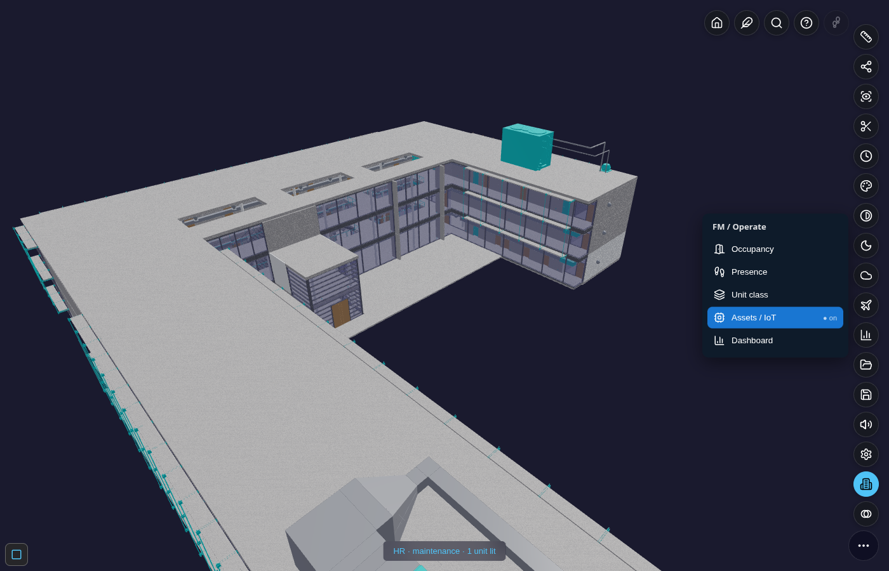

3. If this entry is **greyed “no data”**, the building simply carries no asset/IoT records — nothing is faked.

#### The IoT sensor + CCTV cockpit (mockup)
Tapping **Assets / IoT** does two things at once: it tints the asset in the model (above) **and** opens a
supplementary pane for that asset — a small operate-cockpit showing what a real IoT feed would look like.
This whole pane is an **explicit mockup** — every reading is a deterministic synthetic curve (same input,
same output, always — never `Math.random`), watermarked, and never claimed as a real sensor value.

**Six sensor channels, last 24 hours** — temperature, boiler pressure, sound level, dust (PM2.5), solar
output, and electrical load — each its own small trend chart:

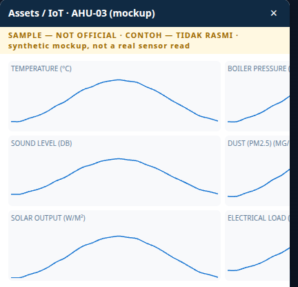

**A CCTV mockup grid and the ERP billing table**, scrolled further down the same pane — six camera tiles
(explicitly captioned "MOCKUP — NO REAL FEED", no invented video), and underneath, each sensor's *latest*
reading compiled into a **billable line** — a real `C_OrderLine` (quantity, unit of measure, net amount)
under a `C_Order` header, the same "compile into the real ERP dictionary, don't invent a parallel one"
discipline the rest of this module follows:

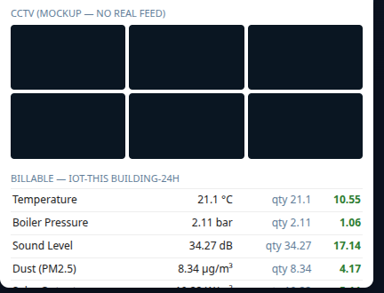

This is the clearest illustration of the module's **Spatial ERP** idea: a sensor bound to a real element in
the model is, at the same time, a line item a real ERP order can bill — one binding, two views (the 3D tint
and the ledger line), off the same record. Each billing row's **open ↗** deep-links straight to that
`C_Order`/`C_OrderLine` in iDempiere — "here's a real billable document, ready for management's follow-up",
not just a mockup number:

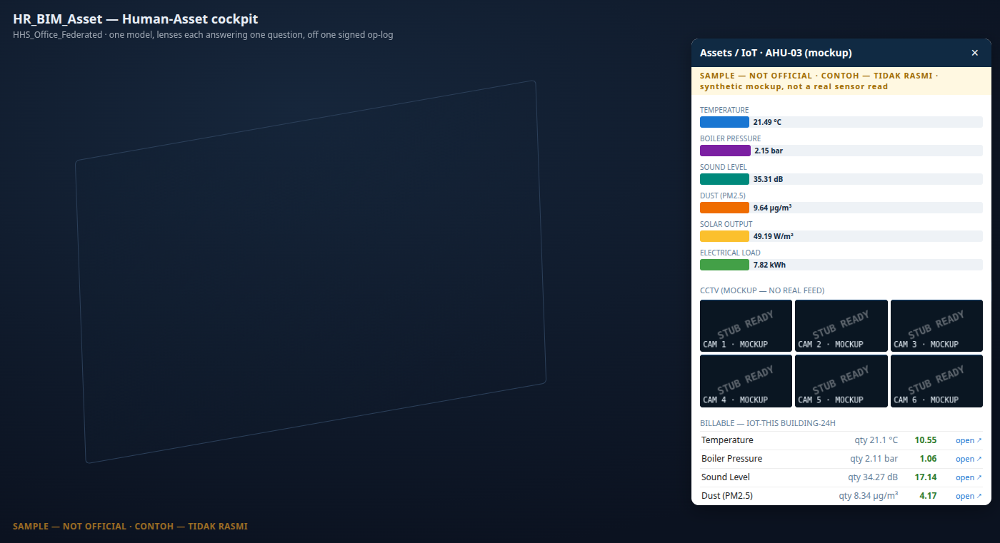

### Jump straight to the ERP record
Every pane above that shows data compiled onto a **real AD table** carries a small **open ↗** link per row —
Dashboard's Resources, Payslip's concept lines, Leave's unpaid entries, Tenancy's subscriptions, and IoT's
billing lines. Tapping it opens that exact record in `erp/idempiere.html` in a new tab — the *same* deep-link
mechanism the Viewer's own **Find** panel already uses to reopen a pushed Project Order (`?client=garden&
window=<id>&record=<pk>`), reused here rather than invented fresh. Every window number below was looked up
from the real AD dictionary, never guessed:

| Pane · row | iDempiere window | Native table |
|---|---|---|
| Dashboard → Resources | Resource | `S_Resource` |
| Payslip → concept line | Payroll Movement | `HR_Movement` |
| Leave → unpaid entry | Payroll Concept Catalog | `HR_Concept` (the "Leave without pay" concept it feeds — Leave has no native table of its own) |
| Tenancy → subscription | Subscription | `C_Subscription` |
| IoT → billing line | Sales Order | `C_Order` |

No link appears on a row that doesn't (yet) resolve to a real record — the same non-invent discipline as
everywhere else in this module: an absent link is honest, never a dead one.

### Classify spaces
1. Open the drawer → tap **Unit class**.

   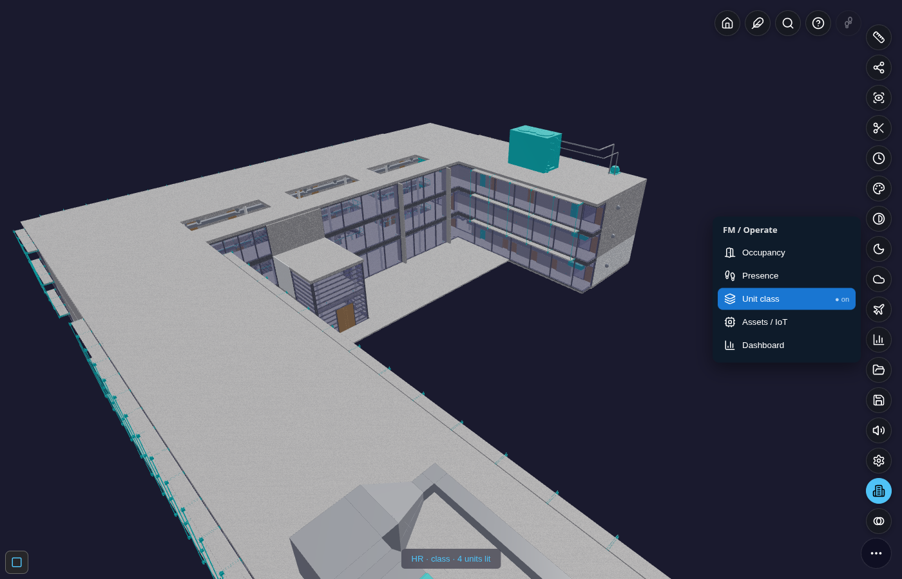

2. Spaces tint **residential (green) · commercial (orange) · office (indigo) · unclassified (grey)**.
3. The class is never guessed — see [How a space gets its class](#how-a-space-gets-its-class-non-invent).

### Read the numbers (Dashboard)
1. Open the drawer → tap **Dashboard**. An additive pane opens (it never touches the 3D scene) with three KPI
   tiles and three charts, every value a read-only fold of the same signed op-log — nothing typed by hand.

   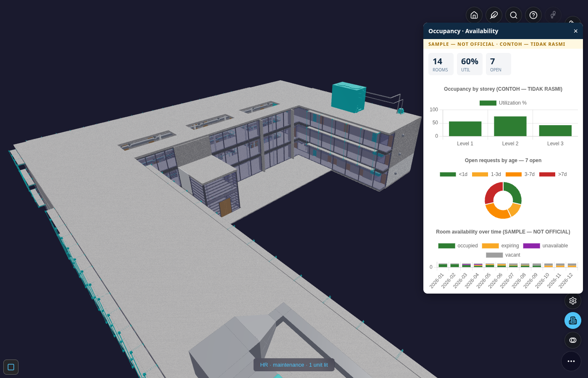

2. What you're seeing:
   - **KPI tiles** — rooms, overall utilisation, open tickets.
   - **Occupancy by storey** — utilisation % per level (all storeys, not just the ground floor).
   - **Open requests by age** — the SLA doughnut, tickets bucketed `<1d · 1–3d · 3–7d · >7d`.
   - **Room availability over time** — a 12-month stacked trend of occupied / expiring / unavailable / vacant.
3. **Resources**, scrolled further down the same pane — one row per real room (name · storey · utilisation),
   each a genuine `S_Resource` record ("a room is a bookable resource"). Every row carries an **open ↗** link
   straight to that record in iDempiere — see [Jump straight to the ERP record](#jump-straight-to-the-erp-record)
   below.

   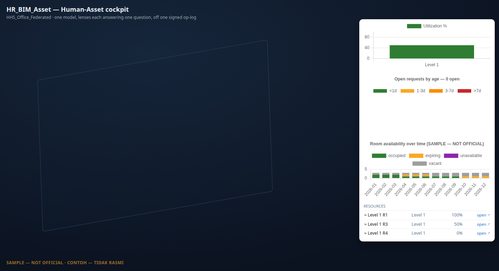

### Payroll — payslip
1. Open the drawer → tap **Payslip**. An additive pane opens with an employee picker and that employee's
   payslip — gross/net KPIs and a per-concept line trace (Base Salary, Allowance, EPF, PCB…), each line showing
   the **rule it came from** (glass-box, not a black-box number).

   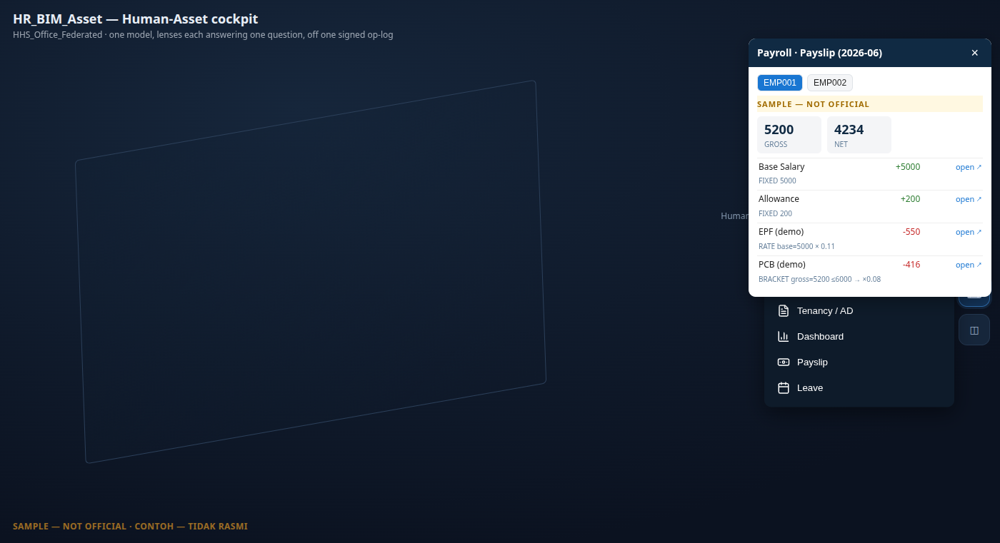

2. Every line is a real `HR_Movement` row — the native iDempiere payroll table (dormant everywhere else this
   dictionary ships, first activated here). Each line's **open ↗** deep-links straight to that movement record.

### Leave — balance & statement
1. Open the drawer → tap **Leave**. Balances (taken / unpaid / per-type) are **replayed** from a signed
   accrue/take op-log — never a stored number — with a chain-integrity check shown inline.

   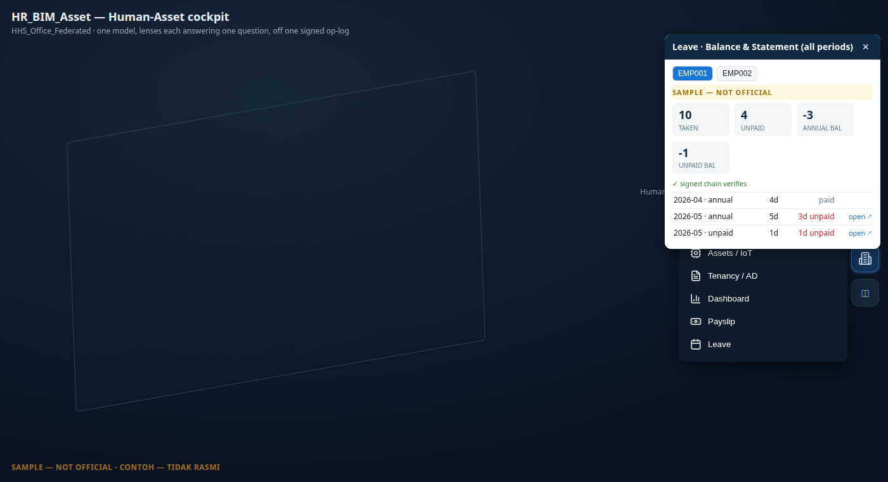

2. Leave itself has **no native AD table anywhere** in iDempiere (checked against the real dictionary) — it's a
   genuine addition, not a reinvention of something that already existed. So an unpaid row's **open ↗** doesn't
   point at a fabricated "leave record" window; it points at the real **"Leave without pay" payroll concept**
   the unpaid days feed into once payroll runs — the honest, real thing an unpaid entry actually compiles onto.

### Tenancy — AD compile
1. Open the drawer → tap **Tenancy / AD**. Every lease and strata charge in the building compiled onto real
   iDempiere tables — a unit is a `M_Locator` + `M_Product` under a `M_Warehouse`-as-building, a lease or strata
   fee is a real `C_Subscription` (party · unit · cadence · term).

   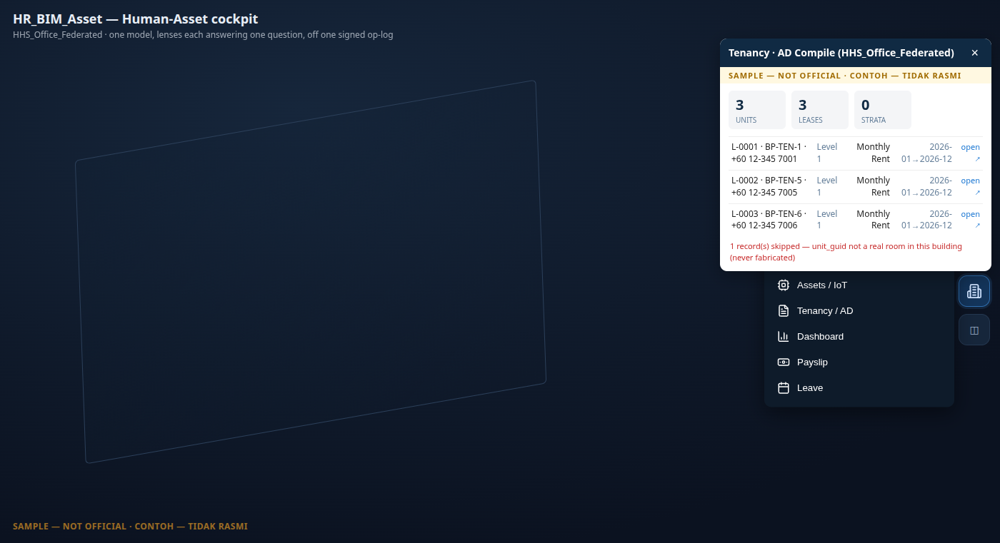

2. Row click flies the camera to that unit (the same shared fly-to used by the Presence roster above); the
   **open ↗** link is separate and deep-links straight to the `C_Subscription` record. A record whose unit
   doesn't resolve to a real room in this building is **skipped**, never fabricated — the footer says so.

### BIM BOM — assembly & recipe
1. Open the drawer → tap **BOM**. Every room in the building is an **assembly**: the room itself plus
   every element physically contained in it, compiled onto iDempiere's native Bill of Materials tables
   — the same recipe structure iDempiere uses for manufacturing, not a bolt-on BIM-only concept.

   *(Screenshot pending — the pane shows a per-room assembly list, each row expandable into its
   contained elements with quantities, and an "open ↗" link into iDempiere's Bill of Materials and
   Formula window.)*

2. Expand an assembly to see its component lines — one row per contained element, with the recipe
   quantity carried over from the model. The **open ↗** link deep-links to the real **"Bill of
   Materials and Formula"** window, the same one a manufacturing user would use for a physical product's
   recipe — a room's contents are read through the identical lens, not a parallel BIM-only screen.
3. This pane has no 3D wash — it's a compiled list, like Tenancy and Dashboard.

---

## A building with no rooms? Aisle-zones

Not every building has `IfcSpace` rooms. A **warehouse** like the *GardenWorld* sample has none — just elements
grouped into **aisles**. The module detects this and falls back to **aisle-as-zone**: each aisle becomes a zone,
its members are the real elements parked in that aisle, and the same lenses light it. Below, Occupancy is on
("HR · occupancy · 2 units lit") while *Unit class* and *Assets / IoT* are greyed because this warehouse carries
neither.

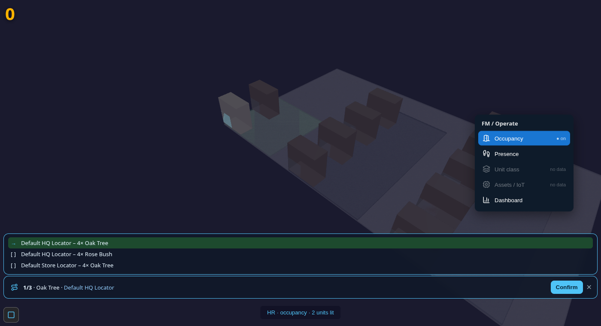

This is also the clearest example of the wash itself: the aisle's whole floor-slab tints green (occupied), an easy
contrast to spot from a distance — unlike a room bound only to small fixtures (see the note under Occupancy
above). Nothing is invented to make this work: the aisle labels and the element guids are all read from the model.

---

## The lenses at a glance (reference)

| Lens | The one question | Colour legend |
|---|---|---|
| **Occupancy** | *Is this unit occupied — and what's its lease status?* | occupied `#2e7d32` · expiring `#f9a825` · vacant `#9e9e9e` · unavailable `#8e24aa` |
| **Presence** | *Who is physically here right now?* | 1 `#90caf9` · 2–4 `#1976d2` · 5+ `#0d47a1` (+ per-person avatars near-field) |
| **Unit class** | *What is this space?* | residential `#43a047` · commercial `#fb8c00` · office `#3949ab` · unclassified `#9e9e9e` |
| **Assets / IoT** | *What equipment needs service?* | ok `#2e7d32` · due `#f9a825` · overdue `#c62828` |
| **Tenancy / AD** | *What's the AD-compiled lease/strata detail?* | opens the AD-compile pane (no 3D wash) |
| **BOM** | *What's this room's assembly recipe?* | opens the BOM pane (no 3D wash) |
| **Dashboard** | *Give me the numbers.* | opens the charts pane (no 3D wash) |
| **Payslip** | *What did this employee actually get paid, and why?* | opens the payslip pane (no 3D wash) |
| **Leave** | *What's this employee's leave balance and statement?* | opens the leave pane (no 3D wash) |

**Wake-aware, always.** The `FM` pill appears only when the building has *some* operate data; inside the drawer
each lens is enabled only when *its* data exists here. No data → greyed “no data” → no clutter, nothing faked.

**Watermark.** Every screen and export carries `CONTOH — TIDAK RASMI` / `SAMPLE — NOT OFFICIAL`. The demo values
are illustrative; any real statutory rate or fee sits behind a research gate and is never shipped as fact.

---

## Under the hood — the data model

You don't need this to *use* the lenses, but it explains why every wash is trustworthy.

- **One signed op-log.** Everything — bookings, check-ins, tickets — is an append-only **signed `kernel_op`**.
  Each op chains to the previous (`verifyChain`); amending a signed op breaks the chain. The lenses are pure
  **replays** of this log, so two reads give a bit-identical result and a vacant room is vacant from the *absence*
  of an op — never a fabricated value.

- **Records (the “WHAT”).** A handful of AD-defined models seed the demo: **Tenancy** (a lease), **Strata**
  (ownership/parcel), **Asset** (equipment, linking a `bim_guid` to an `iot_device` + a service schedule), and
  **Request** (a maintenance/service ticket). Each carries the **guid** of the room or element it concerns.

- **How a unit binds to the model (the “WHERE”).** A record lights a unit **only** when its guid **resolves to a
  real mesh** in the loaded building. An `IfcSpace` room usually isn't drawn as its own mesh, so the lens resolves
  and tints it through its **rendered contained members** (`rel_contained_in_space`). A guid that resolves to
  nothing is honestly **un-linked** — shown nowhere, never a faked tint. For a room-less building the same join
  runs over **aisle-zones** (see above). Avatars stand at the **centroid** of a zone's rendered members.

- **Occupancy = a signed resource ledger (`S_Resource`-style).** A room is a *resource*; you **`ASSIGN`** a party
  to it for a period, **`RELEASE`** it early, or mark it **`UNAVAIL`** for a blackout. *Availability at any month*
  is the replay of that ledger — which is exactly what the Occupancy lens and the dashboard read.

- **The periodic RUN engine (the “HOW”).** One generic engine — **`(period × parties × element-rules) → signed
  lines → GL`** — serves four profiles, so tenancy is “payroll inverted”, not a new build:

  | Profile | Parties | Cash direction | Statement |
  |---|---|---|---|
  | `payroll` | employees | OUT | payslip |
  | `tenancy` | active leases | IN (AR) | rent invoice |
  | `strata` | owners / parcels | IN (AR) | fee notice |
  | `maintenance` | assets | COST | work order |

  Every line **cites the rule it came from and recomputes exactly** (glass-box), and every run posts a **balanced**
  journal. The module boots and runs **standalone** on its own seed — no ERP required — and only lights up two
  dotted-line adapters (GL posting, `C_BPartner.isEmployee`) when an ERP *is* present.

### How a space gets its class (non-invent)
Class is resolved by strict priority and **never guessed**: (1) a *real* `IfcSpace` `predefined_type` from the
model, when present; else (2) the **declared class on the lease record** (a watermarked business datum); else
(3) **unclassified**. The HHS office sample carries no IFC space-type, so its demo leases declare their class —
the room guids are real, the labels are sample lease declarations.

---

## Troubleshooting

| Symptom | What it means | What to do |
|---|---|---|
| **No `FM / Operate` pill** | The building has **no operate data that resolves to a real element** (no lease/asset/check-in binds to a drawn guid). | Expected on a bare model. Load a building with operate records (e.g. the HHS sample), or seed records bound to real guids. |
| **A lens is greyed “no data”** | That lens's data type isn't present here (e.g. no IoT assets → *Assets / IoT* greyed). | Normal and honest — the lens won't fabricate data to look busy. |
| **A room I expected isn't lit** | Either its guid doesn't resolve to a drawn element, or it's genuinely **vacant** (no booking). | Check the record's guid exists in the model; remember vacancy is the *absence* of a booking, not an error. |
| **The dashboard charts are blank** | Chart.js didn't load (offline / blocked). | The KPI tiles still read correctly; reload with the chart library reachable and the three charts render. |
| **Toggled a lens off and the colours look odd** | Overlays restore on toggle-off; a stuck state is rare. | Toggle the lens off again, or reopen the drawer — the scene restores fully (zero residue by design). |

---

## The money + contract side (when ERP is loaded)

The **deal and money** half of a tenancy — the lease as a signed **agreement**, the **rent run → AR**
(`C_Invoice → C_Payment → allocation → GL`), the **Request/ticket** workflow, and the product catalog (rental vs
purchase, installment schedules) — lives in the **[Kernel-ERP guide → Tenancy](ERPUserGuide.md#hr-tenancy)**. HR
supplies the **people + access** (party = `C_BPartner`, signed check-in, capability tokens); the Viewer supplies
the **spatial** view above; ERP supplies the **money**. One lease threads all three over the shared BIM model and
the one signed op-log — see **[Spatial ERP × BIM × HR — One Building, One Log](SpatialERPIntegration.md)**.

---

## Future roadmap (addendum)

Two directions under consideration, not yet built:

- **Find ↔ FM linking.** Today, *Find* (the Viewer's element search) and the *FM / Operate* drawer are separate
  surfaces — Find locates a spatial element, FM toggles a building-wide lens. The natural next step is linking
  them rather than merging them: extend Find's search index to also cover HR_BIM_Asset records (a tenant's name,
  a lease number, a ticket ID), so a search hit that resolves to an operate record both zooms to the unit *and*
  deep-links into the FM drawer already scoped to that record (e.g. searching a tenant opens Occupancy with
  their lease highlighted). One front door — "find anything, including people" — without forcing lens-toggle
  behaviour into a search box.
- **Larger property-portfolio management.** The compile-not-model foundation laid in this module (a leasable
  unit already compiles to a real `M_Product`/`M_Locator` under a `M_Warehouse`-as-building, a lease/strata
  charge is a real `C_Subscription`, an asset is a real `a_asset`) is structured to scale past a single
  demonstrator building — the same native AD tables carry a portfolio of many buildings/units without a new
  schema per building. Find↔FM linking would be the natural cross-portfolio search layer once more than one
  building is loaded at once.

---

*Spec: `prompts/RESUME_HR_BIM_ASSET.md` (§FM-FAMILY · §REAL-BIND · §AISLE-ZONES · §RICH-DEMO · §AVATAR-LOD ·
§BINDING · §CLASS · §PILLAR 1–4 · §CRITICAL "Compile not Model"). Back to the [BIM Viewer Guide](BIMUserGuide.md).*
