# Modeller — First Steps (10 minutes, no experience needed)
*[← Back to the **Modeller guide**](ModellerGuide.md) · [Home](index.md)*

One small job, start to finish: **open a building, click one wall, nudge it, undo it, save.**
Use a desktop browser (Chrome or Edge). Every step below was run by a script against the live site
and the numbers quoted are what the app itself reported.

---

### Step 1 — Open the Modeller

Go to **[red1oon.github.io/bim-ootb/modeller/modeller.html](https://red1oon.github.io/bim-ootb/modeller/modeller.html)**.
You should see an empty dark grid, a row of round buttons down the right edge, and the word *history*
with a slider along the bottom.

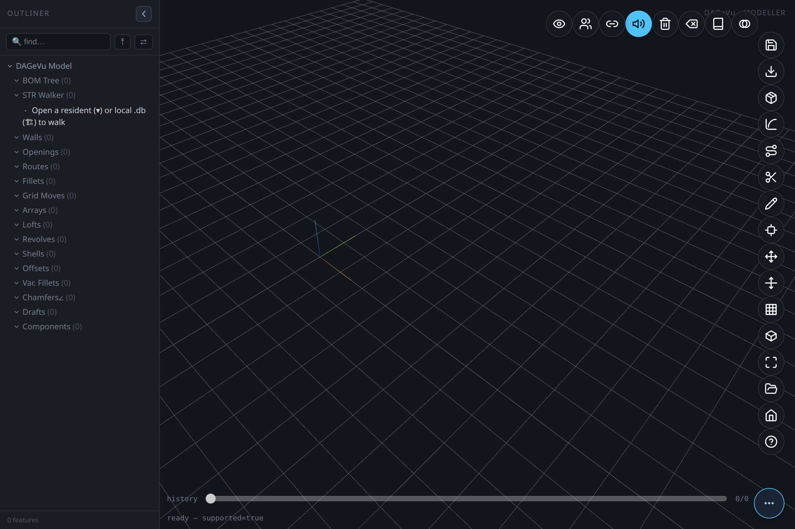

### Step 2 — Click the folder button (Open)

On the right edge, click the **folder** button (**📂 Open**). A list called **OPEN A BUILDING** appears.

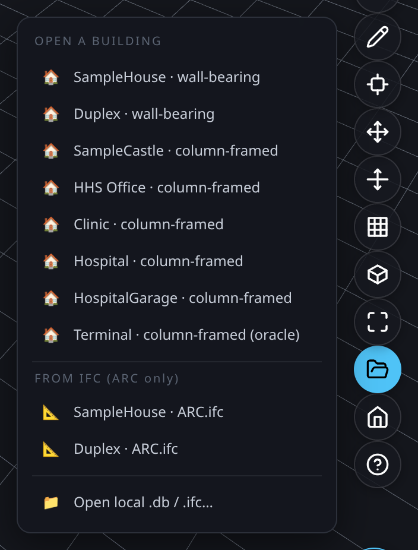

### Step 3 — Click **Duplex**

Click **Duplex · wall-bearing**. Wait about 15–20 seconds. The house appears on the grid and its parts
list fills the **Outliner** on the left. (The app reported 196 building elements.)

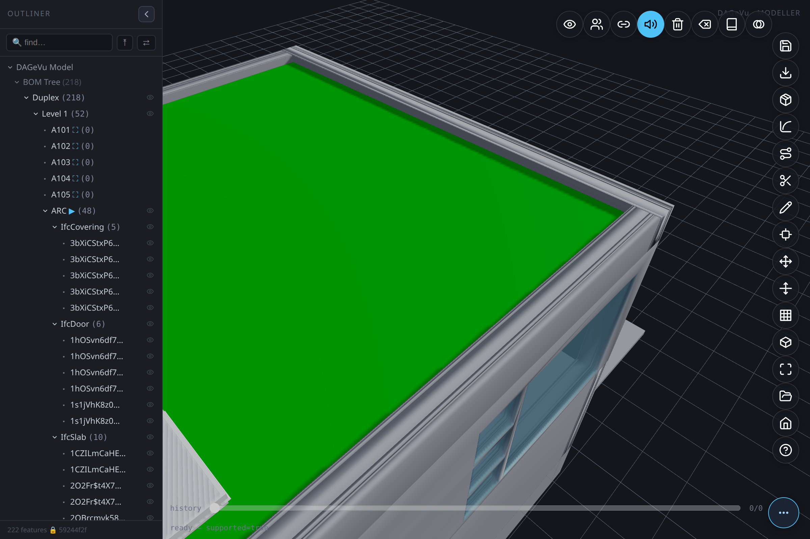

### Step 4 — Click Fit

Click the **square-corners** button (**Fit**), or press **F**. The whole house is now centred in view
(all 196 elements on screen).

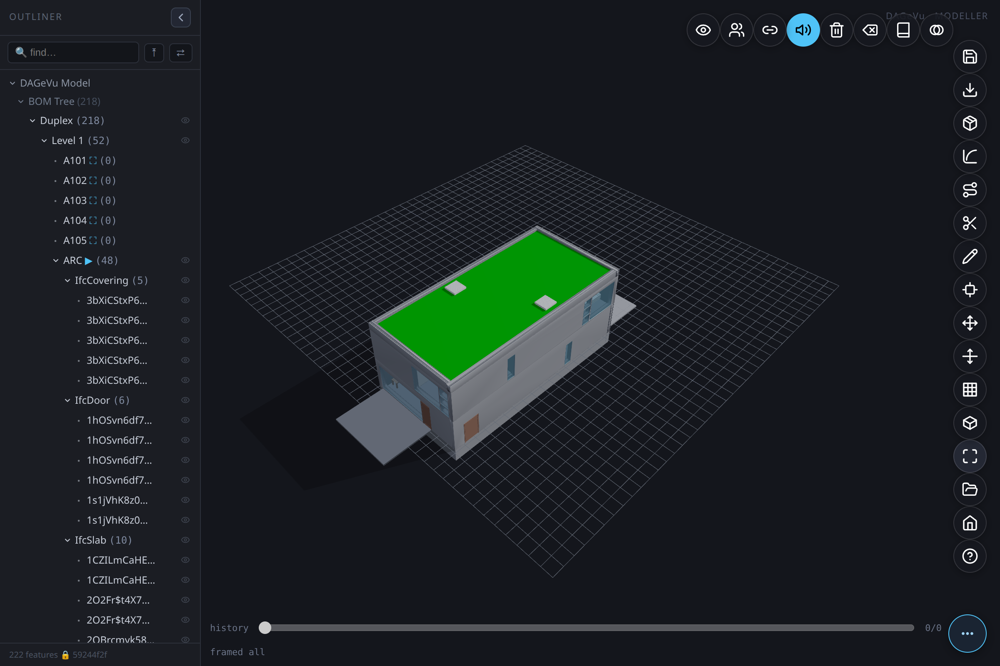

### Step 5 — Click one wall

Click the long **low wall along the bottom edge** of the house. It turns light blue and the status line
at the bottom-left says `selected feature #…`. Exactly one thing is selected.

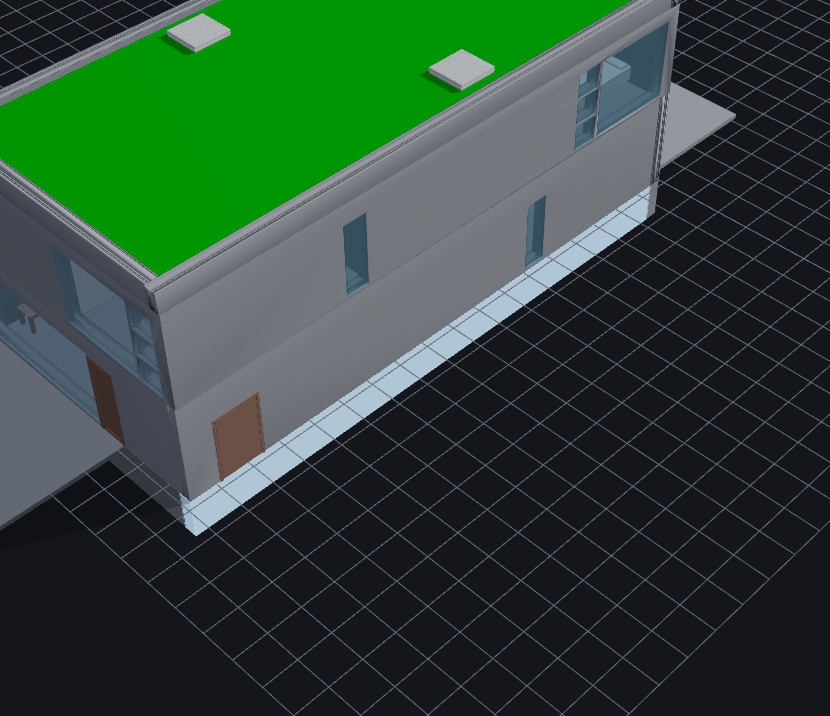

> Tip: a wall that carries a door or window takes them along when it moves. That is still **one** undo: one
> **Ctrl + Z** takes the wall and its door back together (proved on the live site: moving a Duplex wall with
> two hosted openings wrote 3 rows, one Ctrl + Z restored all 3, and Save still worked).

### Step 6 — Click the Move button

Click the **four-arrow** button (**Move**). Three coloured arrows and a yellow ring appear on the wall.
The **red arrow** moves it sideways (X).

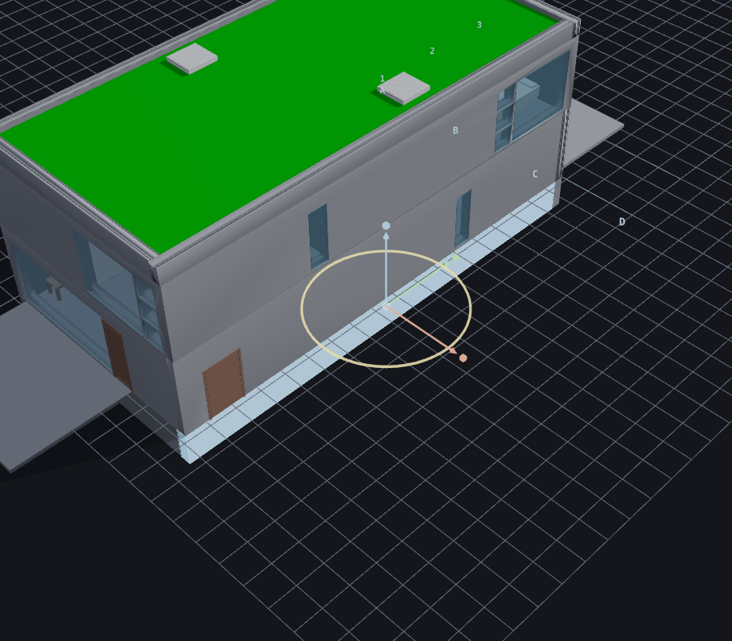

### Step 7 — Drag the red arrow a little

Press on the **red arrow**, drag it a short way along its own direction, and let go. The wall slides.
The status line reads something like `moved #82 Δ(0.42,0.00,0.00) verify=true`. The move snaps to the grid,
so it can differ slightly from how far you dragged. (You may also see `ORANGE` — a soft "a neighbour is now close"
note, not an error.)

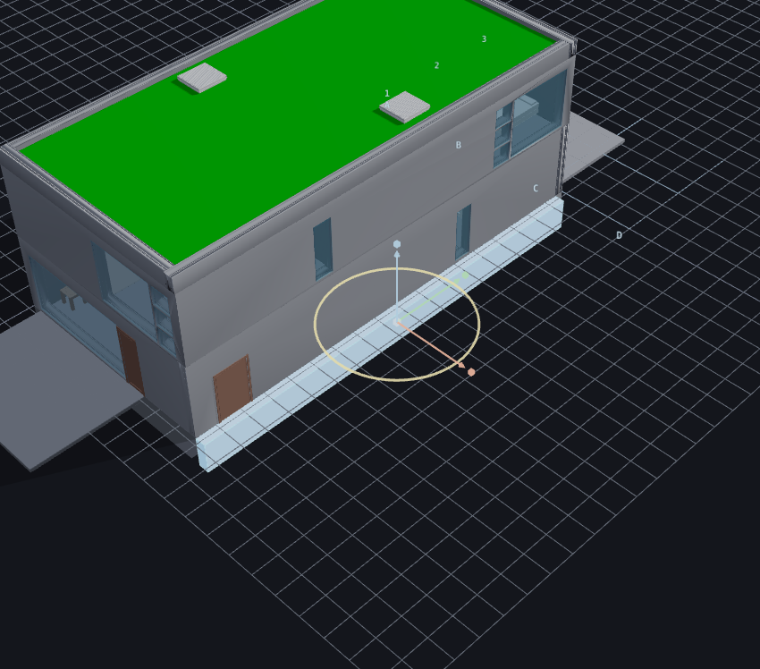

### Step 8 — Undo it

Press **Ctrl + Z**. The wall jumps back to exactly where it was and the status line says `undo #…`.
(The history slider at the bottom moves one notch left; you can also drag it.)

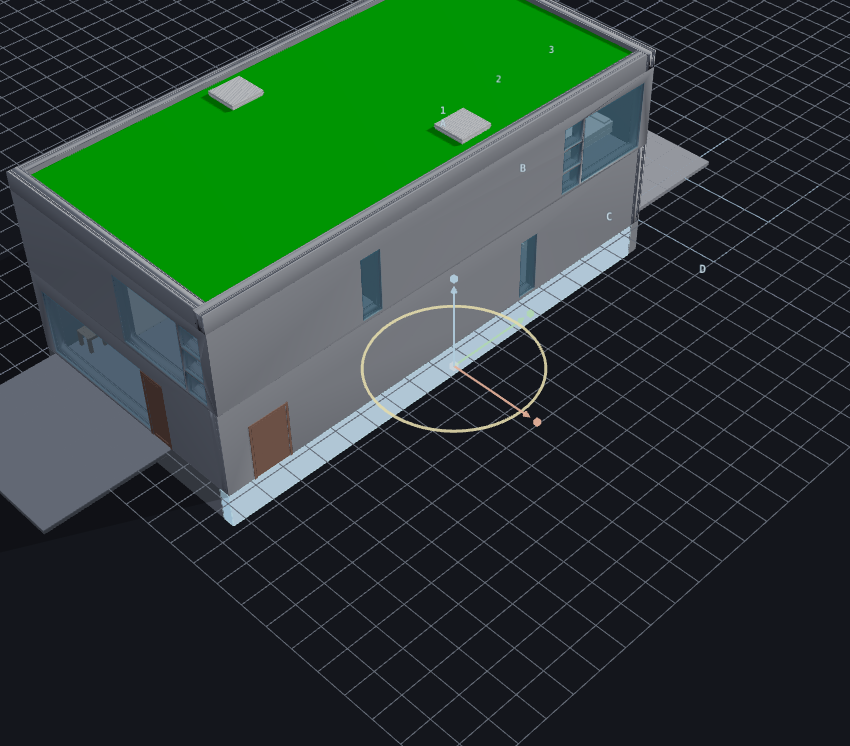

### Step 9 — Click Save

Click the **floppy-disk** button at the top of the right-hand column (**Save**).

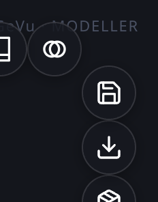

The app checks the model for clashes, then writes a snapshot. After a few seconds the status line reads
**`Saved — v0 (1 version)`**. (The snapshot was about 150 KB.)

**That is the whole loop:** open → select → tool → drag → undo → save. Two more short parts follow:
**[Part 2 — see what your edit costs and send it to ERP](#part-2-see-what-your-edit-costs-and-send-it-to-erp)** and
**[Part 3 — fill the building with services](#part-3-fill-the-building-with-services-mep-walk)**. The full
[Modeller guide](ModellerGuide.md) covers every other tool.

---

## Part 2 — See what your edit costs, and send it to ERP

*Do Part 1 steps 1–5 first, so a wall is selected. Everything below was run against the live site by a script;
the numbers are what the app itself reported. This is the material cost and labour time of the
**edit** — a projection, not a quote.*

### 2.1 — Stretch the wall

With the wall selected click **Move**, then drag the small **cube** at the end of the gizmo along the wall's own
length. The wall grows. (In the test the wall went from 10.586 m² to 13.233 m² of face area.) Press **Esc** to leave the tool.

### 2.2 — Hover the wall

Rest the pointer on the stretched wall. A small label appears beside the pointer:

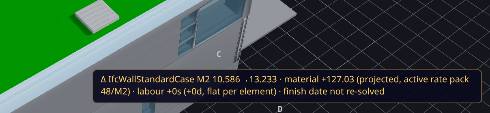

One number everywhere: the same basis prices the Project Order line and any Variation Order below.

Read it left to right: the wall class, its area **before → after**, the **material** change (**+127**, the
extra square metres times the price per m², rounded the way the Project Order line is — 48 per m² in this run), the **labour** change (**+0 s**: an ordinary wall
takes a flat time per element, so stretching it changes cost but not labour), and the note that the **finish date
is not re-solved** (the Modeller does not re-run the whole programme for one edit).

> The price per m² comes from your **language pack** (this run: US English = 48 per m²; another country has its own
> table). Moving a wall without stretching it changes no quantity, so its line reads `+0.00`.

### 2.3 — Click the wall

Click the wall. The same line stays pinned at the bottom-left, above the **ERP ▸ Project Order** button:

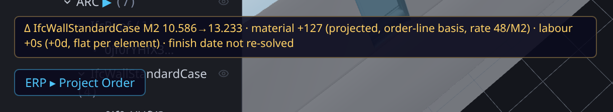

### 2.4 — Undo

Press **Ctrl + Z**. The line reads **`Δ 0 — edit undone (no quantity change)`**.

### 2.5 — See the same numbers in the Viewer

Tap **Connect** in the Modeller, open the [Viewer](https://red1oon.github.io/bim-ootb/viewer/viewer.html?connect=1)
in another tab, switch on **hover name** (press `'`) and rest the pointer on the same wall. The Viewer shows the
**identical** line — the same code computes it on both sides (the test compares the text byte for byte):

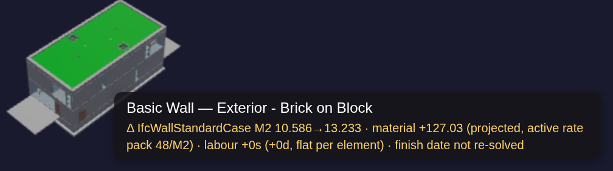

### 2.6 — Open the ERP panel

Select the wall and click **ERP ▸ Project Order** (bottom-left). The first click fetches the ERP data once (about
27 MB), so wait a few seconds. The panel says whether these parts already have a **Project Order**:

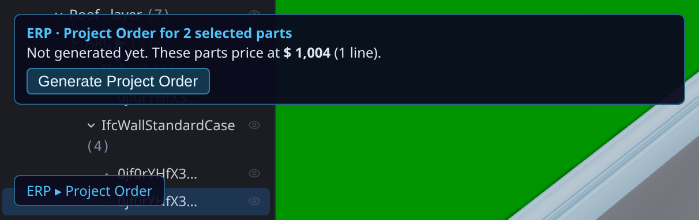

### 2.7 — Generate the Project Order

Click **Generate Project Order**. The panel now shows the order number and its planned amount, and an
**Open in ERP ↗** link:

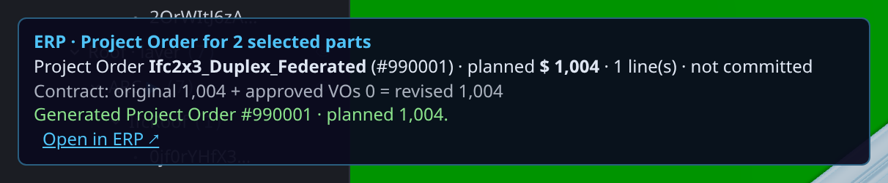

**Open in ERP ↗** opens the ERP app on that record (choose the standard GardenWorld sign-in). The Viewer's own
**› ERP** button, given the same parts, reports the same planned amount and finds this order instead of making a
second one.

### 2.8 — Edit a part that is already in the order

Stretch a selected wall again (2.1). The panel now calls it a **variant** of the same order and offers two choices:

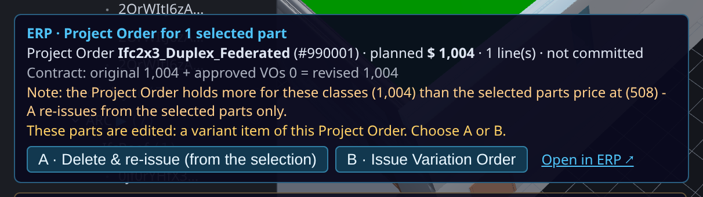

- **A · Delete & re-issue** — for work that has **not started**. It deletes the old order and issues a fresh one
  from the selected parts (test: still exactly **one** Project Order, planned amount 1,004 → 635). If the order held more
  than the selected parts, the panel says so first.
- **B · Issue Variation Order** — for an order **already committed to a vendor**. It adds a Variation Order to the
  same Project Order instead of starting over. Its amount is the **priced difference of the order line it amends**, on the
  same basis as the order itself: original order + Variation Order = what a fresh order for the edited parts costs, to the cent.

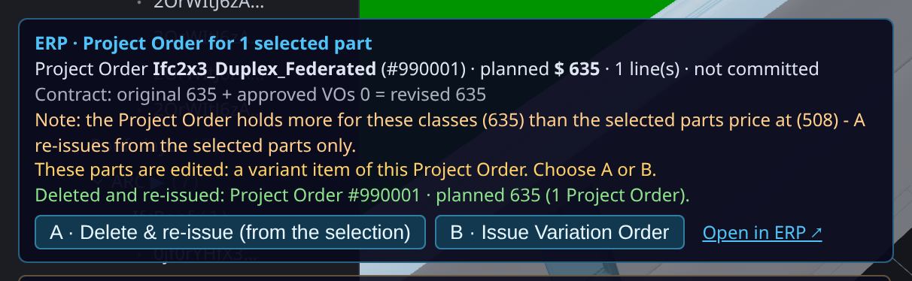

### 2.9 — When it is committed, only B is allowed

"Committed" is read from the ERP records (a purchase order on the project that is completed). Then **A** is greyed
out with the reason written under it, and **B** stays available:

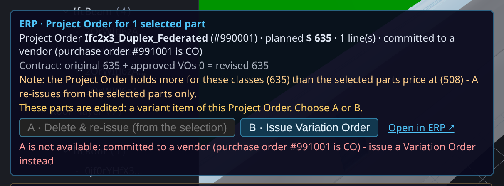

Click **B**. The panel sends the Variation Order and lists it with its status read from the ERP record (**Drafted**), here **127.00** for a second, larger stretch (original 635 + 127 = 762, the fresh fold):

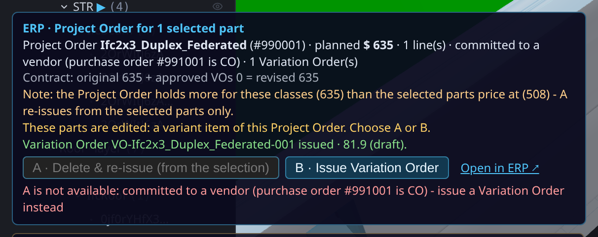

Approval of a Variation Order is done **on the ERP side**; the Modeller only sends it and shows the status the ERP record carries (Drafted, Approved …). This works for **any IFC you open**: the order is keyed by the model's own name (e.g. `SampleHouse_ARC` for the sample `.ifc`), tested on the local-IFC open path.

---

## Part 3 — Fill the building with services (MEP walk)

*Duplex opens as a bare architectural model. A **walk** places the plumbing, ducts, cable or sprinkler
components and draws their runs. Only **plumbing** was walked step by step for this page, on the live site.*

### 3.1 — Open Duplex

Open **Duplex** as in Part 1 step 3. It is a bare architecture model: no plumbing fixtures, no pipes yet
(measured: 196 elements, 0 fixtures, 0 pipe runs).

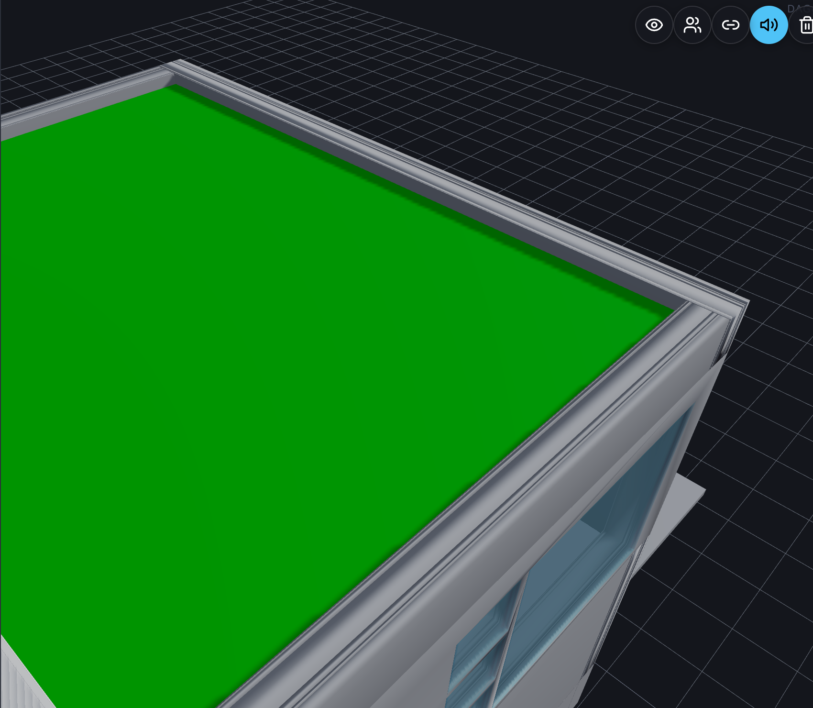

### 3.2 — Find the PLB row in the Outliner

In the **Outliner** (left) scroll to the **Walk** rows: **ACMV**, **ELEC**, **PLB**, **FP**. PLB is plumbing. Each row
has a blue **▶** — its tooltip reads "Walk this discipline".

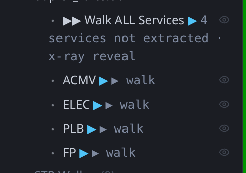

### 3.3 — Click ▶ on PLB

Click the **▶** on the **PLB** row. After a few seconds the fixtures are placed and pipes are drawn between them. The
status line reads **`PLB — 18 placed across 6/21 spaces · 22 nn-chains`**. Measured on the live site: **18 fixtures**, **22 pipe
runs** all drawn, **22** written to the signed history, 5 bend fittings, one history step **"Walk PLB (45)"**, and the
building itself untouched (196 elements before, 196 after). The pipes sit inside the solid building, so press **X-ray**
(the pill in the right-hand rail, or the **X** key): the structure goes glass and the plumbing shows.

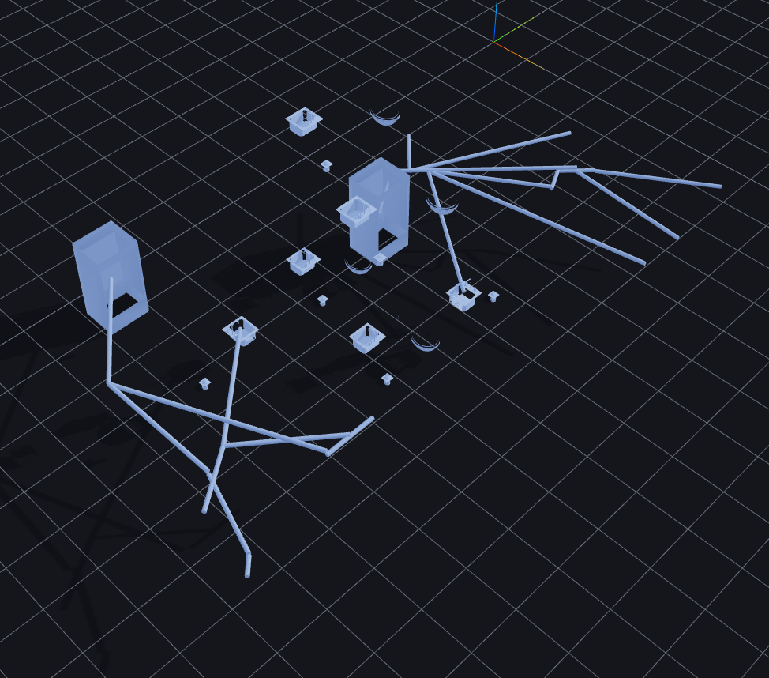

### 3.4 — What the pipes are

Every pipe is a signed row that names the product it is drawn as, and its size is read from that row — never typed in:
**25.4 mm** cold water (1 run) and **48.3 mm** waste (21 runs), all 22 rows citing a real product. *(You cannot click a pipe to
select it yet: it sits inside the solid building and even the x-ray glass takes the click.)*

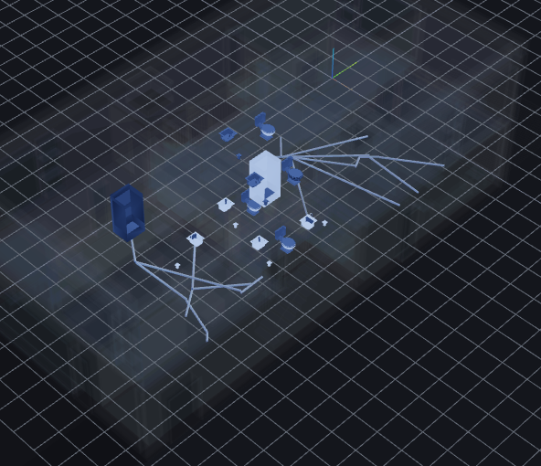

### 3.5 — Move a fixture and its pipes follow

Moving a walked fixture re-routes its pipes. **Today there is no drag handle on a walked fixture** (a gridline drag moves walls, not fixtures): clicking one
only identifies it (`walked PLB · FlowTerminal … (generated — identify only)`, Move stays greyed out; measured with the building hidden). So this
step was proven by moving a fixture 0.5 m with the same signed move the Move tool writes: the network re-routed in
**about half a second** (524 ms on the live site, Duplex) — 22 runs became 16, and a run now ends **exactly** at the fixture's new spot
(distance 0.0000 m; it was 0.500 m from the old spot). The re-routed runs and their bend fittings are written to the signed
history too.

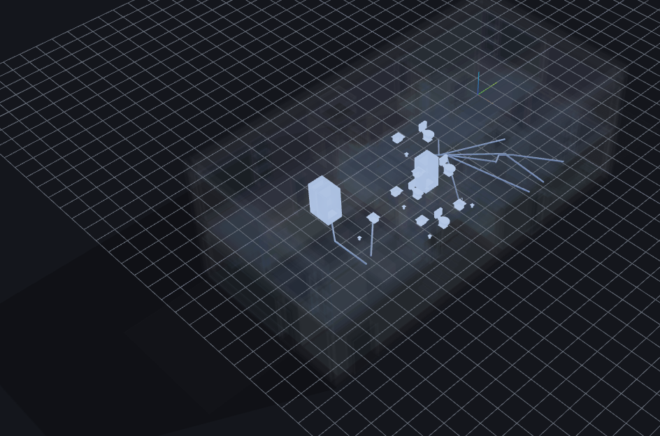

*(Terminal, a much larger building, has not been timed.)*

### 3.6 — Ctrl + Z takes the move back

Press **Ctrl + Z**. The fixture and its pipes return: the original 22 runs are back to within 1 mm.

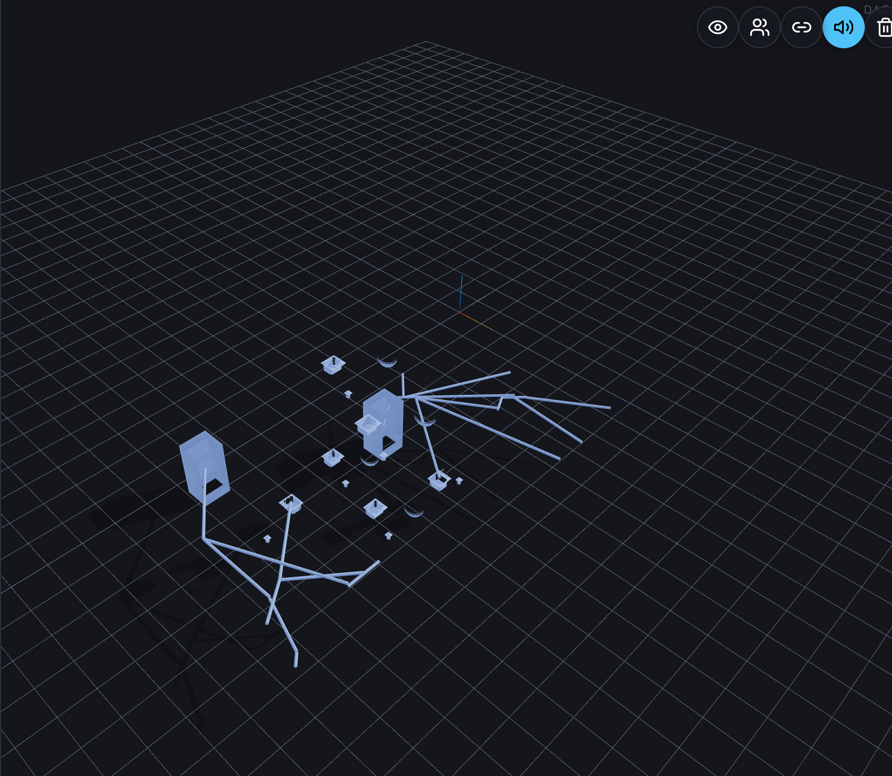

### 3.7 — Ctrl + Z again takes the whole walk back

Press **Ctrl + Z** once more. The **whole** walk goes — fixtures 18 → 0, pipe runs drawn 22 → 0 — and the model is back to its
opened state (history position 196).

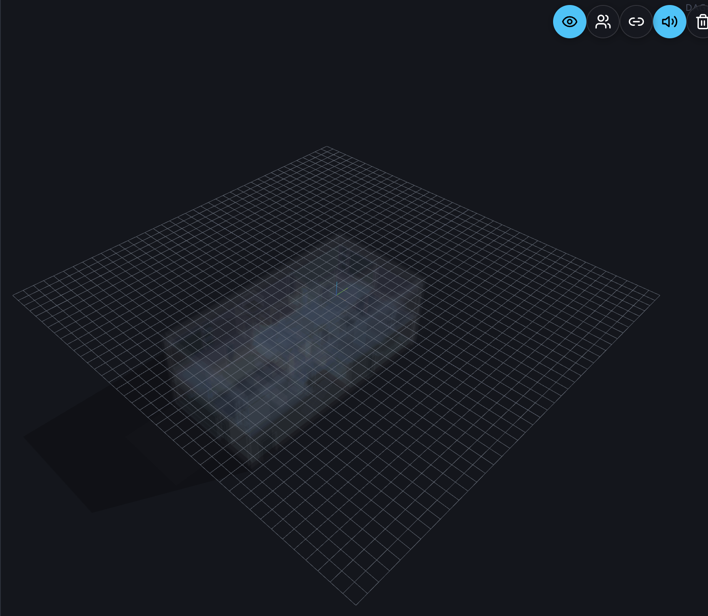

### 3.8 — Ctrl + Y brings it back

Press **Ctrl + Y**. The same 18 fixtures and 22 pipe runs return (history position 196 → 241).

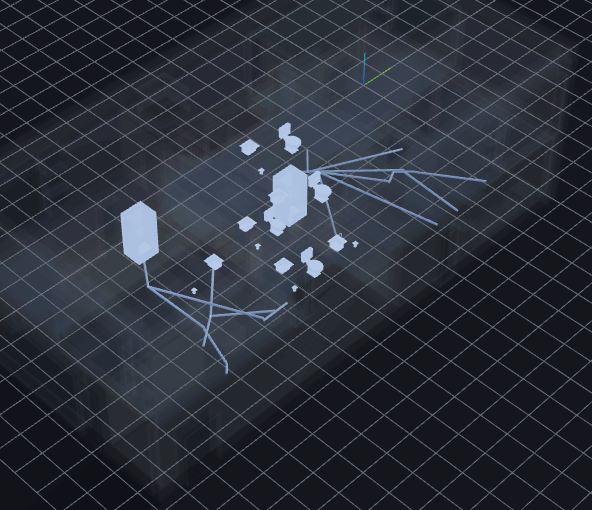

**What is routed today:** plumbing, as above. In **Walk ALL Services** the existing witness (`W-MEP-OPENPATH`, Duplex, run
2026-09-30) also shows **ACMV** ducts (8 runs) and **FP** sprinklers (4 runs) routed and signed; **ELEC** cable is placed
but not routed (0 runs on Duplex). Those were not walked step by step here.
