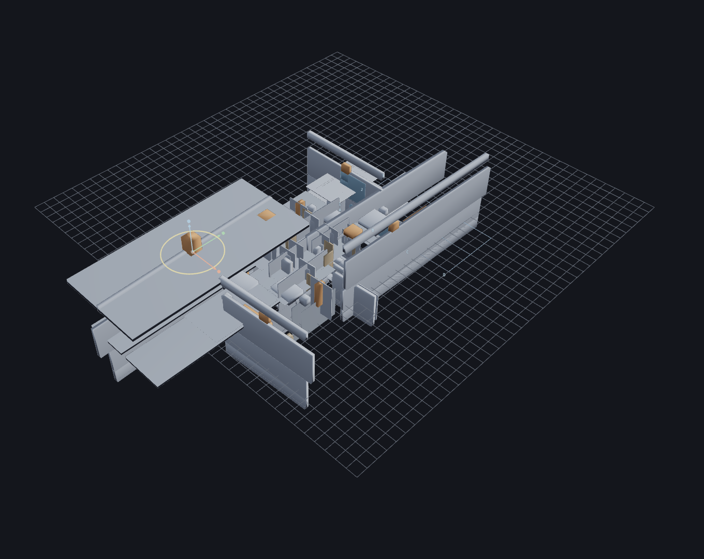
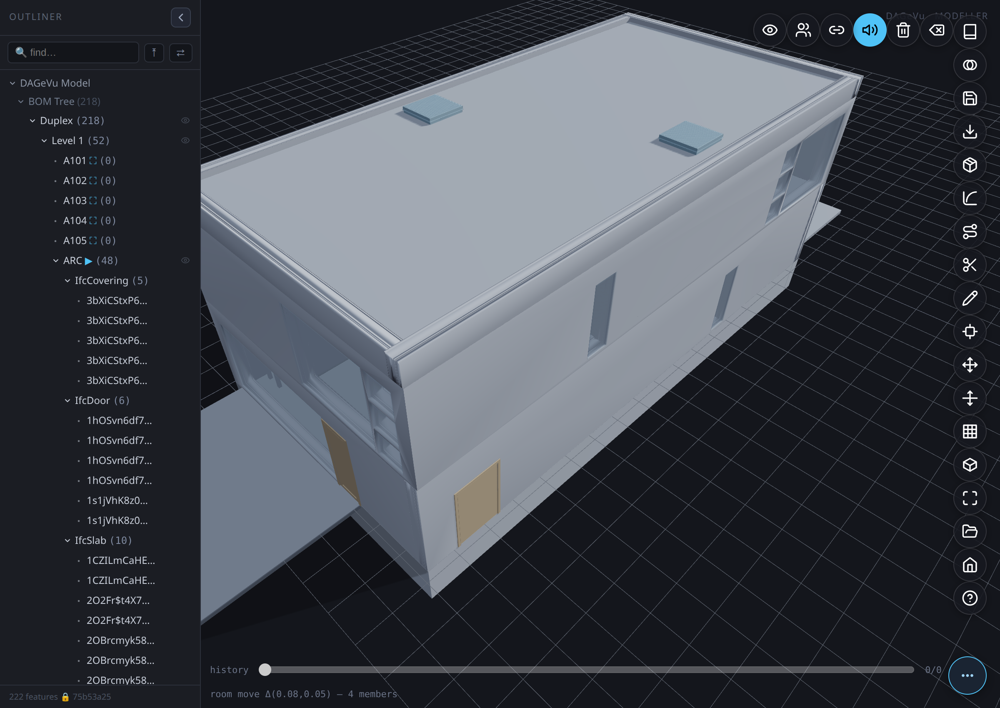
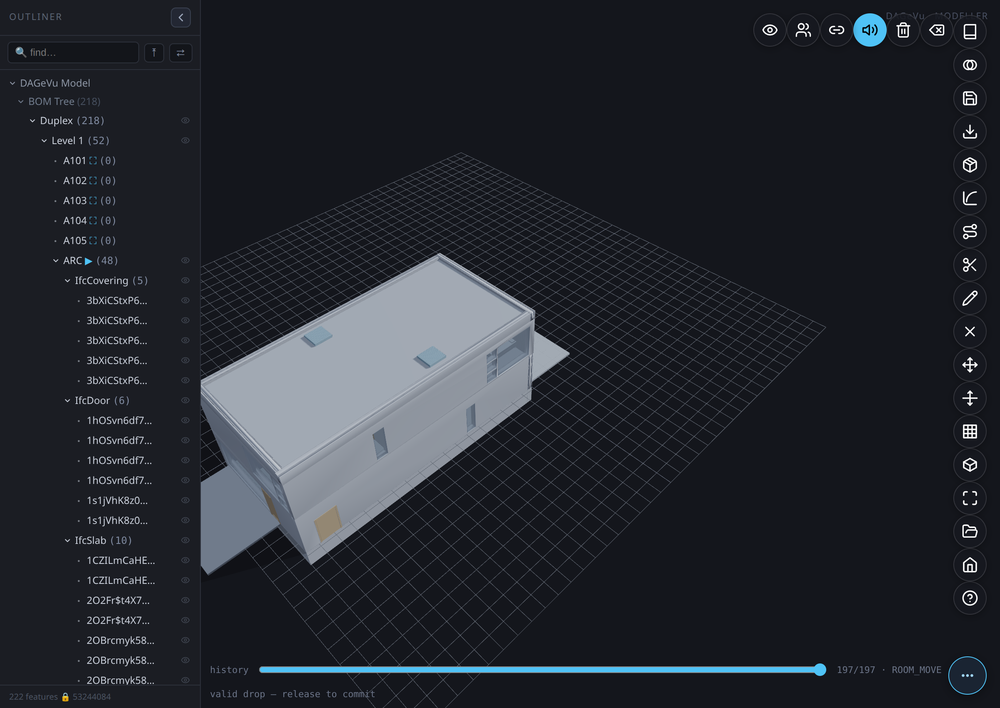
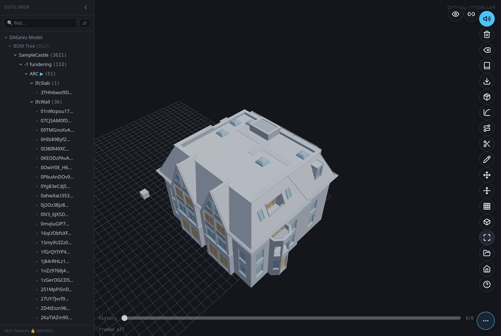

# DAGeVu Modeller — User Guide
*[← Back to the **User Guide**](USER_GUIDE.md) · [Home](index.md)*

DAGeVu is a **browser BIM authoring surface** that sits beside the read-only viewer. You don't edit a
dead file — every action (drop a component, cut a window, route a duct, move a wall) is **one signed
operation** folded into a verifiable hash-chain. The 3D you see is a pure *fold* of that operation log,
so **every edit is exact, reversible, and provable** — never invented. The same signed-log engine drives
the Kernel-ERP.

**Open it:** [red1oon.github.io/bim-ootb/modeller/modeller.html](https://red1oon.github.io/bim-ootb/modeller/modeller.html)
(desktop — the B-rep kernel is heavy). The **Home** pill returns to the Matrix landing.

> **Every tool on this page is proven by a real-user, end-to-end test** — the tool is driven through the
> production path with real mouse/keyboard and the result checked by numbers (the op-log, the scene graph,
> the pixels), not by eye. **The screenshots are real frames captured from those test runs** — nothing here
> is a mock-up.

---

## The big idea — open a building and edit it

Don't draw a model up from a blank grid. **📂 Open** a real building's **ARC** (architectural) model — its
*digital twin* — and edit *that*. The other disciplines and dimensions aren't re-drawn; they **follow**:
structure, MEP, the 4D schedule, the 5D cost and the ERP auto-complete by *crawling* against your ARC
(the **Walk** tools), and every edit and every follow is one signed operation the enterprise folds from.

<svg viewBox="0 0 820 320" xmlns="http://www.w3.org/2000/svg" role="img" aria-label="The modelling inversion: open a ready ARC twin, edit it, and the rest auto-completes from one signed op-log." style="max-width:100%;height:auto;font-family:system-ui,-apple-system,sans-serif">
  <rect x="0" y="0" width="820" height="320" fill="#fbfcfe"/>
  <text x="20" y="28" font-size="16" font-weight="700" fill="#1b2b3a">Open a ready ARC twin · edit · the rest auto-completes</text>
  <g font-size="12" fill="#16324a">
    <rect x="20" y="70" width="170" height="74" rx="8" fill="#e9f2fb" stroke="#3f78b5" stroke-width="1.5"/>
    <text x="105" y="98" text-anchor="middle" font-weight="700">📂 Open extracted.db</text>
    <text x="105" y="116" text-anchor="middle">the ARC twin</text>
    <text x="105" y="134" text-anchor="middle" fill="#5b6473">(real building, verbatim)</text>
    <rect x="232" y="70" width="170" height="74" rx="8" fill="#e9f2fb" stroke="#3f78b5" stroke-width="1.5"/>
    <text x="317" y="98" text-anchor="middle" font-weight="700">Edit the ARC</text>
    <text x="317" y="116" text-anchor="middle">move · cut · insert · grid</text>
    <text x="317" y="134" text-anchor="middle" fill="#5b6473">each a signed op</text>
    <rect x="444" y="70" width="170" height="74" rx="8" fill="#eef6ee" stroke="#5a9e5a" stroke-width="1.5"/>
    <text x="529" y="98" text-anchor="middle" font-weight="700">Followers crawl</text>
    <text x="529" y="116" text-anchor="middle">Walk · RouteWalk</text>
    <text x="529" y="134" text-anchor="middle" fill="#5b6473">STR · MEP regenerate</text>
    <rect x="656" y="70" width="144" height="74" rx="8" fill="#eef6ee" stroke="#5a9e5a" stroke-width="1.5"/>
    <text x="728" y="98" text-anchor="middle" font-weight="700">Auto-complete</text>
    <text x="728" y="116" text-anchor="middle">4D · 5D · ERP</text>
    <text x="728" y="134" text-anchor="middle" fill="#5b6473">the live twin</text>
  </g>
  <g fill="#3f78b5" font-size="20" font-weight="700">
    <text x="201" y="113">→</text><text x="413" y="113">→</text><text x="625" y="113">→</text>
  </g>
  <rect x="20" y="178" width="780" height="44" rx="8" fill="#1b1d23"/>
  <text x="410" y="199" text-anchor="middle" font-size="13" font-weight="700" fill="#dce6f4">ONE signed op-log</text>
  <text x="410" y="216" text-anchor="middle" font-size="11.5" fill="#aab4c4">every edit &amp; every follow is a signed fact — model · structure · MEP · 4D · 5D · ERP all fold from it</text>
  <text x="20" y="250" font-size="12" fill="#16324a" font-weight="700">Why it's faster</text>
  <text x="20" y="270" font-size="11.5" fill="#5b6473">Speed — you start complete (a real building), not a blank canvas.   ·   Completion — open a bare ARC and the rest fills itself in.</text>
  <text x="20" y="288" font-size="11.5" fill="#5b6473">Reuse — the real building is the substrate; you edit batches, never reconstruct.   ·   Trust — a verified twin, so editing starts from truth.</text>
  <text x="20" y="310" font-size="10.5" fill="#8a93a0">Open = ARC only (the single editable substrate). Structure / MEP / 4D / 5D / ERP are shown but derived — they regenerate against your ARC edits.</text>
</svg>

---

## The workspace

- **Outliner** (left) — the BOM tree of the opened building (`Building → Level → Room → ARC → element`), plus the **Walk** rows and a live **find** filter. Collapse it with its chevron to free the canvas.
- **Canvas** (centre) — the 3D building on the construction grid. Click an element to select it; **Shift-drag** marquee-selects many. Elements cast real shadows onto each other and the ground, so massing and floor-to-floor relationships read correctly at a glance — not a flat, shadowless render.
- **Pill toolbar** (right edge) — an icon rail. Tap **⋯** (bottom-right) to fan the pills open; hover a pill for its name; **? Help** lists every tool + shortcut. `Esc` cancels any active mode.
- **History scrubber** (bottom) — the signed op-log *is* the timeline. Drag it to travel through every edit. The status line beneath it echoes what each op did (e.g. `scaled #183 X ×1.50  verify=true`).

**How to read it:** the op-log is the model, the 3D is a fold of it, and the slider is the single honest
retreat across every tool below.

---

## Getting started — your first five minutes

1. **Open the app** — [red1oon.github.io/bim-ootb/modeller/modeller.html](https://red1oon.github.io/bim-ootb/modeller/modeller.html)
   (desktop; the B-rep kernel is heavy). Tap **⋯** at the bottom-right to fan the pill toolbar open.
2. **Open a building** — tap **📂 Open** and pick a resident building (e.g. *Duplex*). Its **ARC** model loads
   onto the grid and its BOM tree fills the Outliner on the left. You're now editing a real building, not a
   blank canvas.
3. **Frame it** — press **`F`** (or tap **Fit**) to zoom the whole building into view.
4. **Select something** — click an element (a wall, a door). It highlights; the status line names it.
   **Shift-drag** to marquee-select many.
5. **Do one edit** — tap **Move**, drag an axis arrow, and release. Watch the status line print the signed op
   (e.g. `moved #142 Δ(0.50,0.00,0.00)  verify=true`). That edit is now one fact in the op-log.
6. **Undo it** — drag the **history scrubber** (bottom) one notch left. The edit reverses exactly, because the
   3D is a pure fold of the log. Drag right to redo.

That's the whole loop: **open → select → tool → commit → scrub**. Every tool below is a variation on it. Press
**? Help** any time for the live list of pills and shortcuts, or **`Esc`** to cancel a mode.

### Open your own building — straight from an `.ifc`

The resident buildings are there so you can start in one click, but **📂 Open** takes your own model too.
Besides a resident, it accepts an **`.ifc` file** and a local **`.db`**.

1. Tap **📂 Open**.
2. Choose **FROM IFC** and pick your `.ifc` — or pick a local `.db` you exported earlier.
3. The building lands on the grid the same way a resident does: it walks the structure and seeds the
   editable ARC substrate, so you can select and edit immediately.

Two things to know. First, an IFC opens **filtered to ARC** — the architectural model only, the single
editable substrate; the other disciplines follow by walking, exactly as they do for a resident. Second,
it's parsed by the **same engine the Viewer uses** — not a second, differently-behaved importer — so a
building reads the same in both tools.

Because an IFC carries more than the pre-filtered resident `.db` does, an IFC-opened building often shows
*more* ARC elements than the same building opened as a resident. That's the source file being richer, not
a discrepancy.

---

## Outliner — find, focus, and manage what's shown

The Outliner is more than a tree of rows — it's the fastest way to find an element and control what the
canvas shows, especially on a large building.

- **Click a row** to select that element and fly the camera to it — this works even for a row with no
  direct canvas widget of its own; it flies to the element's real position, not a fallback toast.
- **Selecting anything expands its ancestors automatically** — you never have to manually drill down
  through Building → Level → Room to see where a selected element sits in the tree.
- **The selected element gets a highlighted outline** on the canvas, in addition to the existing status-line
  name — easier to spot on a busy, similarly-coloured floor.
- **Type in the find filter** and the tree narrows to matches — everything that doesn't match **dims** on
  the canvas too, so filtering the list and seeing where those elements actually are happen together.
- **Toggle the eye icon** on any row to hide or show that element (and its children) on the canvas without
  deleting it — useful for looking inside a wall or floor you'd otherwise have to work around.
- The tree stays responsive on large buildings — rows render only as you scroll near them, so opening a
  building with thousands of elements doesn't stall the panel.

### Building Parts — Stairway / Lift Shaft / Plant Room

Below the BOM tree, a **Building Parts** row appears in the Outliner whenever the open building actually
contains one of three part types — it's the Modeller-side twin of the Viewer's Find-panel **Parts** axis
(same building, same categories, same underlying match rules), so a building looks the same way in both
tools. Each category is independently gated: a building with stairs but no lift shows only **Stairway**;
a small house typically shows Stairway and, if the ARC data has HVAC-plant elements, Plant Room — no
empty categories, no clutter.

- **Stairway** — every `IfcStair`/`IfcRamp` element.
- **Lift Shaft** — elements named for a lift/elevator (works across a few languages — e.g. "liftdeur").
- **Plant Room** — HVAC-plant elements (ducts, fans, air-handling units, dampers, chillers, pumps).

Click **Building Parts** to select and zoom to every real element across all three categories at once,
which also expands the tree to show them; click **Stairway** (or Lift Shaft / Plant Room) the same way to
zoom to just that category; click one specific item inside a category to fly the camera to that exact
element, same as any other Outliner row.

---

## Realistic glass

Windows render as real glass now — see-through, not a solid opaque panel the same colour as the wall
around them. The Modeller reads each element's real material transparency (the same `material_rgba` alpha
value the Viewer already used) and renders it faithfully: an element with real glass data gets a
transparent material at its true opacity, everything else is unaffected.

## What a wall is made of

A plain-looking wall box in the Modeller is real geometry, not a shortcut — the file itself only ever
described the wall as one outer shape plus a list of layer thicknesses, never as separate layer shapes.

Take a real one: the party wall between two Duplex units (`2O2Fr$t4X7Zf8NOew3FNbT`) is built from 7
layers — plasterboard (16mm), metal stud (41mm), block (193mm), an air gap (50mm), block again (193mm),
metal stud (41mm), plasterboard (16mm). That's real, measured construction. But the source file never
draws those 7 slabs as 7 shapes — it draws **one outer box** the size of the whole stack, and records the
7 thicknesses as a side list ("this box is made of, in order..."). The Modeller renders exactly what's
there: one box — 14 triangles for this wall (a perfectly plain box tessellates to 12, two per face on
six faces, and 35 of the Duplex's walls are exactly that; this one's outline carries two more). That's
not a placeholder standing in for the real wall. It *is* the real wall, drawn at the detail the file
actually authored.

You can tell a real box from a broken one by whether it can be cut. A door or window cut through a wall
only works if the wall has a real shape to cut — a stand-in box has nothing behind it to carve. In the
Duplex, 18 walls carry a door or window hole and each ends up with 28–120 triangles once the cut is
applied; that's proof the geometry underneath is real, not a fallback.

**Why the Viewer looks richer on the same building.** Open Duplex in the Viewer and you'll see far more
going on — because the Viewer loads everything the Modeller deliberately doesn't: pipes, ducts, and other
services (904 extra parts). The walls themselves are identical in both — same boxes, same 12 triangles
each. The Modeller is scoped to architecture + structure by design; it isn't missing wall detail the
Viewer somehow has.

**Why a July fix looked dramatic on one building and invisible on another.** An earlier pass removed
*fake* placeholder boxes — geometry the pipeline invented when it couldn't resolve a real shape. On one
test building (heavily irregular massing) that fix visibly cleaned up the model. On the Duplex it changed
nothing you could see, because a plain wall's honestly-tessellated box and a fake placeholder box are both
12 triangles — removing the fake ones simply left the real ones exactly as they were.

**What changes next.** The file-side link from a wall to its own layer list is now extracted
(`rel_material_layer_set`), so the data needed to draw those 7 slabs individually — instead of one box —
already exists. Once that slicing ships (§LOD400-LAYERS-REAL), this same party wall will render as 7
stacked slabs whose thicknesses sum to the wall's true 550mm, not a single block.

---

## Assemble & draw

### Insert — assemble from the catalog
*Commits `GEOM_INSERT`.*

The fastest way to build is to **assemble, not draw**.

1. Tap **Insert** (the cube pill) to open the **BOM catalog** on the left.
2. Search or filter (**All · Structure · Openings · Furniture · Sets**), then click a **component** — or a whole **Set** (an assembly that drops its entire recipe at once).
3. Aim on the grid (press **R** to rotate, set **Elev** for storey height) — a ghost previews the landing — then **click** to place.

The component lands as one signed `GEOM_INSERT` (a LOD-200 box that lazily refines to its real library
mesh). An assembly drops as one grouped op of *N* seated, oriented parts — a door takes its host wall's
facing automatically. Undo removes it exactly.

### Sketch → Extrude — draw a wall
*Commits `GEOM_EXTRUDE_POLY` (a real occt B-rep solid).*

1. Tap **Sketch** and click **≥3 points** on the grid to lay a closed profile.
2. Set the **depth**, then tap **Extrude**.

The solved polygon is swept to depth and committed as one signed operation.

#### Type an exact dimension (rect / square)

Cycle **Constrain** to **Rect** or **Square** before or during your 4 clicks — once the profile closes,
**W / H / ∠** fields appear showing the sketch's current width, height, and corner angle. Type a new
number into any of them and press **Enter**: the WHOLE profile re-solves from that one value, not just
the one edge — a rectangle at 90°, or a true parallelogram at any other typed angle.

A click that lands near an **earlier point in the same sketch** welds the new point exactly onto it
(the status line reads `welded to p«N»`) instead of adding a near-duplicate point a few centimetres off —
useful for closing a hand-drawn polygon precisely back onto its own start.

### Circle → Extrude — draw a cylinder
*Commits `GEOM_EXTRUDE_POLY` with a `circle` profile (a real occt cylinder, not a tessellated polygon).*

1. Cycle **Constrain** to **Circle**.
2. Click a **centre** point, then click a second point to set the **radius** — or type an exact radius
   into the field that appears.
3. Set the **depth**, then tap **Extrude**.

The circle sweeps into a genuine cylindrical solid (`makeCircleEdge` → a real curved B-rep face), the same
signed-op path as a polygon extrude.

### Route → Sweep-Run — lay a run / duct
*Commits `GEOM_SWEEP`.*

1. Tap **Route** and click **≥2 points** to lay a spine.
2. Set the **profile** size, then tap **Sweep-Run**.

The profile is swept along the spine (an occt pipe) as one signed op — the way MEP runs are authored.

### Cut — open a wall
*Commits `GEOM_CUT` (a child of the selected wall).*

1. Click a wall to **select** it.
2. Tap **Cut** — a window void is derived from the wall and subtracted.

The opening shows immediately; undo closes it to the exact original frame. (Cutting a seeded ARC wall
promotes its measured box to a B-rep just-in-time, so the subtraction is exact — never approximated.)

### Fillet — round a solid's edge
*Commits `GEOM_FILLET`.*

1. Select a B-rep solid and tap **Fillet** — its edges become pickable markers.
2. Click an edge (or several), set the **radius**, then tap **Apply**.

The picked edge is rounded in place (the wall's triangle count grows exactly where the round lands); undo
restores it.

---

## Transform

Every transform below — move, scale, rotate, grid-stretch, delete — commits as one signed operation in
the same tamper-evident log that drives undo/redo/history-scrub, and a move or stretch is checked against
the building's own recovered relationships before it settles: a hosted door rides its host wall rather
than divorcing from it, and a delta-based conformity gate flags only what the edit actually broke (RED)
or softly disturbed (ORANGE) — never a pre-existing condition the building already shipped with. That
combination — open a *complete, real, production* IFC and safely edit *part* of it — is what a
Bonsai/FreeCAD-style direct editor doesn't do. Full dated disclosure:
**[Event-Sourced Geometry & the Graph-Cascade Conformity Layer](ModellerKernelFold.md)**.

Select an element and tap **Move** to raise the **transform gizmo** — the shared handle for moving,
scaling and rotating.

While you drag any handle, a **floating readout** follows your cursor showing the live delta (distance
moved, scale factor, or degrees turned) — the same number the status line prints on release, just visible
mid-drag instead of only after.

### Move
*Commits `GEOM_MOVE {dx,dy,dz}`.*

1. Select an element to raise the transform gizmo.
2. Drag an **axis arrow** (X/Y/Z, grid-snapped) — or nudge with the arrow keys for a free move.
3. Release to commit. A moved host **drags its hosted fillings** (a door rides its wall); undo is exact to the micron.

### Snap-to-geometry

While dragging the ground-plane hub (not a single axis arrow), the handle also snaps to nearby
**vertices, edge-midpoints, and face-centers of OTHER elements** — not just the grid. A small marker
appears at the candidate point, and the status line reads `snap-to-geometry`; releasing commits the exact
snapped coordinate, read from the other element's own real bounding box (never invented).

### Multi-select

**Shift-drag** an empty-space marquee to select every element whose on-screen footprint falls inside the
box (shift-click adds/removes one at a time). The transform gizmo then acts on the WHOLE set — a group
move/rotate/scale commits the same delta to every selected element about their shared centre.

### Scale
*Commits `GEOM_SCALE {fx,fy,fz}`.*

1. Select a single component to raise the gizmo.
2. Drag a **cube handle** to stretch that axis — it's edge-anchored, so the opposite face stays put.
   The preview follows the element's own **local axes** (not the world grid), so a rotated element
   previews and commits identically — no snap-back or mismatch on release.
3. Release to commit. The rendered extent grows by exactly the committed factor (the status line reads the signed factor).

### Rotate
*Commits `GEOM_ROTATE {drot}`.*

1. Select an element to raise the gizmo.
2. Drag the yellow **yaw ring** to spin the selection about its centre — 15° snap, hold `Shift` for a free angle.
3. Release to commit. The rendered footprint turns by exactly the committed angle.

### Keyboard-arm a handle (`T` / `S`)

With an element selected, press **`T`** to arm the rotate ring or **`S`** to arm the scale cubes directly
— no need to first tap Move and then find the right handle. Arming is a pure affordance: the armed handle
lights at full opacity while the rest of the gizmo dims, and dragging it commits through the exact same
`GEOM_ROTATE`/`GEOM_SCALE` path as clicking the handle normally would. Press the same key again (or `Esc`)
to disarm. `R` is reserved for Insert, so it doesn't arm anything here.

### Grid-Stretch
*Commits `GEOM_GRID_MOVE`.*

1. Tap **Move Grid**.
2. Drag a **gridline**.
3. Release to commit. Walls attached to that line **recompose** — a span stretches, an attached wall translates — as one signed operation. A hosted door or window **rides** its wall rather than stretching or divorcing from it, same as Move.

What that recompose actually does, in plain terms:

1. **Walls fill the gap, never leave one.** Every wall on the dragged gridline is classified against it first — a wall that only touches the gridline **translates** with it, a wall that **spans** across to another gridline **stretches**, with its far end staying anchored on that other gridline. Either way the wall keeps meeting the gridline; it can't detach or overshoot.
2. **Only the grabbed bay moves.** The edit is scoped to the walls actually connected to the dragged gridline — a wall elsewhere in the building that happens to sit at the same coordinate, but belongs to an unrelated room, is left alone.
3. **Hosted doors and windows ride, never distort.** A filling keeps its own size; it moves by its own share of the stretch (see below), it never scales and never divorces from its host.
4. **Furniture and fixtures stay put.** They aren't part of the grid at all — a couch sitting in a room doesn't drag when the room's wall stretches.

The ride is not a guess about what looks hosted. It follows the **authored** host↔opening↔filling chain
recovered verbatim from the building's own IFC, so a door rides the wall its designer actually put it in —
and where a building's author never declared that relationship, the modeller says so rather than inventing
one. In practice that means the ride is exact on *SampleHouse* (all 7 hosted openings) and *Duplex* (36 of
its 38), and partial on *SampleCastle*, whose window-frame walls are consumed by their own openings and so
aren't separate things to ride.

#### On a real building, not a diagram

The two frames above are a clean teaching diagram (Move Grid on a synthetic scratch wall). The mechanic works
identically against a real, fully-loaded building — no separate mode, nothing cleared first. Here it is on
Duplex's own ground floor, near the stair: a column grid aligned to a real wall's own measured edge, then that
gridline dragged for real.

Witnessed end-to-end (`modeller/tests/witness_e2e_gridmove_real.js`, 8/8 §-tagged assertions green, real
`pg.mouse` down→move→up, no synthetic shortcuts):

- A real mouse drag on gridline "2" landed at **delta = 0.5000 m**. The governed wall's own *rendered*
  Y-extent grew from **2.920 m → 3.420 m** — exactly the committed op's delta, read back off the live mesh,
  not assumed from the drag alone.
- Its hosted door — a real `rel_fills_host` edge recovered from the IFC, not a proximity guess — **rode
  0.273 m**, not the wall's full 0.500 m: §STRETCH-RIDE keeps a filling's *proportional* position along its
  host, so it moves by its own anchored share of the stretch, never scales, never divorces.
- The gesture landed as **one** signed `GEOM_GRID_MOVE` plus **9** induced rider `GEOM_MOVE`s (other walls the
  same gridline governs, several carrying their own hosted doors) — one Ctrl+Z undoes the whole group,
  verified: cursor and wall extent both restored byte-exact.
- `verifyChain` held throughout. The drag-session cache (§SCALE_CHECK_FIX) is built once per gesture and reused
  every pointermove frame, not rebuilt per frame, cited from its own log line rather than re-profiled.

The conformity gate runs on every drag, real building included — it doesn't get a pass because the input is a
big, dense floor plan. This particular 0.5 m test drag pushed the wall into real clashes against neighbouring
structure; the app's own status line reports the count instantly (`recomposed=16 §STRETCH-RIDE riders=9
verify=true 23 RED`) rather than silently accepting a bad edit — visible in the "after" frame below.

Roofs recompose the same way. *SampleHouse*'s barrel-vault roof spans the two gridlines bracketing the
building; dragging the far one **0.5000 m** grows the roof's own rendered X-extent from **14.8410 m → 15.3410
m** — exactly the drag, with the near edge held fixed at the other gridline — while the wall it sits on rides
along in the same recomposed group (`recomposed=8`, `§STRETCH-RIDE riders=7`). Undo restores the roof's extent
byte-exact. Witnessed end-to-end: `modeller/tests/witness_e2e_gridmove_roof.js`, 8/8 §-tagged assertions green.

### Delete
*Soft-deletes from the signed log (reversible).*

1. Select the feature — its children (hosted fillings) come along.
2. Tap **Delete** (or press `Del`).
3. The feature hides from the model — the signed payload is never rewritten, so the chain stays valid. **Redo** (`Ctrl+Y`) brings it back exactly.

### Room Move
*Commits `GEOM_ROOM_MOVE {spaceGuid,dx,dy,members[]}`.*

Moving furniture around a room one piece at a time divorces the room from its contents the moment anything
gets left behind. Room Move grabs the **whole room** instead — everything it actually contains, plus
anything sitting freestanding inside its footprint, plus any hosted door or window riding a wall that moves
with it — and translates it all by one shared delta, as a single signed operation with one-step undo.

1. Open the **Outliner**'s BOM Tree and expand down to the room you want (Building → Storey → Room).
   An `IfcSpace` has no rendered mesh of its own, so the room's Outliner row — not a click in the 3D view —
   is the grab target.
2. Click the **⛶** icon next to the room's name. It enumerates every real member for that room right then
   (logged to the status line and the console) and arms the drag; a room with nothing honest to move (zero
   members across every leg) refuses the grab instead of dragging an empty box.
3. Drag anywhere on the canvas — it's the **ground-plane delta** that moves the room, not where inside the
   room you happened to click.
4. Release to commit. Everything the grab found moves together, as one signed operation with one-step undo
   (`Esc` cancels an armed grab before you release).

Membership is never a proximity guess: an element joins the move only because a real recovered relationship
says so —

- every element with a real `rel_contained_in_space` edge into the room,
- a bounding wall, *if* the building's extracted schema carries a real space-boundary edge for it (most
  don't yet — a room's walls stay put rather than being swept in by nearness),
- a freestanding, non-structural item with no containment edge whose real footprint centre falls inside the
  room (tagged `derived-footprint` in the op, so it's always visible which leg brought each element in), and
- any door/window hosted by a wall that's already a member, carried over the same one-hop host→filling ride
  Grid-Stretch uses.

Because the whole set shares one rigid `(dx,dy)` — never a per-member recompute — the room's contents stay in
the same relative arrangement, and the BOM needs zero work to follow: no containment edge changes, so the
same tree replay is valid before and after. The move is in-plane only (a `dz` is refused outright — moving a
room to a different storey is a bigger, separate decision this tool doesn't make) and it snaps back to
nothing on an empty room (nothing honest to move). Like every other geometry edit, a room move still runs
through the modeller's conformity gate — if the delta pushes a member into another element's real footprint,
the status line names the clash the same way Move or Grid-Stretch would.

Verified on SampleHouse's "1 - Living room" (`witness_room_move.js`, 10/10): 16 real members — 12 via
`rel_contained_in_space`, 4 via `derived-footprint` — move as one `GEOM_ROOM_MOVE`, every member's rendered
centre landing on the committed delta to within float32 precision (max error 2.4×10⁻⁷ m). Round-tripping
`(dx,dy)` then `(−dx,−dy)` (`witness_room_move_roundtrip.js`, 7/7) returns all 16 members to their exact
starting position — 0.000 mm residual. The Outliner grab-to-drag UI above is verified the same way, with real
pointer input instead of a direct engine call: `witness_e2e_roommove_ui.js` (9/9, real Duplex) clicks a real
⛶ glyph, drags a real mouse gesture across the canvas, and asserts the committed op's member list is
byte-identical to what the grab enumerated, the moved elements' rendered centres shifted by exactly the
committed delta, and one scrub undoes it exactly.

### Item Drag
*Commits `GEOM_MOVE {parent,dx,dy,dz}`.*

A free single-item drag for one non-structural piece — a fixture, fitting, or loose furnishing — placed by
eye onto a real surface rather than nudged axis-by-axis. It's a dedicated tool (its own **Drag Item** toolbar
button), not the Move gizmo from the [Transform](#move) section above — Move is an ungated axis drag for
anything already selected; Item Drag is specifically gated by real product data and a real drop surface, so
it stays a separate button rather than silently changing what Move already does.

1. Tap **Drag Item**.
2. Click a fixture or fitting in the 3D view to grab it. Two refusals happen before anything can move, and
   neither ever falls back to a guess:
   - **No real dimensions, no lift.** The drag session looks up the item's real product dimensions before it
     starts; with nothing to match, it throws `WalkerGapError`, refuses the grab, and the item never leaves
     its spot — never a placeholder box standing in for a real size.
   - **Not a valid subject.** A wall, or an element already hosting a door or window, is refused as a drag
     *subject* outright — those move via Grid-Stretch or Room Move instead.
3. Drag across the canvas. The preview tints **green** where the drop would be valid, **red** where it
   wouldn't — a wall-mounted item must find an actual wall face under the cursor (a floor item an actual
   slab, a ceiling item an actual soffit), and a drop that collides with another element's real footprint is
   refused the same way, with every refusal reporting what it hit.
4. Release. A valid drop commits one ordinary `GEOM_MOVE` — item-drag introduces no new op type, so it plays
   back through the exact same fold and undo path as the Move gizmo. An invalid release snaps the item
   straight back to its pre-drag position, uncommitted (`Esc` cancels an armed grab before you release).

On today's building data, every already-placed fixture in the log honestly refuses at step 2 — the product
identity a walker used to place it lives only in a transient value at commit time, never written to the
signed log, so there's nothing left afterward for a generic pick to match against. That's not a UI gap, it's
the same refuse-don't-fabricate rule the rest of the modeller runs on: a future catalog-drop flow that still
holds the product id at drag time reaches the real match/commit path shown below; a plain pick on existing
content reaches the refusal path, cleanly, every time.

`witness_item_drag_gate.js` (9/9, real SampleHouse data) proves both refusals live at the engine level: a
session with no product hint throws `WalkerGapError` and adds zero rows to the op-log; a matched item (a real
sink, 0.5×0.45×0.2 m from `ad_product_dim`) that collides with a neighbour is refused with the colliding fids
named and the log length unchanged; the same item dropped against a real wall face commits exactly one
`GEOM_MOVE` with a `snappedPos` read off that wall's own geometry. `witness_e2e_itemdrag_ui.js` (8/8, real
Duplex) proves the UI above end-to-end with real pointer input: a real **Drag Item** arm + real canvas pick
on existing content refuses cleanly (zero ops); a held product hint reaches a real wall face found by
scanning with the tool's own validity check and commits one `GEOM_MOVE`, the dragged mesh's rendered centre
landing on the exact committed delta; the same grab dropped onto another element's real box refuses the
commit and leaves the mesh exactly where it started.

---

## Generate — walkers fill the ARC

When you open a bare **ARC** building, the other disciplines *fill themselves in*. You pick a discipline
that is **absent** — Structure, Electrical, Fire-Protection, Plumbing, HVAC — and the modeller **walks**
it: it places that trade's elements at the **measured cadence** of a real coordinated building, chains the
runs it can, gates the clashes, and **honestly refuses** when the building has nothing to hang the trade
on. Nothing is invented — every placement uses a spacing/clearance rule *mined from a real IFC model*.

A normal (non-X-ray) view of this same walk is honestly near-empty: a real electrical outlet or light
lives inside a room, not poking through an exterior wall, so from outside the sealed shell it's naturally
occluded — same as it would be in a real building. Tap **X-ray** (or press `X`) to see the walk actually
landed, as captured here: structure fades to near-transparent glass and the fixtures glow through it in
their discipline colour, room by room. This is the corrected placement too (2026-07-12): a previous
version of this pipeline had a containment bug where roughly a quarter of placements landed outside the
building's own walls — fixed (mesh-recovered true-midpoint host binding) and independently verified 5
separate ways (containment count, real-oracle walk-back match, measured-pattern conformance, wall-clearance
margin, mirror-symmetry residual on the Duplex's own A/B twin layout).

**How real is the fixture mesh, up close?** It depends on whether the rule-set was mined from *this*
building. Duplex is the building `duplex_rules.db`'s residential standard was mined from, so its own
walked fixtures resolve to their own real extracted device mesh — a genuine ceiling fan, motor housing and
all, not a box:

SampleCastle walks the *same* residential rule-set (it's a different building — see the table below), so
it has no catalog match for its own fixture classes and falls back honestly to a measured box, sized from
that class's real dimensions but not a finished model:

Guessing at a fixture's real shape when no mesh is mined is exactly what this project's non-invent rule
forbids — a plain box, correctly sized and positioned, beats an invented model every time.

**One engine, two standards.** A single walker drives every discipline; the discipline is just a data
filter. It carries two measured rule-sets and auto-selects by building class:

| Building class | Standard used | Mined from | Why |
|---|---|---|---|
| House / residential (SampleHouse, Duplex, SampleCastle) | **residential** (`duplex_rules.db`) | the Duplex's *own* real MEP — 908 elements | tight residential cadence (~0.5 m trade separation) |
| Large / complex (airport, hospital) | **large-complex** (`terminal_rules.db`) | a real airport terminal | sparse, plenum-scale cadence |

On open you'll see `§DW-PROV` print the standard and its provenance, so you always know which rule-set is
driving the walk. The tables below are the **evidence** that the walk produces sensible numbers — every
figure traces to a witnessed `§`-log (no estimates).

### What a walk actually places

Status-line results per discipline on the three residential buildings
(`build/logs/witness_disc_walk_generalize.log`). *Placed* = elements seated; *chains* = runs linked
end-to-end; the note is what the walk reported when a trade had nothing to route:

| Building (storeys) | Discipline | Placed | Chains | Honesty note |
|---|---|---:|---:|---|
| **SampleHouse** (3) | Fire-Protection | 55 | 0 | — |
| | Electrical | 159 | 0 | — |
| | Structure | 30 | 1 | members linked, no measured gap |
| | Plumbing | 6 | 0 | ~no pipes in a small house → honest |
| **Duplex** (5) | Fire-Protection | 303 | 0 | — |
| | Electrical | 771 | 0 | — |
| | Structure | 162 | 1 | members linked |
| | Plumbing | 10 | 0 | sparse → honest |
| **SampleCastle** (7) | Fire-Protection | 2 665 | 0 | — |
| | Electrical | 8 123 | 0 | — |
| | Structure | 1 836 | 1 | members linked |
| | Plumbing | 14 | 0 | sparse → honest |

Counts scale with footprint because the **cadence is constant** — the same measured spacing tiles a bigger
floor. Walking an *unknown* discipline returns **REFUSE — no measured rule** rather than guessing.

### Why the right standard matters — clash collapse

The walk gates clashes between the fixtures it placed. Using the **right** standard for the building class
collapses the phantom clashes a mismatched (too-wide) standard would raise — same layout, only the
clearance standard changes (`witness_disc_walk_duplex_generalize.log`, gated irreducible residual):

| Building | Residual @ large-complex standard | Residual @ residential standard | Collapse |
|---|---:|---:|---:|
| SampleHouse | 9 | **4** | 56 % |
| Duplex | 32 | **2** | 94 % |
| SampleCastle | 501 | **3** | 99.4 % |

Every residual is **flagged, none silent** — the walk never hides a clash to make the number look good.

### Does the residential standard reproduce a real house's MEP?

The residential standard was mined from the Duplex's own MEP, so the acid test is whether it *re-grows*
that MEP (`witness_duplex_rules.log`, `§DXM-RT`):

| Discipline | Verdict | What it means |
|---|---|---|
| Plumbing | ✅ **GREEN** (4/4 classes) | the bulk of a house's MEP reproduces — segments 0.93, fittings 0.85 |
| Electrical | 🟡 **WEAK** | fixtures (n = 89) GREEN; the sparse 8-segment conduit is honestly WEAK |
| HVAC | 🔴 **RED** (n = 2) | a house has ~no ductwork — honest RED, *not* a failure |

RED/WEAK here are **honesty**, not breakage: a single-family house genuinely has almost no ducting, so the
walk declines to fabricate it.

### Does it generalize to a building it never saw?

We routed the residential rules (mined from the Duplex) onto held-out buildings and scored each against
*that building's own pipes* (`witness_generalize_curve_*.log`, `§GC`). Precision is the **don't-fabricate**
score: of the joins the walker drew, how many land on a real pipe touch.

| Building | Type | In/out of domain | Segments | Precision @0.15 m | Fabricated |
|---|---|---|---:|---:|---:|
| Duplex *(self-consistency ceiling)* | house | — | 358 | **0.969** | 0 |
| **LTU_AHouse** | house | **in-domain** | 32 138 | **0.839** | 0 |
| WBDG_Office | office | out-of-domain | 2 241 | 0.749 | 0 |
| Clinic | healthcare | out-of-domain | 4 906 | 0.705 | 0 |
| HHS_Office | office | out-of-domain | 1 380 | 0.620 | 0 |

The model **degrades gracefully** and never collapses. On **every** building **0 joins were fabricated** and
**0 exceeded the gap bound**. An ARC-only building with no pipes routes **0**, never a guess.

### Walk them all at once

You don't have to pick the trades one at a time. Under **Not extracted — walk from …** in the Outliner,
the first row is **▶▶ Walk ALL Disciplines**; its sub-label tells you how many trades the building is
missing (e.g. *4 not extracted · x-ray reveal*).

1. Open a bare ARC building.
2. Click **▶▶ Walk ALL Disciplines**.

It walks every absent discipline in turn, through exactly the same production path a single click uses —
same rules, same gating, same honest refusal when a trade has nothing to hang on. The difference is the
presentation: X-ray brackets the whole run so you can watch it land, and each discipline's placements
flash amber and settle into their own trade colour just before they're committed, so you can see *which*
trade just filled in rather than watching one undifferentiated wave.

X-ray is restored afterwards even if a discipline refuses part-way. On a very large building the
per-element flash is dropped in favour of one batched hold-and-settle — the geometry committed is
identical either way, only the reveal animation is coarser.

### Seed-Trunk — route a service trunk

After walking a discipline, route its **service trunk** from a real entry.

1. In the Outliner, open the **Route trunk** row for the walked discipline.
2. A popup offers the real service **entry** elements (doors / stairs) — confirm the default or choose one.
3. Tap **Route ▶**.

A corridor-aware trunk is routed from that entry through the walked fixtures — around walls, through real
doors, up risers between storeys.

> **Deeper proof.** The full mining, round-trip, boundary and generalization analysis lives in the resume
> cards `prompts/RESUME_DX_MEP_RESIDENTIAL_STANDARD.md`, `RESUME_TERMINAL_RULE_MINING.md` and
> `RESUME_DISC_WALKER_ENVELOPE_BOUND.md`, each backed by the witnessed `build/logs/` set summarised above.

---

## History — the slider *is* the timeline

- Drag the **history scrubber** back to undo, forward to redo — it scrubs the signed op-log and re-folds the
  geometry deterministically. It is a strict superset of the keyboard shortcuts.
- **`Ctrl+Z`** undo · **`Ctrl+Y`** (or `Ctrl+Shift+Z`) redo · **`Del`** delete selection · **`F`** fit · **`Esc`** cancel mode · **`R`** rotate a pending insert.
- Every retreat is exact because the geometry is a pure fold of the log — there is no separate "undo buffer"
  to drift out of sync.

---

## Share an issue — BCF export

Tap the **BCF** pill to export your current view as a **BCF 2.1** file (`.bcfzip`) — the open
buildingSMART format for exchanging issues between BIM tools. The export carries your live camera
viewpoint and the real `IfcGuid`s of whatever's selected, so the file opens correctly in Navisworks,
Solibri, BIMcollab, Revit (via plugin), or Trimble Connect — never a synthetic ID that only means
something inside this app. See [Clash Detection §8.5](CLASH_DETECTION.md#85-bcf-export) for exporting a
whole batch of detected clashes as one topic set.

---

## Toolbar — icon index

The toolbar is a **⋯ pill rail** at the right edge: tap **⋯** to fan the pills, hover for a name, and open
**? Help** for the live registry (icon · name · shortcut). `Esc` always cancels the current mode.

| Icon | Does |
|------|------|
| **⋯ Toolbar** | Fan the pills open / closed |
| **? Help** | Toolbar & shortcuts — the live pill registry |
| **Home** | Back to the Matrix landing |
| **Fit** | Zoom to fit — the selection, or the whole scene (`F`) |
| **Iso** | Cycle the view: Iso ⇄ Top |
| **Grid** | Show / add a construction grid |
| **Move Grid** | Drag a gridline — attached walls recompose (`GEOM_GRID_MOVE`) |
| **Move** | Transform gizmo — move / scale / rotate the selection (`M`) |
| **Sketch** | Start a 2D sketch |
| **Extrude** | Push a sketch profile into a solid (`GEOM_EXTRUDE_POLY`) |
| **Axis** | Set the constraint intent the solver enforces on the sketch |
| **Cut** | Cut an opening in the selected wall (`GEOM_CUT`) |
| **Route** | Lay a spine to sweep a profile along (e.g. an MEP run) |
| **Sweep Run** | Sweep the profile along the route (`GEOM_SWEEP`) |
| **Fillet** | Round a selected solid's picked edges (`GEOM_FILLET`) |
| **Apply** | Commit the pending fillet / chamfer |
| **Insert** | Insert a library component — assemble, don't draw (`GEOM_INSERT`) |
| **LOD 200** | Refine the last-placed component's level of detail (same signed row) — appears once you enter **Insert**, not on the resting rail |
| **IFC** | Export the authored model as IFC4 |
| **Undo / Redo** | Undo (`Ctrl+Z`) · Redo (`Ctrl+Y`) |
| **Delete** | Delete the selection (`Del`) |
| **Clear** | Empty the scene |
| **Sound** | Toggle authoring sound feedback |
| **Connect** | Connect Scene — share selection / timeline with the Viewer & ERP (opt-in) |

---

## Troubleshooting

Each row below is a real behaviour the tool suite exercised (and, where it was a defect, fixed) — not a
hypothetical. If you hit something else, **? Help** lists every tool and shortcut, and the history scrubber is
always a safe retreat.

| Symptom | Why | What to do |
|---|---|---|
| **A pill looks stuck in the top-left corner** and won't click | A mode-revealed pill (Extrude, Sweep-Run, Apply) is shown only after you start its mode; the rail lays them out on reveal. | Start the mode first (e.g. finish the Sketch before reaching for **Extrude**). The rail re-positions the pill as it appears — if one still looks stranded, toggle the **⋯** rail closed and open. |
| **Cut / Scale seems to do nothing on a wall from an opened building** | A seeded ARC wall is a *baked* box, not a B-rep. Cut promotes it to a B-rep just-in-time so the subtraction is exact; a rotated/non-box insert is refused up-front (logged) rather than approximated. | Nothing to do for a normal axis-aligned wall — the op commits and renders. If a specific insert is *refused*, it isn't box-like enough to cut exactly; sketch the void instead. |
| **A Walk seems to hang on a big building** | A discipline walk places hundreds of fixtures; they commit as **one batched signed group**, so a large walk takes a couple of seconds, not a frozen minute. | Wait for the batch — the status line reports the result when it lands (e.g. `ELEC — 267 placed across 5 storeys · 0 routed`). Scrub the slider back to clear them. |
| **I want to "make an opening" but there's no Opening tool** | Opening is not a separate authoring tool — the real "cut a window/door" is the **Cut** tool (`GEOM_CUT`). | Select the wall, tap **Cut**. `GEOM_OPENING` is only a legacy sample primitive, never a user action. |
| **Fillet won't pick an edge** | Fillet needs a **B-rep solid**; a seeded ARC insert has no worker edges to round. | Author a solid first (Sketch → Extrude), select it, then **Fillet** — its edges become pickable markers. |
| **An edit didn't land the way I expected** | Every edit is a signed op; nothing is silently applied. | Drag the **history scrubber** back one notch to undo it exactly, then retry. There is no separate undo buffer to drift out of sync. |

---

## Collaborate on the design — the Teams overlay

The Modeller shares **one signed op-log** with the Viewer and the Kernel-ERP, so the same **Teams overlay**
rides on it: git-style **design branches** ("you build that wing, I build this"), a **spatial merge gate**
that flags where two branches clash, identity-coloured **who-dots** on elements, and the tabbed Outliner
(Tree / Chat / Dashboard). Off by default, pixel-identical until you toggle it on.
→ **[Teams Overlay guide (with screenshots)](TeamsOverlayGuide.md).**

---

*Part of [BIM OOTB](USER_GUIDE.md). Copyright (c) 2025–2026 Redhuan D. Oon. MIT Licensed.*
