# DAGeVu Modeller — User Guide
*[← Back to the **User Guide**](USER_GUIDE.md) · [Home](index.md)*

DAGeVu is a **browser BIM authoring surface** that sits beside the read-only viewer. You don't edit a
dead file — every action (drop a component, cut a window, route a duct, move a wall) is **one signed
operation** folded into a verifiable hash-chain. The 3D you see is a pure *fold* of that operation log,
so **every edit is exact, reversible, and provable** — never invented. The same signed-log engine drives
the Kernel-ERP.

**Open it:** [red1oon.github.io/bim-ootb/viewer/modeller.html](https://red1oon.github.io/bim-ootb/viewer/modeller.html)
(desktop — the B-rep kernel is heavy). The **Home** pill returns to the Matrix landing.

> **Every tool on this page is proven by a real-user, end-to-end test** — the tool is driven through the
> production path with real mouse/keyboard and the result checked by numbers (the op-log, the scene graph,
> the pixels), not by eye. **The screenshots are real frames captured from those test runs** — nothing here
> is a mock-up.

---

## The big idea — open a building and edit it

Don't draw a model up from a blank grid. **📂 Open** a real building's **ARC** (architectural) model — its
*digital twin* — and edit *that*. The other disciplines and dimensions aren't re-drawn; they **follow**:
structure, MEP, the 4D schedule, the 5D cost and the ERP auto-complete by *crawling* against your ARC
(the **Walk** tools), and every edit and every follow is one signed operation the enterprise folds from.

<svg viewBox="0 0 820 320" xmlns="http://www.w3.org/2000/svg" role="img" aria-label="The modelling inversion: open a ready ARC twin, edit it, and the rest auto-completes from one signed op-log." style="max-width:100%;height:auto;font-family:system-ui,-apple-system,sans-serif">
  <rect x="0" y="0" width="820" height="320" fill="#fbfcfe"/>
  <text x="20" y="28" font-size="16" font-weight="700" fill="#1b2b3a">Open a ready ARC twin · edit · the rest auto-completes</text>
  <g font-size="12" fill="#16324a">
    <rect x="20" y="70" width="170" height="74" rx="8" fill="#e9f2fb" stroke="#3f78b5" stroke-width="1.5"/>
    <text x="105" y="98" text-anchor="middle" font-weight="700">📂 Open extracted.db</text>
    <text x="105" y="116" text-anchor="middle">the ARC twin</text>
    <text x="105" y="134" text-anchor="middle" fill="#5b6473">(real building, verbatim)</text>
    <rect x="232" y="70" width="170" height="74" rx="8" fill="#e9f2fb" stroke="#3f78b5" stroke-width="1.5"/>
    <text x="317" y="98" text-anchor="middle" font-weight="700">Edit the ARC</text>
    <text x="317" y="116" text-anchor="middle">move · cut · insert · grid</text>
    <text x="317" y="134" text-anchor="middle" fill="#5b6473">each a signed op</text>
    <rect x="444" y="70" width="170" height="74" rx="8" fill="#eef6ee" stroke="#5a9e5a" stroke-width="1.5"/>
    <text x="529" y="98" text-anchor="middle" font-weight="700">Followers crawl</text>
    <text x="529" y="116" text-anchor="middle">Walk · RouteWalk</text>
    <text x="529" y="134" text-anchor="middle" fill="#5b6473">STR · MEP regenerate</text>
    <rect x="656" y="70" width="144" height="74" rx="8" fill="#eef6ee" stroke="#5a9e5a" stroke-width="1.5"/>
    <text x="728" y="98" text-anchor="middle" font-weight="700">Auto-complete</text>
    <text x="728" y="116" text-anchor="middle">4D · 5D · ERP</text>
    <text x="728" y="134" text-anchor="middle" fill="#5b6473">the live twin</text>
  </g>
  <g fill="#3f78b5" font-size="20" font-weight="700">
    <text x="201" y="113">→</text><text x="413" y="113">→</text><text x="625" y="113">→</text>
  </g>
  <rect x="20" y="178" width="780" height="44" rx="8" fill="#1b1d23"/>
  <text x="410" y="199" text-anchor="middle" font-size="13" font-weight="700" fill="#dce6f4">ONE signed op-log</text>
  <text x="410" y="216" text-anchor="middle" font-size="11.5" fill="#aab4c4">every edit &amp; every follow is a signed fact — model · structure · MEP · 4D · 5D · ERP all fold from it</text>
  <text x="20" y="250" font-size="12" fill="#16324a" font-weight="700">Why it's faster</text>
  <text x="20" y="270" font-size="11.5" fill="#5b6473">Speed — you start complete (a real building), not a blank canvas.   ·   Completion — open a bare ARC and the rest fills itself in.</text>
  <text x="20" y="288" font-size="11.5" fill="#5b6473">Reuse — the real building is the substrate; you edit batches, never reconstruct.   ·   Trust — a verified twin, so editing starts from truth.</text>
  <text x="20" y="310" font-size="10.5" fill="#8a93a0">Open = ARC only (the single editable substrate). Structure / MEP / 4D / 5D / ERP are shown but derived — they regenerate against your ARC edits.</text>
</svg>

---

## The workspace

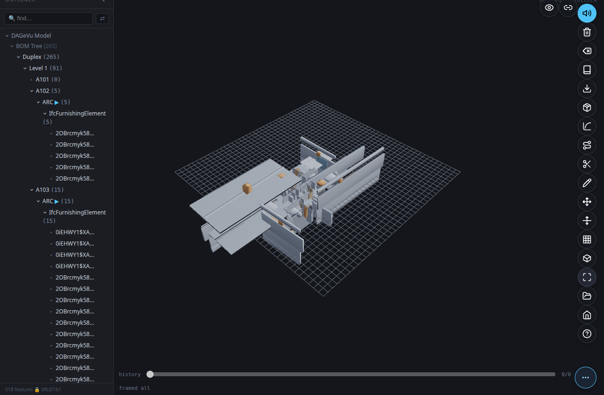

- **Outliner** (left) — the BOM tree of the opened building (`Building → Level → Room → ARC → element`), plus the **Walk** rows and a live **find** filter. Collapse it with its chevron to free the canvas.
- **Canvas** (centre) — the 3D building on the construction grid. Click an element to select it; **Shift-drag** marquee-selects many.
- **Pill toolbar** (right edge) — an icon rail. Tap **⋯** (bottom-right) to fan the pills open; hover a pill for its name; **? Help** lists every tool + shortcut. `Esc` cancels any active mode.
- **History scrubber** (bottom) — the signed op-log *is* the timeline. Drag it to travel through every edit. The status line beneath it echoes what each op did (e.g. `scaled #183 X ×1.50  verify=true`).

**How to read it:** the op-log is the model, the 3D is a fold of it, and the slider is the single honest
retreat across every tool below.

---

## Assemble & draw

### Insert — assemble from the catalog
*Commits `GEOM_INSERT`.*

The fastest way to build is to **assemble, not draw**.

1. Tap **Insert** (the cube pill) to open the **BOM catalog** on the left.
2. Search or filter (**All · Structure · Openings · Furniture · Sets**), then click a **component** — or a whole **Set** (an assembly that drops its entire recipe at once).
3. Aim on the grid (press **R** to rotate, set **Elev** for storey height) — a ghost previews the landing — then **click** to place.

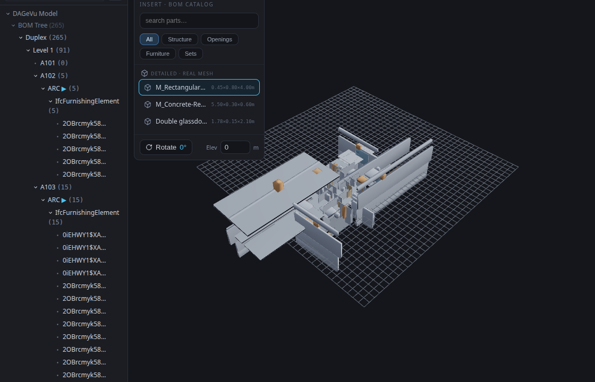

The component lands as one signed `GEOM_INSERT` (a LOD-200 box that lazily refines to its real library
mesh). An assembly drops as one grouped op of *N* seated, oriented parts — a door takes its host wall's
facing automatically. Undo removes it exactly.

### Sketch → Extrude — draw a wall
*Commits `GEOM_EXTRUDE_POLY` (a real occt B-rep solid).*

1. Tap **Sketch** and click **≥3 points** on the grid to lay a closed profile.
2. Set the **depth**, then tap **Extrude**.

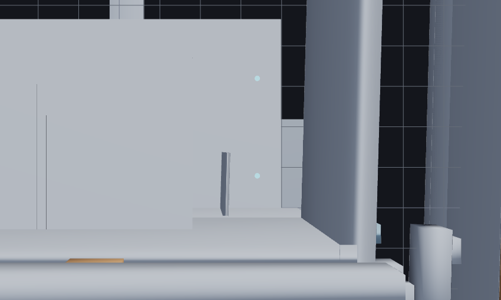

The solved polygon is swept to depth and committed as one signed operation.

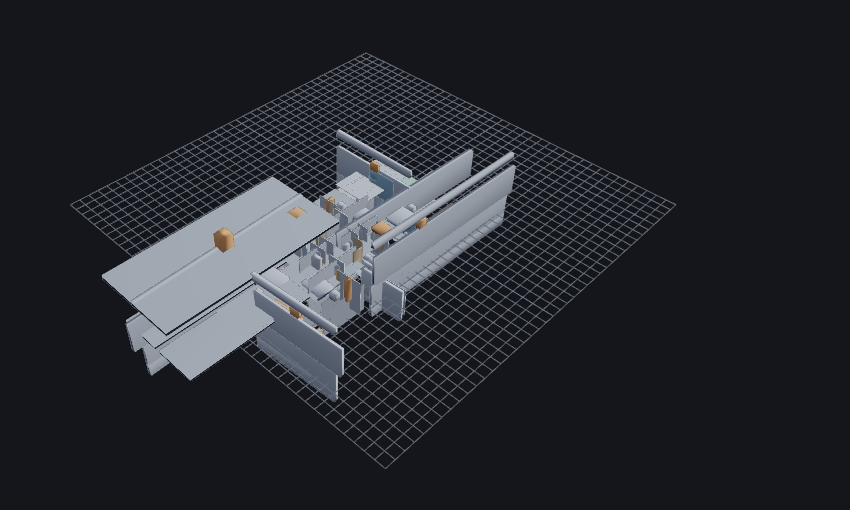

### Route → Sweep-Run — lay a run / duct
*Commits `GEOM_SWEEP`.*

1. Tap **Route** and click **≥2 points** to lay a spine.
2. Set the **profile** size, then tap **Sweep-Run**.

The profile is swept along the spine (an occt pipe) as one signed op — the way MEP runs are authored.

### Cut — open a wall
*Commits `GEOM_CUT` (a child of the selected wall).*

1. Click a wall to **select** it.
2. Tap **Cut** — a window void is derived from the wall and subtracted.

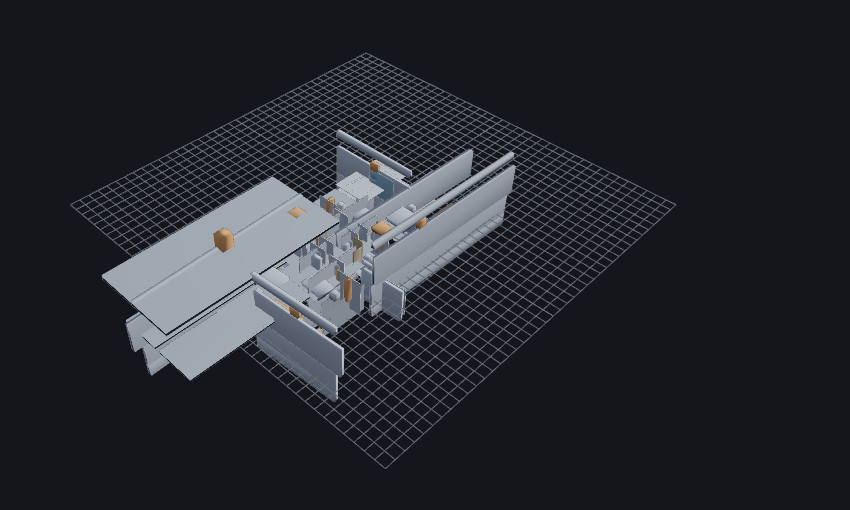

The opening shows immediately; undo closes it to the exact original frame. (Cutting a seeded ARC wall
promotes its measured box to a B-rep just-in-time, so the subtraction is exact — never approximated.)

### Fillet — round a solid's edge
*Commits `GEOM_FILLET`.*

1. Select a B-rep solid and tap **Fillet** — its edges become pickable markers.
2. Click an edge (or several), set the **radius**, then tap **Apply**.

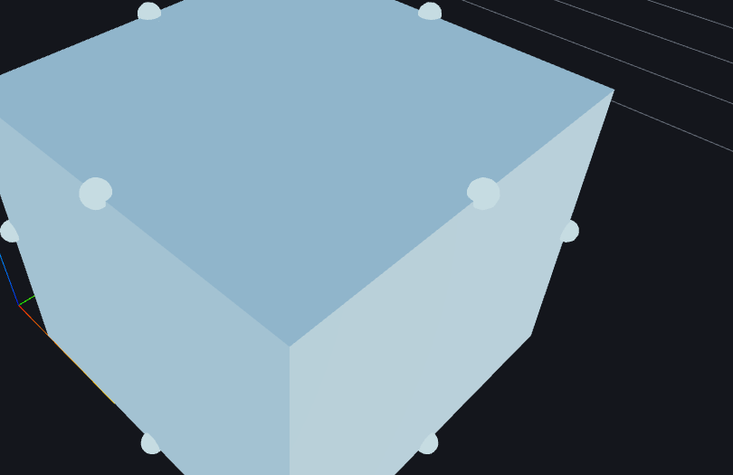

The picked edge is rounded in place (the wall's triangle count grows exactly where the round lands); undo
restores it.

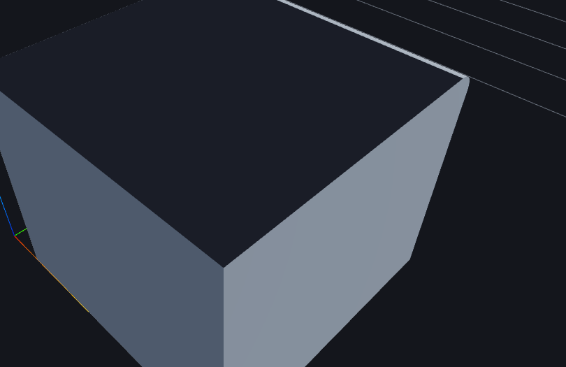

---

## Transform

Select an element and tap **Move** to raise the **transform gizmo** — the shared handle for moving,
scaling and rotating.

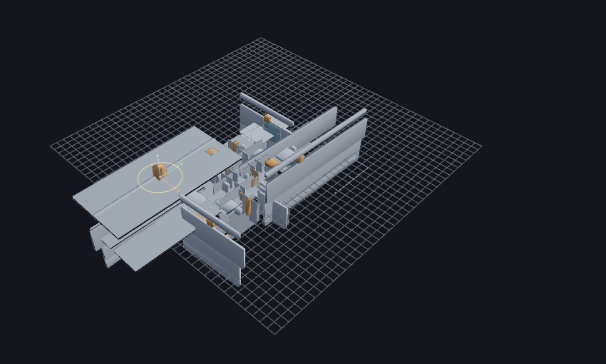

### Move
*Commits `GEOM_MOVE {dx,dy,dz}`.* Drag an **axis arrow** (with grid snap) or nudge with the arrow keys.
Release commits one signed `GEOM_MOVE`; a moved host **drags its hosted fillings** (a door rides its
wall). Undo is exact to the micron.

### Scale
*Commits `GEOM_SCALE {fx,fy,fz}`.* On a single component, drag a **cube** handle to stretch that axis
(edge-anchored — the opposite face stays put). The rendered extent grows by exactly the committed factor.

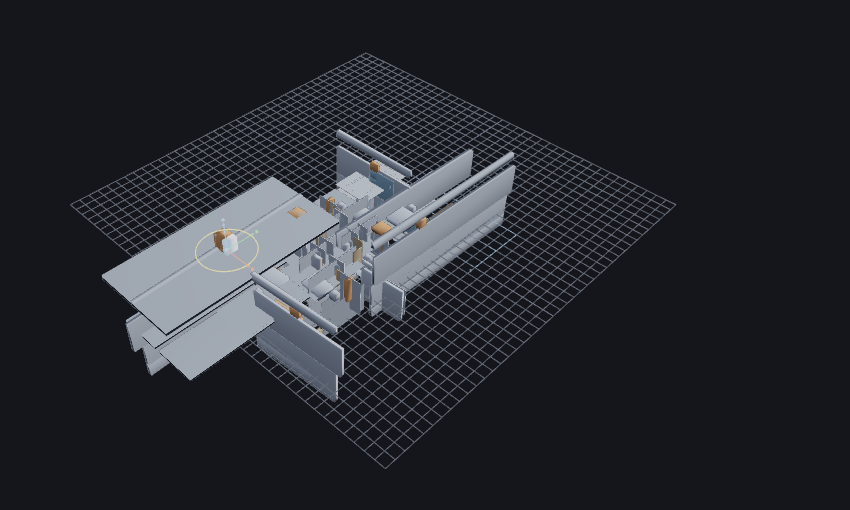

### Rotate
*Commits `GEOM_ROTATE {drot}`.* Drag the yellow **yaw ring** to spin the selection about its centre (15°
snap, Shift for free angle). The rendered footprint turns by exactly the committed angle.

### Grid-Stretch
*Commits `GEOM_GRID_MOVE`.* Tap **Move Grid**, then drag a **gridline**. Walls attached to that line
**recompose** — a span stretches, an attached wall translates — as one signed operation.

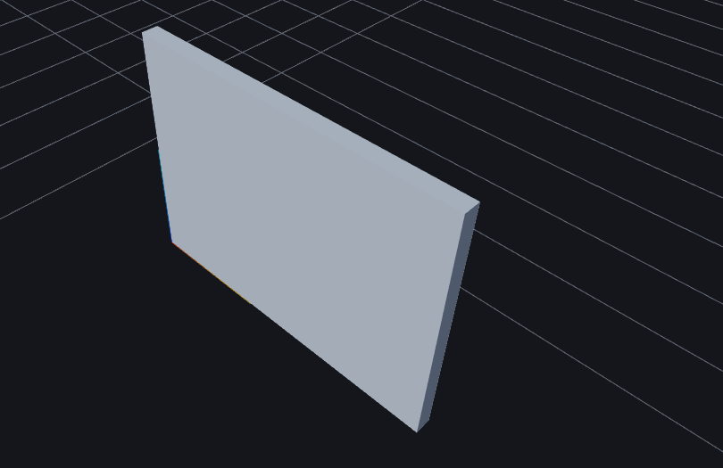
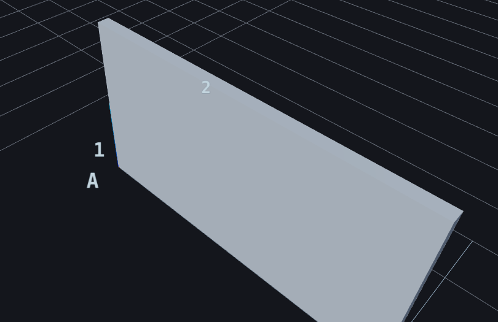

### Delete
*Soft-deletes from the signed log (reversible).* Select and tap **Delete** (or press `Del`). The feature
(and its children) hide from the model — the signed payload is never rewritten, so the chain stays valid.
**Redo** (`Ctrl+Y`) brings it back exactly.

---

## Generate — walkers fill the ARC

When you open a bare **ARC** building, the other disciplines *fill themselves in*. You pick a discipline
that is **absent** — Structure, Electrical, Fire-Protection, Plumbing, HVAC — and the modeller **walks**
it: it places that trade's elements at the **measured cadence** of a real coordinated building, chains the
runs it can, gates the clashes, and **honestly refuses** when the building has nothing to hang the trade
on. Nothing is invented — every placement uses a spacing/clearance rule *mined from a real IFC model*.

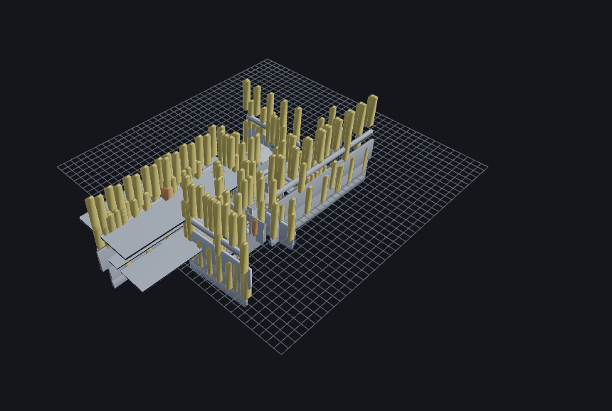

**One engine, two standards.** A single walker drives every discipline; the discipline is just a data
filter. It carries two measured rule-sets and auto-selects by building class:

| Building class | Standard used | Mined from | Why |
|---|---|---|---|
| House / residential (SampleHouse, Duplex, SampleCastle) | **residential** (`duplex_rules.db`) | the Duplex's *own* real MEP — 908 elements | tight residential cadence (~0.5 m trade separation) |
| Large / complex (airport, hospital) | **large-complex** (`terminal_rules.db`) | a real airport terminal | sparse, plenum-scale cadence |

On open you'll see `§DW-PROV` print the standard and its provenance, so you always know which rule-set is
driving the walk. The tables below are the **evidence** that the walk produces sensible numbers — every
figure traces to a witnessed `§`-log (no estimates).

### What a walk actually places

Status-line results per discipline on the three residential buildings
(`build/logs/witness_disc_walk_generalize.log`). *Placed* = elements seated; *chains* = runs linked
end-to-end; the note is what the walk reported when a trade had nothing to route:

| Building (storeys) | Discipline | Placed | Chains | Honesty note |
|---|---|---:|---:|---|
| **SampleHouse** (3) | Fire-Protection | 55 | 0 | — |
| | Electrical | 159 | 0 | — |
| | Structure | 30 | 1 | members linked, no measured gap |
| | Plumbing | 6 | 0 | ~no pipes in a small house → honest |
| **Duplex** (5) | Fire-Protection | 303 | 0 | — |
| | Electrical | 771 | 0 | — |
| | Structure | 162 | 1 | members linked |
| | Plumbing | 10 | 0 | sparse → honest |
| **SampleCastle** (7) | Fire-Protection | 2 665 | 0 | — |
| | Electrical | 8 123 | 0 | — |
| | Structure | 1 836 | 1 | members linked |
| | Plumbing | 14 | 0 | sparse → honest |

Counts scale with footprint because the **cadence is constant** — the same measured spacing tiles a bigger
floor. Walking an *unknown* discipline returns **REFUSE — no measured rule** rather than guessing.

### Why the right standard matters — clash collapse

The walk gates clashes between the fixtures it placed. Using the **right** standard for the building class
collapses the phantom clashes a mismatched (too-wide) standard would raise — same layout, only the
clearance standard changes (`witness_disc_walk_duplex_generalize.log`, gated irreducible residual):

| Building | Residual @ large-complex standard | Residual @ residential standard | Collapse |
|---|---:|---:|---:|
| SampleHouse | 9 | **4** | 56 % |
| Duplex | 32 | **2** | 94 % |
| SampleCastle | 501 | **3** | 99.4 % |

Every residual is **flagged, none silent** — the walk never hides a clash to make the number look good.

### Does the residential standard reproduce a real house's MEP?

The residential standard was mined from the Duplex's own MEP, so the acid test is whether it *re-grows*
that MEP (`witness_duplex_rules.log`, `§DXM-RT`):

| Discipline | Verdict | What it means |
|---|---|---|
| Plumbing | ✅ **GREEN** (4/4 classes) | the bulk of a house's MEP reproduces — segments 0.93, fittings 0.85 |
| Electrical | 🟡 **WEAK** | fixtures (n = 89) GREEN; the sparse 8-segment conduit is honestly WEAK |
| HVAC | 🔴 **RED** (n = 2) | a house has ~no ductwork — honest RED, *not* a failure |

RED/WEAK here are **honesty**, not breakage: a single-family house genuinely has almost no ducting, so the
walk declines to fabricate it.

### Does it generalize to a building it never saw?

We routed the residential rules (mined from the Duplex) onto held-out buildings and scored each against
*that building's own pipes* (`witness_generalize_curve_*.log`, `§GC`). Precision is the **don't-fabricate**
score: of the joins the walker drew, how many land on a real pipe touch.

| Building | Type | In/out of domain | Segments | Precision @0.15 m | Fabricated |
|---|---|---|---:|---:|---:|
| Duplex *(self-consistency ceiling)* | house | — | 358 | **0.969** | 0 |
| **LTU_AHouse** | house | **in-domain** | 32 138 | **0.839** | 0 |
| WBDG_Office | office | out-of-domain | 2 241 | 0.749 | 0 |
| Clinic | healthcare | out-of-domain | 4 906 | 0.705 | 0 |
| HHS_Office | office | out-of-domain | 1 380 | 0.620 | 0 |

The model **degrades gracefully** and never collapses. On **every** building **0 joins were fabricated** and
**0 exceeded the gap bound**. An ARC-only building with no pipes routes **0**, never a guess.

### Seed-Trunk — route a service trunk

After walking a discipline, route its **service trunk** from a real entry.

1. In the Outliner, open the **Route trunk** row for the walked discipline.
2. A popup offers the real service **entry** elements (doors / stairs) — confirm the default or choose one.
3. Tap **Route ▶**.

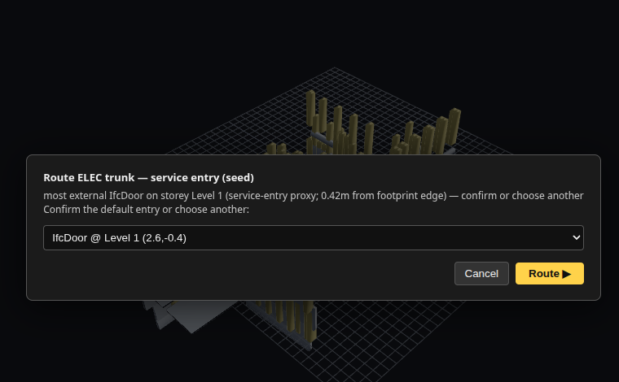

A corridor-aware trunk is routed from that entry through the walked fixtures — around walls, through real
doors, up risers between storeys.

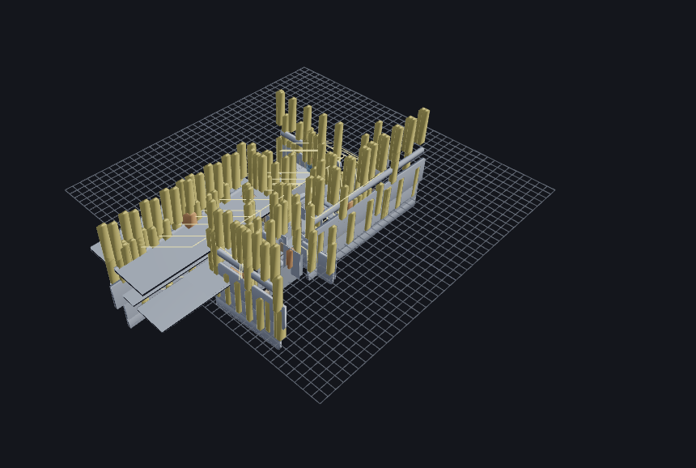

> **Deeper proof.** The full mining, round-trip, boundary and generalization analysis lives in the resume
> cards `prompts/RESUME_DX_MEP_RESIDENTIAL_STANDARD.md`, `RESUME_TERMINAL_RULE_MINING.md` and
> `RESUME_DISC_WALKER_ENVELOPE_BOUND.md`, each backed by the witnessed `build/logs/` set summarised above.

---

## History — the slider *is* the timeline

- Drag the **history scrubber** back to undo, forward to redo — it scrubs the signed op-log and re-folds the
  geometry deterministically. It is a strict superset of the keyboard shortcuts.
- **`Ctrl+Z`** undo · **`Ctrl+Y`** (or `Ctrl+Shift+Z`) redo · **`Del`** delete selection · **`F`** fit · **`Esc`** cancel mode · **`R`** rotate a pending insert.
- Every retreat is exact because the geometry is a pure fold of the log — there is no separate "undo buffer"
  to drift out of sync.

---

## Toolbar — icon index

The toolbar is a **⋯ pill rail** at the right edge: tap **⋯** to fan the pills, hover for a name, and open
**? Help** for the live registry (icon · name · shortcut). `Esc` always cancels the current mode.

| Icon | Does |
|------|------|
| **⋯ Toolbar** | Fan the pills open / closed |
| **? Help** | Toolbar & shortcuts — the live pill registry |
| **Home** | Back to the Matrix landing |
| **Fit** | Zoom to fit — the selection, or the whole scene (`F`) |
| **Iso** | Cycle the view: Iso ⇄ Top |
| **Grid** | Show / add a construction grid |
| **Move Grid** | Drag a gridline — attached walls recompose (`GEOM_GRID_MOVE`) |
| **Move** | Transform gizmo — move / scale / rotate the selection (`M`) |
| **Sketch** | Start a 2D sketch |
| **Extrude** | Push a sketch profile into a solid (`GEOM_EXTRUDE_POLY`) |
| **Axis** | Set the constraint intent the solver enforces on the sketch |
| **Cut** | Cut an opening in the selected wall (`GEOM_CUT`) |
| **Route** | Lay a spine to sweep a profile along (e.g. an MEP run) |
| **Sweep Run** | Sweep the profile along the route (`GEOM_SWEEP`) |
| **Fillet** | Round a selected solid's picked edges (`GEOM_FILLET`) |
| **Apply** | Commit the pending fillet / chamfer |
| **Insert** | Insert a library component — assemble, don't draw (`GEOM_INSERT`) |
| **LOD 200** | Refine the selected component's level of detail (same signed row) |
| **IFC** | Export the authored model as IFC4 |
| **Undo / Redo** | Undo (`Ctrl+Z`) · Redo (`Ctrl+Y`) |
| **Delete** | Delete the selection (`Del`) |
| **Clear** | Empty the scene |
| **Sound** | Toggle authoring sound feedback |
| **Connect** | Connect Scene — share selection / timeline with the Viewer & ERP (opt-in) |

---

## Collaborate on the design — the Teams overlay

The Modeller shares **one signed op-log** with the Viewer and the Kernel-ERP, so the same **Teams overlay**
rides on it: git-style **design branches** ("you build that wing, I build this"), a **spatial merge gate**
that flags where two branches clash, identity-coloured **who-dots** on elements, and the tabbed Outliner
(Tree / Chat / Dashboard). Off by default, pixel-identical until you toggle it on.
→ **[Teams Overlay guide (with screenshots)](TeamsOverlayGuide.md).**

---

*Part of [BIM OOTB](USER_GUIDE.md). Copyright (c) 2025–2026 Redhuan D. Oon. MIT Licensed.*
