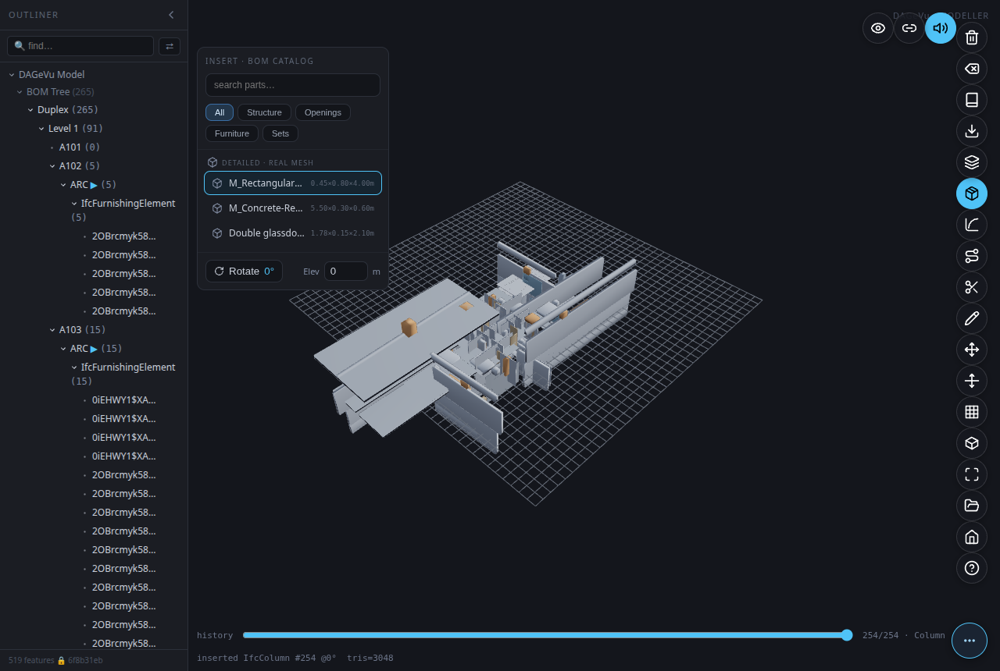
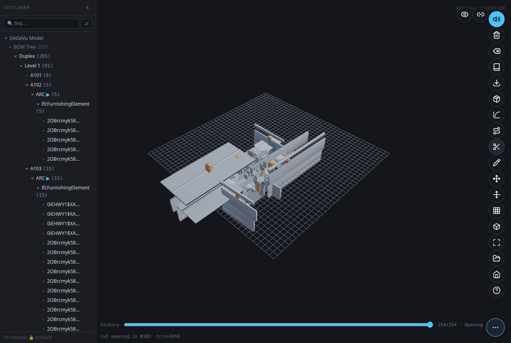
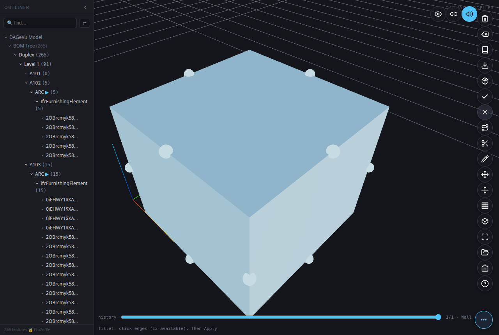
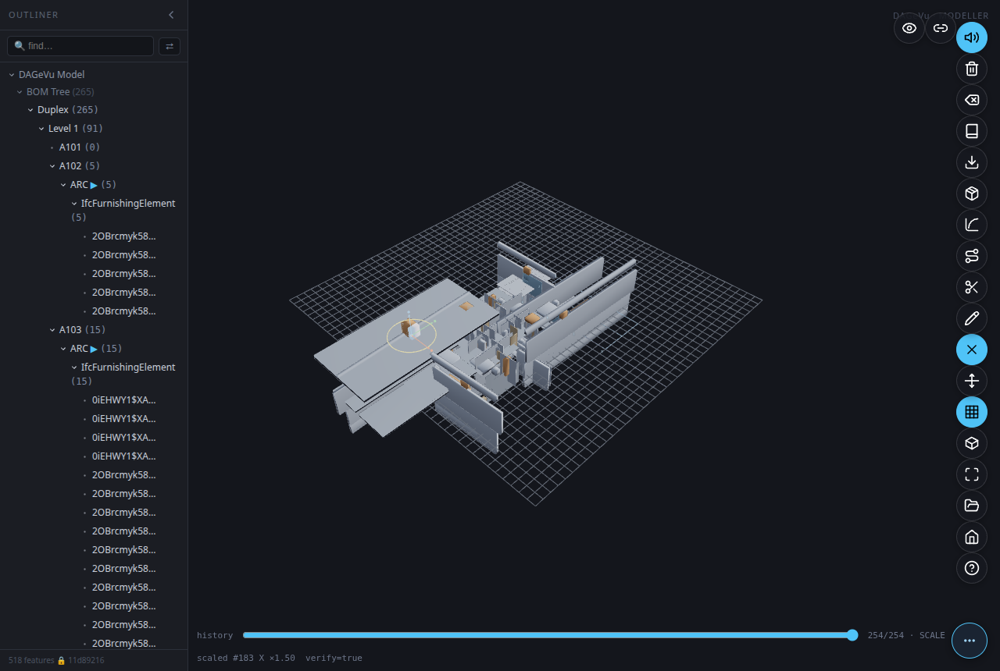
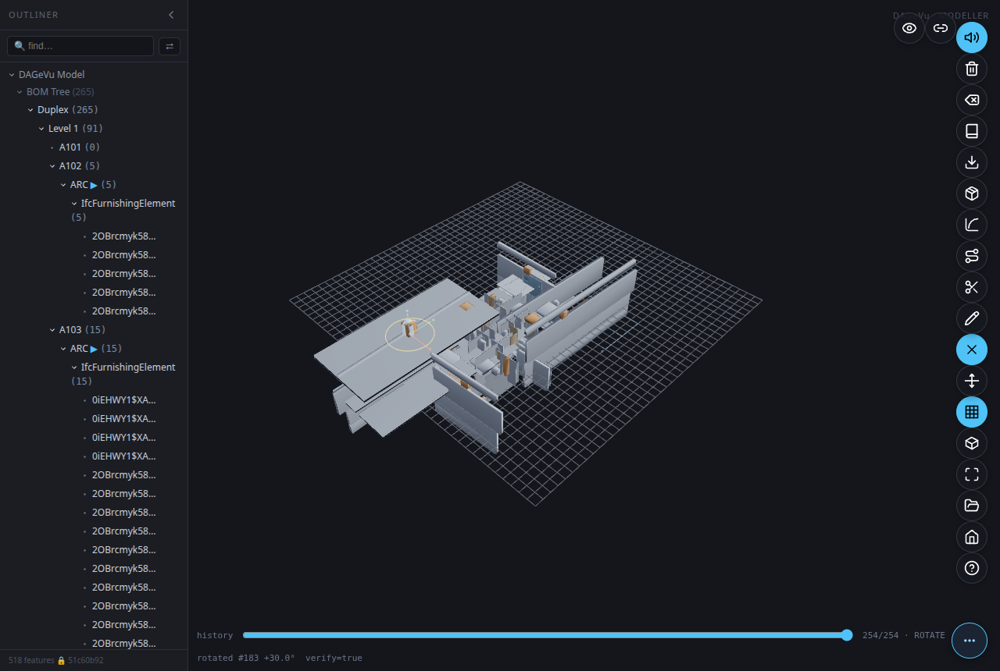
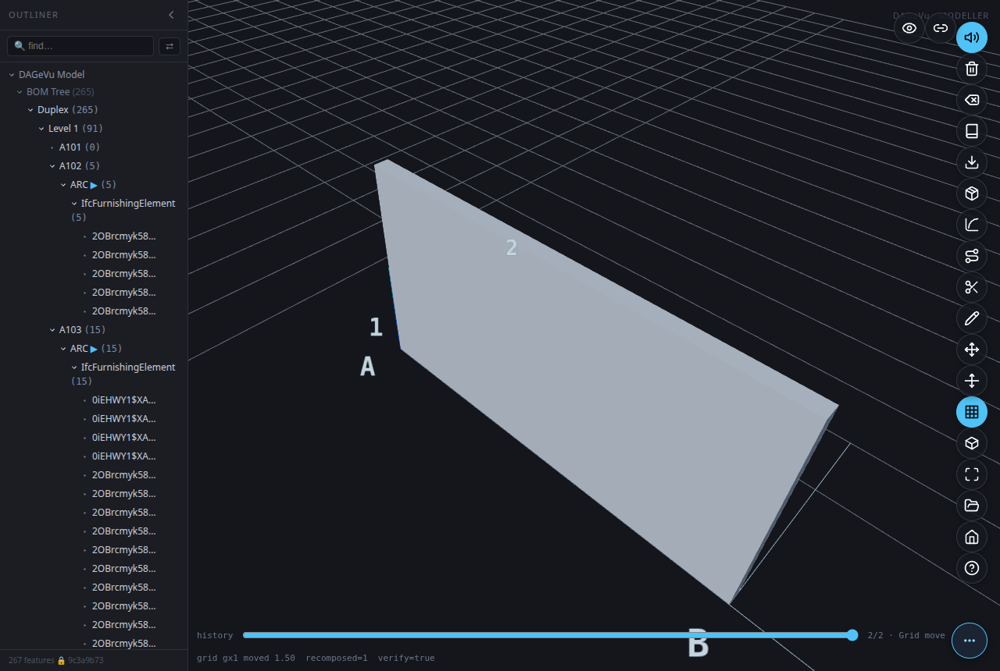
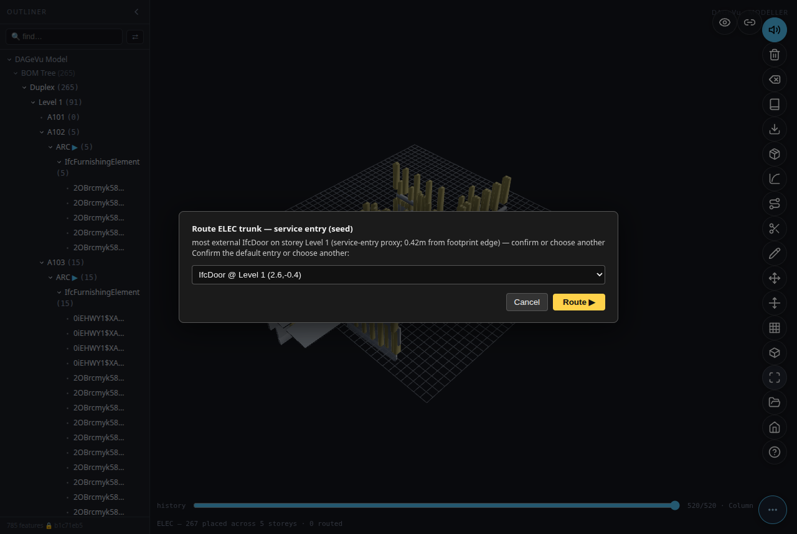
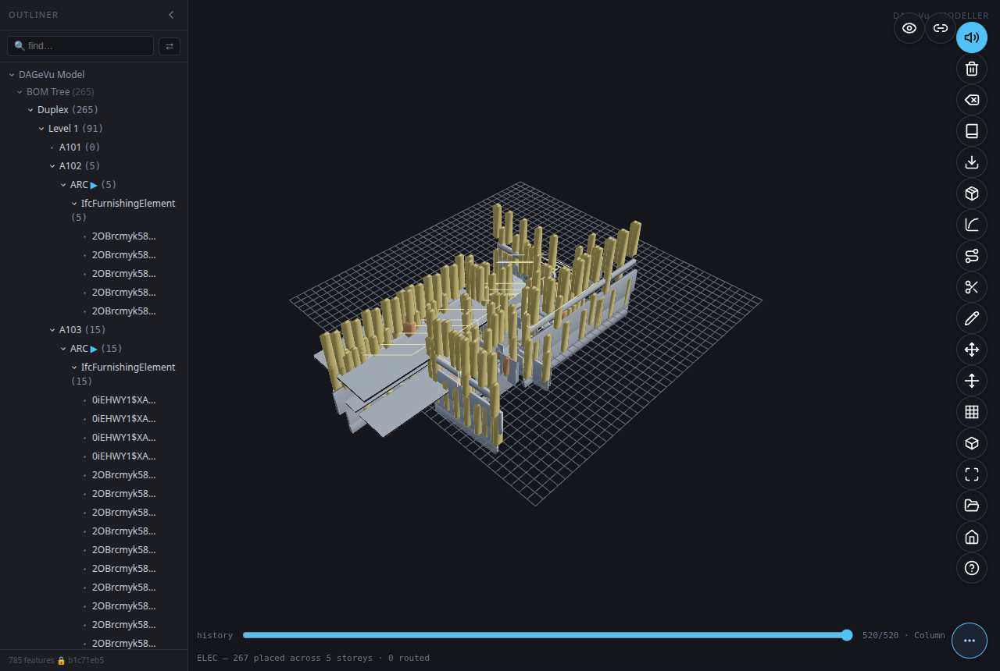

# DAGeVu Modeller — User Guide
*[← Back to the **User Guide**](USER_GUIDE.md) · [Home](index.md)*

The DAGeVu Modeller is an **authoring surface over a signed operation log**. You don't draw a dead
file — every action (move a wall, cut a window, route a duct, walk a discipline) is **one signed
operation** folded into a verifiable hash-chain. The 3D you see is a pure *fold* of that log, so
**every edit is exact, reversible, and provable** — never invented.

The vision is *open-and-edit, not draw-from-scratch*: you **📂 Open** a real building's **ARC**
(architectural) model and edit *that*. Structure, MEP, the 4D schedule and 5D cost **follow** by
crawling against your ARC (the **Walk** tools), and the **history slider** is the single, honest
retreat across all of it.

> **Every tool on this page is backed by a real-user, maths-asserted end-to-end test** — the tool is
> driven through the exact production path with real mouse/keyboard, and the result is asserted by
> numbers (the op-log, the scene graph, and the framebuffer), never by eye. The screenshots below are
> **real frames captured from those test runs** (`modeller/tests/witness_e2e_*.js`). Nothing here is a
> mock-up.

---

## How it works (read this once)

- **The op-log is the model.** Each tool commits a signed `GEOM_*` operation. `verifyChain` proves the
  chain is intact after every commit.
- **The 3D is a fold.** Replaying operations `0..k` *is* the history; the **history slider** scrubs `k`.
- **Undo is exact.** Scrubbing back removes an edit and restores the previous geometry to the bit.
- **Two kinds of element.** A seeded ARC element (a wall in an opened building) is a *baked* component
  (`GEOM_INSERT`); a wall you sketch is a *B-rep solid* (`GEOM_EXTRUDE_POLY`). Most tools work on both;
  a couple (Fillet) need a B-rep.

---

## Navigate

| Pill | Action |
|------|--------|
| **📂 Open** | Load a resident building's ARC into the editor. |
| **Fit** (`F`) | Frame everything in view. |
| **View** | Cycle standard views (top / front / iso). |
| **Grid** | Toggle the architectural column grid (snap target for sketch & insert). |
| **X-ray** (`X`) | See-through shading to reach interior elements. |

Select by clicking an element; **Shift-drag** marquee-selects many. The selection is the target for
Move, Scale, Rotate, Cut, Fillet and Delete.

---

## Author geometry

### Insert — assemble from the catalog
*Commits `GEOM_INSERT`.*

Click **Insert** to open the BOM catalog, click a component, then click a cell on the grid to drop it.
The component lands as one signed `GEOM_INSERT` (a baked LOD-200 box that lazily refines to its real
library mesh). Undo removes it exactly.

### Sketch → Extrude — draw a wall
*Commits `GEOM_EXTRUDE_POLY` (a real occt B-rep solid).*

Click **Sketch**, click ≥3 points on the grid to lay a closed profile, set the **depth**, then click
**Extrude**. The solved polygon is swept to depth and committed as one signed operation.

### Route → Sweep-Run — lay a run/duct
*Commits `GEOM_SWEEP`.*

Click **Route**, click ≥2 points to lay a spine, set the **profile** size, then click **Sweep-Run**.
The profile is swept along the polyline (occt pipe) as one signed operation — the way MEP runs are
authored.

### Cut — open a wall
*Commits `GEOM_CUT` (a child of the selected wall).*

Select a wall and click **Cut**. A window void is derived from the wall and subtracted — the opening
shows immediately, and undo closes it to the exact original frame. (Cutting a seeded ARC wall promotes
its measured box to a B-rep just-in-time, so the subtraction is exact, never approximated.)

### Fillet — round a solid's edge
*Commits `GEOM_FILLET`.*

Select a B-rep solid and click **Fillet** — its edges become pickable markers. Click an edge (or
several), set the **radius**, then click **Apply**. The picked edge is rounded in place (the wall's
triangle count grows where the round lands); undo restores it.

---

## Transform

### Move
*Commits `GEOM_MOVE {dx,dy,dz}`.*

Select an element and click **Move** to raise the XYZ gizmo. Drag an axis handle (with grid snap) or
nudge with the arrow keys. Release commits one signed `GEOM_MOVE`; a moved host **drags its hosted
fillings** (a door rides its wall). Undo is exact to the micron.

### Scale
*Commits `GEOM_SCALE {fx,fy,fz}`.*

In Move mode on a single insert, drag a **cube** handle to stretch that axis (edge-anchored — the
opposite face stays put). The rendered extent grows by exactly the committed factor.

### Rotate
*Commits `GEOM_ROTATE {drot}`.*

In Move mode, drag the yellow **yaw ring** to spin the selection about its centre (15° snap, Shift for
free angle). The rendered footprint turns by exactly the committed angle.

### Grid-Stretch
*Commits `GEOM_GRID_MOVE`.*

Click **Move Grid**, then drag a **gridline**. Walls attached to that line **recompose** — a span
stretches, an attached wall translates — all as one signed operation. Drag a column line out and the
wall spanning to it grows by exactly the drag distance.

### Delete
*Soft-deletes from the signed log (reversible).*

Select and click **Delete** (or press `Del`). The feature (and its children) hide from the model — the
signed payload is never rewritten, so the chain stays valid. **Redo** (`Ctrl+Y`) brings it back exactly.

---

## Generate (walkers fill the ARC)

### Walk a discipline
*Commits a batch of `GEOM_INSERT` fixtures.*

Pick a discipline (e.g. **ELEC**) from the Outliner's *Walk* rows. The walker crawls your ARC and
places that discipline's fixtures — corridor-aware, host-bound, exact counts — committed as **one
batched signed group** (so even hundreds of fixtures land in seconds, not a frozen minute). Scrub the
slider back to clear them.

### Seed-Trunk — route a service trunk
*Renders a corridor-aware trunk from a chosen entry.*

After walking a discipline, use the Outliner's **Route trunk** row. A popup offers the real service
**entry** elements (doors / stairs); confirm or choose one and click **Route ▶**. A corridor-aware
trunk is routed from that entry through the walked fixtures — around walls, through real doors, up
risers between storeys.

---

## History

- **The slider *is* the timeline.** Drag it back to undo, forward to redo — it scrubs the signed
  op-log and re-folds the geometry deterministically. It is a strict superset of `Ctrl+Z` / `Ctrl+Y`.
- **`Ctrl+Z`** undo · **`Ctrl+Y`** (or `Ctrl+Shift+Z`) redo · **`Del`** delete selection.
- Every retreat is exact because the geometry is a pure fold of the log — there is no separate "undo
  buffer" to drift out of sync.

---

*This guide supersedes the older toolbar-index `ModellerGuide.md`. Each tool above is locked by a
green real-user E2E in `modeller/tests/witness_e2e_*.js`; the frames are captured from those runs.*
