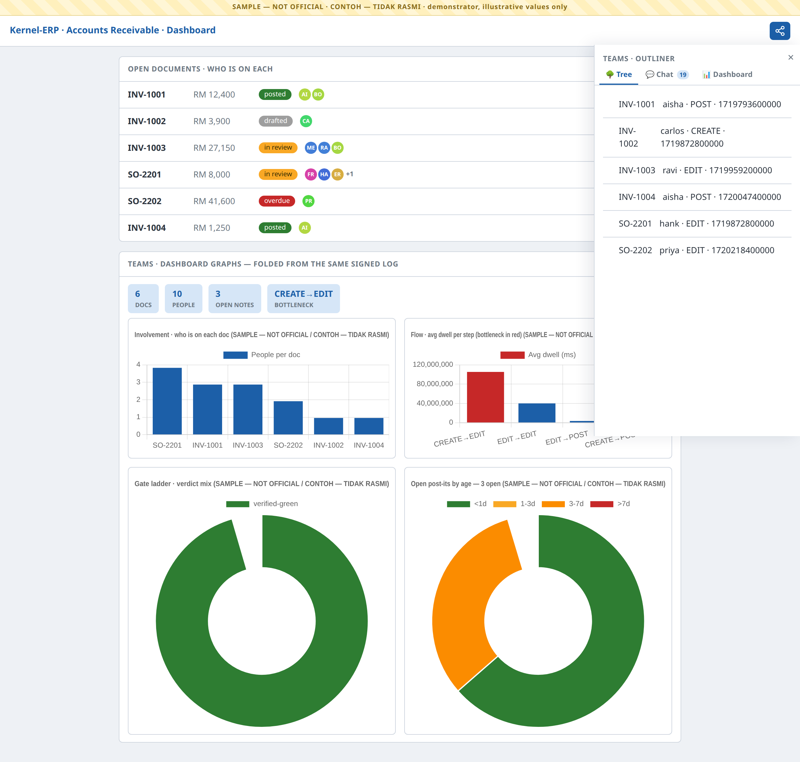
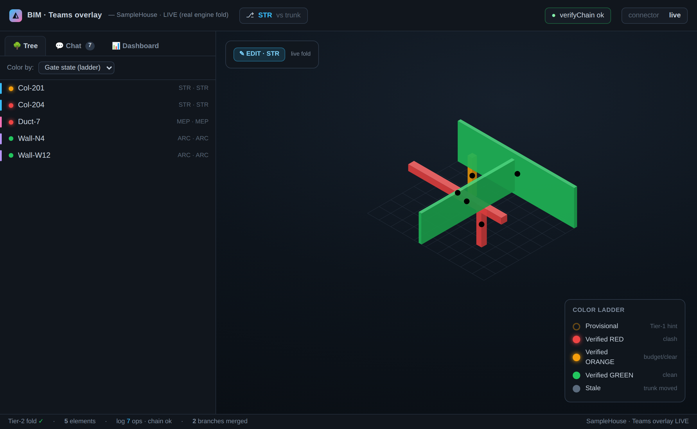

# Teams Overlay — Collaboration & Universal Optics  *(ALPHA)*

> **⚠ DEMONSTRATOR — NOT OFFICIAL.** Every screen and generated chart in this guide carries the
> **`CONTOH — TIDAK RASMI` / `SAMPLE — NOT OFFICIAL`** watermark. The names, documents and numbers are
> illustrative demo values — this is a demonstrator, **not** a production collaboration system.

**The Teams overlay turns any surface — the [Modeller](ModellerGuide.md), the [Viewer](BIMUserGuide.md), or
[Kernel-ERP](ERPUserGuide.md) — into a collaborative one.** It is *not* a separate app. One toggle paints
**who-did-what** onto the screens you already have: coloured dots on the very rows and elements you work with,
a history you can read, a chat that **is** the signed log, and dashboard graphs — the same overlay, the same
grammar, whether you are authoring a building or posting an invoice.

> **One signed op-log · a few optics, each answering one question · the same overlay on every surface.**

This is a **task-oriented manual**. If you just want to *use* it, read **Getting started** and **Common
tasks**. If you want to know *how it works* (or why every number is trustworthy), read **Under the hood**.

---

## Getting started (about 2 minutes)

The overlay is **off by default** — until you turn it on, the screen is byte-for-byte unchanged.

1. **Open any surface.** A Kernel-ERP window (e.g. *Accounts Receivable*), a building in the Viewer, or the
   Modeller — the overlay works the same on all three.
2. **Find the Teams pill.** Look on the toolbar for the **share glyph** (three linked nodes). It is the *host's*
   own icon — the overlay borrows the app's icon set, it never imposes its own.
3. **Toggle it on.** The pill lights with the host's active colour and a side pane — the **Teams Outliner** —
   slides in. Coloured **who-dots** appear on each row: one dot per person who touched it, the colour is that
   person's identity, the letters are their initials, and a **`+N`** collapses a crowd.
4. **Toggle it off.** Tap the pill again. Every dot and the pane are removed and the screen returns to the
   **exact** state it started in — the overlay never leaves residue.

That's the whole interaction model: **open → pill → who-dots + Outliner → toggle off**. Everything below is a
variation on it.

---

## Common tasks

### See who is on each document (or element)
Turn the overlay on. Each row grows a cluster of **identity dots** after its status chip:

| You see | Meaning |
|---|---|
| a coloured dot with initials | a person who touched this record; the **colour is that person** (same person, same colour, everywhere) |
| several dots on one row | everyone currently on it — hover a dot for *name · last action · when* |
| a **`+N`** badge | the crowd overflowed — N more people are on this record than the row shows |

Nothing is invented: **every dot is a real author of a real signed operation.** A record with no activity has no dots.

### Read the history — the **Tree** tab
The Outliner opens on **Tree** — one row per record with **who last touched it, the action, and when** (blame).
It is a pure replay of the log, so the same read always gives the same answer; there is no separate audit table.

### The chat that **is** the log — the **Chat** tab
Switch to **Chat**. Every line is a signed operation rendered as a message — *author · verb · target*. The
badge on the tab counts them. There is no side-channel chat to fall out of sync: **the conversation and the
ledger are the same object.**

### Read the numbers — the **Dashboard** tab & graphs
Switch to **Dashboard**, or read the graph gadgets on the ERP dashboard itself. Each is a read-only **fold** of
the same signed log — never a hand-entered figure:

| Graph | Answers | Colour language |
|---|---|---|
| **Involvement** (bar) | how many people are on each document | host blue `#1c5fa8` |
| **Flow** (bar) | average dwell per process step — the **bottleneck** is red | blue, bottleneck `#c62828` |
| **Gate ladder** (doughnut) | the verdict mix across the work | green `#2e7d32` · orange `#f9a825` · red `#c62828` · provisional `#9e9e9e` |
| **Post-it aging** (doughnut) | open notes by age | `<1d #2e7d32` · `1-3d #f9a825` · `3-7d #fb8c00` · `>7d #c62828` |

### On a building — who-dots on the rooms
In the Viewer's **Find** panel, the same overlay lands on the **Storey → Rooms** result rows: the who-dots
append after each room's state chip, and each **storey header rolls up a `+N` density** of the people active
below it. It is the identical engine as the ERP rows — only the anchor changes (a room's guid instead of a
document id).

### Pin a note — post-its
Any dot or row can carry a **post-it**: a signed note pinned to a universal anchor (a document, a field, a
room, an element). Notes are **private-first** and promote to shared in one operation; they age into the
Dashboard's *post-it aging* doughnut using the **same** colour language as the rest of the platform.

### Explore a "what-if" — branches & the merge gate
The overlay carries **git-style branches** over the one log — *"you build that wing, I build this, then we
join up."* When two branches merge, a **gate** checks them for you, and the gate is the right one for the
surface:

- On the **Modeller / Viewer building side** — a **spatial gate**: it flags where two branches' elements
  **clash** in space.
- On the **schedule side** — a **PERT gate**: it flags **dependency violations** (a task starting before its
  predecessor finishes), **dependency cycles**, and **resource double-bookings** (one crane, two overlapping jobs).

The branch/merge/history machinery is universal; only the *gate* differs by surface. Elements resolve to the
same colour ladder — **red** (a real conflict) beats **orange** (over budget / soft) beats **green** (clean),
with **stale** when the trunk has moved on since you branched.

---

## The same overlay — on the building, too

Everything above is the ERP view. Open the Modeller or Viewer and the *identical* overlay renders over the 3D
model: the tabbed Outliner (Tree / Chat / Dashboard), identity-coloured dots on elements, and the colour
ladder — one grammar, two surfaces.

---

## The optics at a glance (reference)

| Optic | The one question | Where |
|---|---|---|
| **Who-dots** | *Who is on this record / element?* | on every row and element — colour = person, `+N` = crowd |
| **Tree** | *Who last touched it, and when?* | Outliner tab — blame, a pure log replay |
| **Chat** | *What's the conversation?* | Outliner tab — the chat **is** the signed log |
| **Dashboard** | *Give me the numbers.* | Outliner tab + ERP graph gadgets — folds, never hand-typed |
| **Find placement** | *Who is active in this room / storey?* | Viewer Find panel — dots on rooms, `+N` per storey |
| **Merge gate** | *Do these two branches conflict?* | on merge — spatial clash (building) or PERT dep/resource (schedule) |

**Off by default, always.** Until you toggle the pill, the overlay adds **zero** DOM — the host screen is
pixel-identical. Toggle off and it reverts exactly.

**It speaks the host's language.** The pill is built from the *host's* icon set, the pane is the host's own
panel shell, and every colour resolves the host's design tokens (iDempiere blue `#1c5fa8`, the `.bim-panel`
chrome) — so the overlay reads as a native part of whichever app you're in, never a bolt-on.

---

## Under the hood — why every dot is trustworthy

You don't need this to *use* the overlay, but it explains why two people always see the same thing.

- **One signed op-log.** Everything — an edit, a post, a post-it, a schedule change — is an append-only
  **signed operation**. Each op chains to the previous (`verifyChain`); amending one breaks the chain. Every
  optic is a pure **fold** (replay) of this log — so a dot, a blame line, a graph bar and a gate verdict are
  all computed, never stored, and two reads are bit-identical.

- **Colour = identity, deterministically.** A person's dot colour is a pure hash of their signer key — same
  person, same colour, on **every** surface, with no palette table to drift. Identity colour is deliberately
  kept out of the *state* palette, so "who" never reads as "status".

- **NON-INVENT, everywhere.** Every dot is a real op's author; every graph series is read from the fold; a
  record with no activity shows nothing. Where an operation refers to a room or element the overlay can't find,
  it is honestly reported as *un-placed* — never painted onto a random row to look busy.

- **Two merge gates, one engine.** Branch / merge / diff / blame is **universal git** over the op-log. The only
  per-surface plug-in is the *gate*: a **spatial** clash check for the building, a **PERT** dependency/resource
  check for the schedule. Both fold deterministically and resolve to the same red > orange > green ladder.

- **Three distinct timelines — kept separate on purpose.** ① the **4D Gantt Time Machine** (the construction
  *schedule*, tasks × calendar — it lives in the Viewer); ② the **World/History** op-log (who/what/when *events*
  — the Teams core, powering blame and replay); ③ the **What-If Blue-dot** (git branches over the log). They
  are never conflated: the World/History timeline is the substrate, not the Gantt.

---

## Troubleshooting

| Symptom | What it means | What to do |
|---|---|---|
| **No Teams pill** | The surface isn't wired for the overlay yet (it's off-by-default and rolls out per surface). | Use a surface where it's enabled (the ERP AR demo, the standalone showcase). |
| **A row has no dots** | No signed operation has touched that record. | Expected — the overlay never fabricates activity to fill a row. |
| **A dot's colour looks like a status** | It shouldn't — identity hues are kept out of the state palette. | Hover it: a dot always shows *name · action · when*; status lives in the chip, not the dot. |
| **The pane looks foreign to the app** | A styling token didn't resolve. | The overlay consumes host tokens (`--idmp-*` / `.bim-panel`); on a host that exposes them it matches exactly — report the surface if it doesn't. |
| **Toggled off and something stayed** | The overlay removes all its DOM on toggle-off (proven pixel-identical). | Toggle again; a residue would be a bug — report it. |

---

## Related

The Teams overlay supplies the **collaboration + optics** layer; the surfaces supply the work:

- The **[HR / Tenancy / Operate module](HRBIMAssetGuide.md)** is the operate-phase cousin — room-level lenses
  on the building. Teams and HR coexist as separate overlays over the same model; on a room row you may see
  HR's occupancy wash *and* Teams' who-dots, each answering its own question.
- **[BIM Viewer Guide](BIMUserGuide.md)** · **[DAGeVu Modeller Guide](ModellerGuide.md)** ·
  **[Kernel-ERP Guide](ERPUserGuide.md)** — the three surfaces the overlay rides on.

---

*Spec + witnesses: `bim-ootb` `lane/teams-overlay` — `prompts/RESUME_TEAMS_UI_CONSISTENCY.md`,
`teams/UI_CONSISTENCY_GUIDE.md`. Every claim here has a named `§`-witness (dot optics, tab schema, find
placement, dashboard folds, PERT gate) you can run. Back to the [User Guide](USER_GUIDE.md).*
